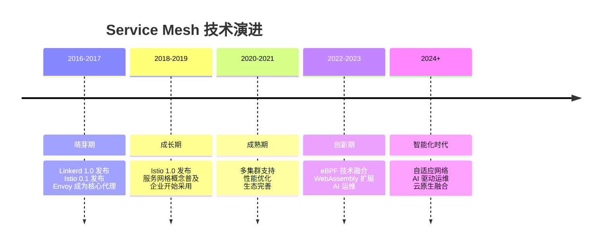

# 第17章：Service Mesh 未来趋势与技术演进

## 1. 技术演进路线图

### 1.1 Service Mesh 发展历程

#### 1.1.1 技术演进阶段


#### 1.1.2 核心技术演进
```yaml
# 核心技术演进路线
technology_evolution:
  data_plane:
    - "2016: Envoy 1.0 - 基础代理功能"
    - "2018: Envoy 1.8 - WASM 支持"
    - "2020: Envoy 1.16 - 扩展性提升"
    - "2022: Envoy 1.22 - eBPF 集成"
    - "2024: 智能数据平面 - AI 驱动路由"
  
  control_plane:
    - "2017: Istio 0.1 - 基础控制平面"
    - "2019: Istio 1.3 - 多集群支持"
    - "2021: Istio 1.10 - 简化架构"
    - "2023: Istio 1.18 - 边缘计算集成"
    - "2025: 自治控制平面 - 自愈自优化"
  
  security:
    - "2018: mTLS 基础认证"
    - "2020: SPIFFE/SPIRE 集成"
    - "2022: 零信任架构"
    - "2024: 量子安全加密"
    - "2026: 自适应安全策略"
```

## 2. 新兴技术融合

### 2.1 eBPF 技术融合

#### 2.1.1 eBPF 在 Service Mesh 中的应用
```c
// eBPF 程序示例：智能流量监控
#include <linux/bpf.h>
#include <bpf/bpf_helpers.h>

struct packet_metadata {
    __u32 src_ip;
    __u32 dst_ip;
    __u16 src_port;
    __u16 dst_port;
    __u32 timestamp;
    __u8 protocol;
};

// eBPF map 用于存储流量统计
struct {
    __uint(type, BPF_MAP_TYPE_HASH);
    __uint(max_entries, 10000);
    __type(key, struct packet_metadata);
    __type(value, __u64);
} traffic_stats SEC(".maps");

// XDP 程序处理网络包
SEC("xdp")
int xdp_traffic_monitor(struct xdp_md *ctx) {
    void *data_end = (void *)(long)ctx->data_end;
    void *data = (void *)(long)ctx->data;
    
    struct ethhdr *eth = data;
    if ((void *)eth + sizeof(*eth) > data_end)
        return XDP_PASS;
    
    // 只处理 IP 包
    if (eth->h_proto != __constant_htons(ETH_P_IP))
        return XDP_PASS;
    
    struct iphdr *iph = data + sizeof(*eth);
    if ((void *)iph + sizeof(*iph) > data_end)
        return XDP_PASS;
    
    // 构建流量元数据
    struct packet_metadata meta = {
        .src_ip = iph->saddr,
        .dst_ip = iph->daddr,
        .timestamp = bpf_ktime_get_ns(),
        .protocol = iph->protocol
    };
    
    // 更新流量统计
    __u64 *counter = bpf_map_lookup_elem(&traffic_stats, &meta);
    __u64 new_count = 1;
    
    if (counter) {
        new_count = *counter + 1;
    }
    
    bpf_map_update_elem(&traffic_stats, &meta, &new_count, BPF_ANY);
    
    return XDP_PASS;
}

char _license[] SEC("license") = "GPL";
```

#### 2.1.2 Cilium Service Mesh 架构
```yaml
# Cilium Service Mesh 配置示例
apiVersion: cilium.io/v2
kind: CiliumClusterwideNetworkPolicy
metadata:
  name: service-mesh-policy
spec:
  endpointSelector:
    matchLabels:
      app: product-service
  
  egress:
  - toEndpoints:
    - matchLabels:
        app: user-service
    toPorts:
    - ports:
      - port: "8080"
        protocol: TCP
      rules:
        http:
        - method: "GET"
          path: "/api/v1/users/*"
  
  # eBPF 加速配置
  bpfAcceleration: true
  bpfHostRouting: true
```

### 2.2 WebAssembly (WASM) 扩展

#### 2.2.1 WASM 过滤器开发
```rust
// Rust WASM 过滤器示例：自定义认证
use proxy_wasm::traits::*;
use proxy_wasm::types::*;
use serde::{Deserialize, Serialize};

#[derive(Serialize, Deserialize)]
struct AuthConfig {
    api_key: String,
    allowed_paths: Vec<String>,
}

proxy_wasm::main! {{
    proxy_wasm::set_log_level(LogLevel::Info);
    proxy_wasm::set_http_context(|_, _| -> Box<dyn HttpContext> {
        Box::new(AuthFilter)
    });
}}

struct AuthFilter;

impl Context for AuthFilter {
    fn on_plugin_start(&mut self, _: usize) -> bool {
        true
    }
}

impl HttpContext for AuthFilter {
    fn on_http_request_headers(&mut self, _: usize, _: bool) -> Action {
        // 获取配置
        let config: Option<AuthConfig> = self.get_plugin_configuration();
        
        if let Some(config) = config {
            // 检查 API Key
            let api_key = self.get_http_request_header("x-api-key");
            
            if api_key != Some(config.api_key) {
                self.send_http_response(
                    401,
                    vec![("Content-Type", "application/json")],
                    Some(b"{\"error\": \"Unauthorized\"}"),
                );
                return Action::Pause;
            }
            
            // 检查路径权限
            let path = self.get_http_request_header(":path").unwrap_or_default();
            if !config.allowed_paths.iter().any(|p| path.starts_with(p)) {
                self.send_http_response(
                    403,
                    vec![("Content-Type", "application/json")],
                    Some(b"{\"error\": \"Forbidden\"}"),
                );
                return Action::Pause;
            }
        }
        
        Action::Continue
    }
}
```

#### 2.2.2 WASM 过滤器部署
```yaml
# WASM 过滤器部署配置
apiVersion: extensions.istio.io/v1alpha1
kind: WasmPlugin
metadata:
  name: auth-filter
  namespace: default
spec:
  selector:
    matchLabels:
      app: api-gateway
  
  pluginConfig:
    api_key: "your-secret-api-key"
    allowed_paths:
    - "/api/v1/public"
    - "/api/v1/health"
  
  url: oci://registry.company.com/wasm-filters/auth:v1.0.0
  
  # 运行时配置
  phase: AUTHN
  priority: 100
```

## 3. 智能化运维趋势

### 3.1 AI 驱动的运维

#### 3.1.1 智能故障预测
```python
# 智能故障预测模型
import pandas as pd
import numpy as np
from sklearn.ensemble import RandomForestClassifier
from sklearn.model_selection import train_test_split
from prometheus_api_client import PrometheusConnect

class ServiceMeshPredictor:
    def __init__(self, prometheus_url):
        self.prom = PrometheusConnect(url=prometheus_url)
        self.model = RandomForestClassifier(n_estimators=100)
        
    def collect_metrics(self, hours=24):
        """收集历史指标数据"""
        metrics = {}
        
        # 收集各种性能指标
        query_metrics = [
            'rate(istio_requests_total[5m])',
            'histogram_quantile(0.95, rate(istio_request_duration_milliseconds_bucket[5m]))',
            'rate(istio_requests_total{response_code=~"5.."}[5m])',
            'envoy_cluster_upstream_cx_active',
            'pilot_xds_push_errors'
        ]
        
        for query in query_metrics:
            result = self.prom.custom_query(query)
            metrics[query] = result
        
        return metrics
    
    def extract_features(self, metrics):
        """提取特征用于机器学习"""
        features = []
        
        for metric_name, data in metrics.items():
            values = [float(point['value'][1]) for point in data]
            
            # 计算统计特征
            feature_set = {
                f'{metric_name}_mean': np.mean(values),
                f'{metric_name}_std': np.std(values),
                f'{metric_name}_max': np.max(values),
                f'{metric_name}_min': np.min(values),
                f'{metric_name}_trend': self.calculate_trend(values)
            }
            
            features.append(feature_set)
        
        return pd.DataFrame(features)
    
    def train_model(self, historical_data):
        """训练预测模型"""
        X = self.extract_features(historical_data['metrics'])
        y = historical_data['labels']  # 故障标签
        
        X_train, X_test, y_train, y_test = train_test_split(X, y, test_size=0.2)
        
        self.model.fit(X_train, y_train)
        
        # 评估模型
        accuracy = self.model.score(X_test, y_test)
        print(f"模型准确率: {accuracy:.2f}")
    
    def predict_failure(self):
        """预测潜在故障"""
        current_metrics = self.collect_metrics()
        features = self.extract_features(current_metrics)
        
        prediction = self.model.predict(features)
        probability = self.model.predict_proba(features)
        
        return {
            'prediction': prediction[0],
            'probability': probability[0].max(),
            'risk_level': self.assess_risk(probability[0])
        }
    
    def assess_risk(self, probabilities):
        """评估风险等级"""
        max_prob = probabilities.max()
        
        if max_prob > 0.8:
            return 'CRITICAL'
        elif max_prob > 0.6:
            return 'HIGH'
        elif max_prob > 0.4:
            return 'MEDIUM'
        else:
            return 'LOW'
```

#### 3.1.2 自适应配置优化
```yaml
# 自适应配置优化框架
apiVersion: ai.istio.io/v1alpha1
kind: AdaptiveConfig
metadata:
  name: auto-optimization
  namespace: istio-system
spec:
  optimizationTargets:
    - name: latency_optimization
      metric: istio_request_duration_milliseconds
      target: p95 < 500ms
      
      # AI 优化策略
      optimizationStrategy:
        type: reinforcement_learning
        exploration_rate: 0.1
        learning_rate: 0.01
        
      actions:
        - type: connection_pool_tuning
          parameters:
            max_connections: [100, 1000]
            http2_max_requests: [50, 500]
        
        - type: load_balancing_strategy
          parameters:
            strategy: ["ROUND_ROBIN", "LEAST_CONN", "RANDOM"]
    
    - name: error_rate_reduction
      metric: istio_requests_total{response_code=~"5.."}
      target: error_rate < 0.01
      
      optimizationStrategy:
        type: bayesian_optimization
        
      actions:
        - type: retry_policy
          parameters:
            attempts: [1, 5]
            per_try_timeout: ["1s", "10s"]
```

## 4. 边缘计算融合

### 4.1 边缘 Service Mesh 架构

#### 4.1.1 边缘节点部署
```yaml
# 边缘 Service Mesh 配置
apiVersion: install.istio.io/v1alpha1
kind: IstioOperator
metadata:
  name: edge-mesh
  namespace: istio-system
spec:
  profile: edge
  
  components:
    # 轻量级控制平面
    pilot:
      enabled: true
      k8s:
        resources:
          requests:
            cpu: 100m
            memory: 256Mi
    
    # 边缘网关
    ingressGateways:
    - name: edge-gateway
      enabled: true
      label:
        istio: edge-gateway
      k8s:
        service:
          type: LoadBalancer
          externalTrafficPolicy: Local
        
        # 边缘优化配置
        nodeSelector:
          node-role.kubernetes.io/edge: ""
        tolerations:
        - key: "node-role.kubernetes.io/edge"
          operator: "Exists"
          effect: "NoSchedule"
```

#### 4.1.2 边缘-云端协同
```yaml
# 边缘-云端协同配置
apiVersion: networking.istio.io/v1beta1
kind: ServiceEntry
metadata:
  name: edge-cloud-sync
  namespace: istio-system
spec:
  hosts:
  - "*.edge.company.com"
  
  location: MESH_EXTERNAL
  resolution: DNS
  
  endpoints:
  - address: edge-gateway.edge-cluster.svc.cluster.local
    locality: edge-beijing
    labels:
      topology: edge
      latency: low
  
  - address: cloud-gateway.cloud-cluster.svc.cluster.local
    locality: cloud-shanghai
    labels:
      topology: cloud
      latency: medium
  
  # 智能路由策略
  trafficPolicy:
    loadBalancer:
      localityLbSetting:
        enabled: true
        failover:
        - from: edge-beijing
          to: cloud-shanghai
          when: 
            latency: >100ms
            error_rate: >0.1
```

## 5. 量子安全与隐私保护

### 5.1 后量子密码学

#### 5.1.1 量子安全加密算法
```yaml
# 量子安全加密配置
apiVersion: security.istio.io/v1beta1
kind: PeerAuthentication
metadata:
  name: quantum-safe-auth
  namespace: istio-system
spec:
  mtls:
    mode: STRICT
  
  # 量子安全密码套件
  cipherSuites:
    - TLS_AES_256_GCM_SHA384
    - TLS_CHACHA20_POLY1305_SHA256
    - TLS_ECDHE_ECDSA_WITH_AES_256_GCM_SHA384
  
  # 后量子算法支持
  postQuantum:
    enabled: true
    algorithms:
      - Kyber-1024
      - Dilithium5
      - Falcon-1024
```

#### 5.1.2 隐私保护增强
```yaml
# 隐私保护配置
apiVersion: networking.istio.io/v1beta1
kind: EnvoyFilter
metadata:
  name: privacy-enhancement
  namespace: istio-system
spec:
  configPatches:
  - applyTo: HTTP_FILTER
    match:
      context: SIDECAR_INBOUND
    
    patch:
      operation: INSERT_BEFORE
      value:
        name: envoy.filters.http.privacy
        typed_config:
          "@type": type.googleapis.com/envoy.extensions.filters.http.privacy.v3.PrivacyFilter
          
          # 数据脱敏配置
          data_masking:
            headers:
            - name: authorization
              mask: "*"
            - name: cookie
              mask: "*"
            
            # 敏感信息检测
            sensitive_patterns:
            - pattern: "\\d{16}"  # 信用卡号
              replacement: "****-****-****-****"
            - pattern: "\\d{3}-\\d{2}-\\d{4}"  # SSN
              replacement: "***-**-****"
          
          # 差分隐私
          differential_privacy:
            enabled: true
            epsilon: 1.0
            delta: 0.00001
```

## 6. 可持续发展与标准化

### 6.1 行业标准与互操作性

#### 6.1.1 标准化发展趋势
```yaml
# Service Mesh 标准化路线
standardization_roadmap:
  current_standards:
    - "SMI (Service Mesh Interface)"
    - "SPIFFE/SPIRE (身份标准)"
    - "OpenTelemetry (可观测性)"
  
  emerging_standards:
    - "Universal Data Plane API (UDPA)"
    - "Mesh Configuration Protocol (MCP)"
    - "Service Mesh Performance (SMP)"
  
  future_directions:
    - "AI/ML 运维标准"
    - "边缘计算互操作性"
    - "量子安全标准"
```

#### 6.1.2 生态可持续发展
```yaml
# 可持续发展策略
sustainability_strategy:
  technical_debt_management:
    - "定期架构评审"
    - "技术债务量化"
    - "重构优先级评估"
  
  community_engagement:
    - "开源贡献计划"
    - "用户反馈机制"
    - "知识共享平台"
  
  environmental_impact:
    - "能效优化"
    - "碳足迹追踪"
    - "绿色计算实践"
```

通过持续关注这些技术趋势和发展方向，Service Mesh 将在未来继续演进，为云原生应用提供更加智能、安全、高效的基础设施支持。