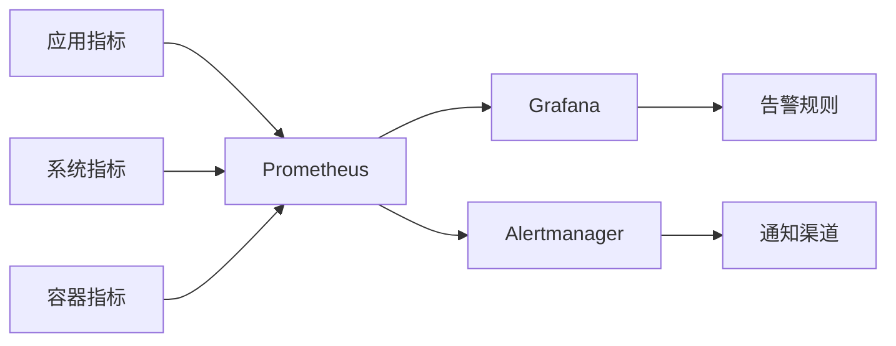
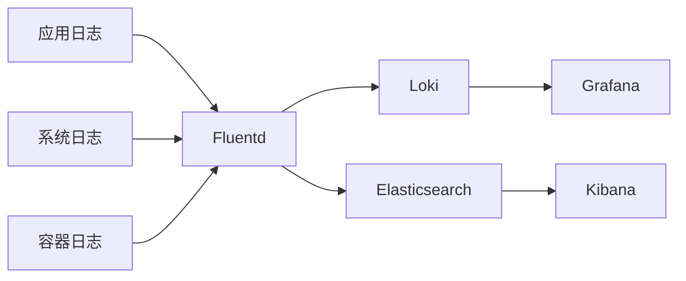
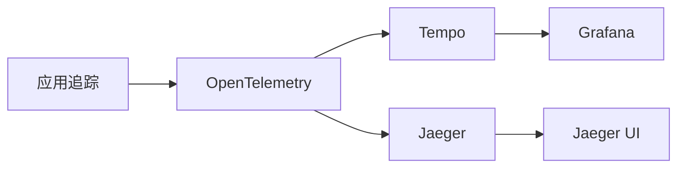

# 可观测性技术架构总体规划

## 1. 概述

可观测性（Observability）是现代软件系统的重要特性，它通过收集和分析系统的运行数据，帮助开发者和运维人员理解系统内部状态、诊断问题并优化性能。本规划文档将全面介绍可观测性技术架构的设计原则、技术栈选择和实施策略。

## 2. 可观测性三大支柱

### 2.1 指标（Metrics）
- **定义**: 数值型时间序列数据，用于量化系统性能
- **特点**: 结构化、可聚合、适合监控和告警
- **应用场景**: 性能监控、容量规划、趋势分析

### 2.2 日志（Logs）
- **定义**: 系统运行过程中产生的文本记录
- **特点**: 非结构化、详细、适合问题诊断
- **应用场景**: 错误排查、安全审计、行为分析

### 2.3 追踪（Traces）
- **定义**: 请求在分布式系统中的完整调用链路
- **特点**: 关联性、时序性、适合性能分析
- **应用场景**: 性能瓶颈定位、依赖关系分析

## 3. 技术架构设计原则

### 3.1 设计原则
1. **统一性**: 统一的采集、存储和查询接口
2. **可扩展性**: 支持水平扩展，适应业务增长
3. **可靠性**: 保证数据不丢失，系统高可用
4. **实时性**: 支持实时数据采集和分析
5. **成本效益**: 平衡性能和成本，优化资源使用

### 3.2 架构模式
- **集中式架构**: 所有数据集中存储和处理
- **分布式架构**: 数据分散存储，统一查询
- **混合架构**: 结合集中式和分布式的优势

## 4. 技术栈选择

### 4.1 核心组件

#### 4.1.1 数据采集层
```
┌─────────────────┐
│   数据采集层     │
├─────────────────┤
│ • Prometheus    │ - 指标采集
│ • Fluentd       │ - 日志采集
│ • OpenTelemetry │ - 追踪采集
│ • Filebeat      │ - 文件日志采集
│ • Telegraf      │ - 系统指标采集
└─────────────────┘
```

#### 4.1.2 数据处理层
```
┌─────────────────┐
│   数据处理层     │
├─────────────────┤
│ • Vector        │ - 数据转换和路由
│ • Logstash      │ - 日志处理
│ • Flink         │ - 流式处理
│ • Kafka         │ - 消息队列
└─────────────────┘
```

#### 4.1.3 数据存储层
```
┌─────────────────┐
│   数据存储层     │
├─────────────────┤
│ • Prometheus    │ - 指标存储
│ • Loki          │ - 日志存储
│ • Tempo         │ - 追踪存储
│ • Elasticsearch │ - 全文搜索
│ • ClickHouse    │ - 分析型存储
│ • TimescaleDB   │ - 时序数据库
└─────────────────┘
```

#### 4.1.4 查询分析层
```
┌─────────────────┐
│   查询分析层     │
├─────────────────┤
│ • Grafana       │ - 统一可视化
│ • Kibana        │ - Elasticsearch可视化
│ • Jaeger UI     │ - 追踪可视化
│ • Prometheus UI │ - 指标查询
│ • LogQL         │ - Loki查询语言
└─────────────────┘
```

#### 4.1.5 告警通知层
```
┌─────────────────┐
│   告警通知层     │
├─────────────────┤
│ • Alertmanager  │ - 告警管理
│ • PagerDuty     │ - 事件管理
│ • OpsGenie      │ - 告警通知
│ • Slack/钉钉    │ - 即时通知
│ • Email         │ - 邮件通知
└─────────────────┘
```

### 4.2 技术栈详细说明

#### 4.2.1 指标监控技术栈
```yaml
指标监控:
  采集器:
    - Prometheus: 主流指标采集和存储
    - Node Exporter: 系统指标采集
    - cAdvisor: 容器指标采集
    - JMX Exporter: Java应用指标采集
    
  存储:
    - Prometheus TSDB: 短期存储
    - Thanos: 长期存储和查询
    - Cortex: 云原生时序数据库
    
  可视化:
    - Grafana: 统一仪表板
    - Prometheus UI: 原生查询界面
```

#### 4.2.2 日志管理技术栈
```yaml
日志管理:
  采集器:
    - Fluentd: 统一日志采集
    - Filebeat: 文件日志采集
    - Logstash: 日志处理管道
    
  存储:
    - Loki: 轻量级日志存储
    - Elasticsearch: 全文搜索存储
    - ClickHouse: 分析型日志存储
    
  查询:
    - LogQL: Loki查询语言
    - Kibana: Elasticsearch可视化
    - Grafana: 统一查询界面
```

#### 4.2.3 分布式追踪技术栈
```yaml
分布式追踪:
  采集器:
    - OpenTelemetry: 标准化采集
    - Jaeger Client: Jaeger客户端
    - Zipkin: 轻量级追踪
    
  存储:
    - Tempo: 云原生追踪存储
    - Jaeger: 完整追踪解决方案
    - Zipkin: 简单追踪存储
    
  可视化:
    - Jaeger UI: 追踪可视化
    - Grafana: 统一可视化
    - Zipkin UI: 简单追踪界面
```

## 5. 架构部署模式

### 5.1 单机部署模式
```
适用于小型团队或测试环境
┌─────────────────────────────────┐
│          单机部署模式            │
├─────────────────────────────────┤
│ 应用服务 → 采集器 → 存储 → 可视化 │
│ (所有组件部署在同一台服务器)       │
└─────────────────────────────────┘
```

### 5.2 集群部署模式
```
适用于生产环境，保证高可用性
┌─────────────────────────────────┐
│          集群部署模式            │
├─────────────────────────────────┤
│ 应用服务集群 → 采集器集群 → 存储集群 │
│ → 可视化集群 → 告警集群           │
└─────────────────────────────────┘
```

### 5.3 云原生部署模式
```
适用于Kubernetes环境
┌─────────────────────────────────┐
│         云原生部署模式           │
├─────────────────────────────────┤
│ Pod → Sidecar采集 → 服务网格     │
│ → 云原生存储 → 云原生可视化        │
└─────────────────────────────────┘
```

## 6. 数据流设计

### 6.1 指标数据流


### 6.2 日志数据流


### 6.3 追踪数据流


## 7. 安全与治理

### 7.1 安全策略
- **数据加密**: 传输和存储加密
- **访问控制**: RBAC权限管理
- **审计日志**: 操作审计和追踪
- **网络隔离**: 网络分段和安全组

### 7.2 数据治理
- **数据保留策略**: 自动清理过期数据
- **数据分类**: 敏感数据识别和处理
- **合规性**: 满足GDPR等法规要求
- **数据质量**: 数据验证和监控

## 8. 性能优化

### 8.1 存储优化
- **数据压缩**: 减少存储空间
- **索引优化**: 提高查询性能
- **分区策略**: 按时间分区管理
- **冷热分离**: 热数据SSD，冷数据HDD

### 8.2 查询优化
- **查询缓存**: 缓存常用查询结果
- **预聚合**: 预计算常用聚合指标
- **查询优化器**: 智能查询路由
- **并行查询**: 多节点并行处理

### 8.3 网络优化
- **数据压缩**: 减少网络传输
- **批量传输**: 合并小数据包
- **就近访问**: CDN和边缘节点
- **连接复用**: 保持长连接

## 9. 成本控制

### 9.1 资源优化
- **自动扩缩容**: 按需分配资源
- **存储分层**: 不同级别存储成本
- **数据采样**: 降低数据量
- **压缩算法**: 优化存储效率

### 9.2 云成本优化
- **预留实例**: 长期使用折扣
- **竞价实例**: 非关键任务使用
- **存储优化**: 选择合适的存储类型
- **网络优化**: 减少跨区域流量

## 10. 实施路线图

### 10.1 第一阶段：基础建设（1-3个月）
- [ ] 部署核心采集组件（Prometheus、Fluentd）
- [ ] 建立基础监控仪表板
- [ ] 配置基础告警规则
- [ ] 培训团队使用监控工具

### 10.2 第二阶段：扩展完善（4-6个月）
- [ ] 部署分布式追踪系统
- [ ] 建立日志分析平台
- [ ] 完善告警通知机制
- [ ] 优化数据存储策略

### 10.3 第三阶段：智能化（7-12个月）
- [ ] 引入AI/ML进行异常检测
- [ ] 建立预测性维护能力
- [ ] 实现自动化故障恢复
- [ ] 建立可观测性成熟度模型

## 11. 最佳实践

### 11.1 指标设计最佳实践
- 使用一致的命名规范
- 避免高基数标签
- 设置合理的采集频率
- 定义清晰的指标文档

### 11.2 日志管理最佳实践
- 结构化日志输出
- 统一的日志格式
- 合理的日志级别
- 日志轮转和清理

### 11.3 追踪实施最佳实践
- 合理的采样率设置
- 完整的上下文传递
- 有意义的操作命名
- 追踪数据的安全处理

## 12. 故障排除指南

### 12.1 常见问题
1. **数据丢失**: 检查采集器状态和网络连接
2. **查询超时**: 优化查询语句和索引
3. **存储空间不足**: 调整数据保留策略
4. **告警误报**: 优化告警规则和阈值

### 12.2 性能调优
- 监控系统资源使用情况
- 优化查询性能
- 调整数据采集频率
- 扩容存储和计算资源

## 13. 未来展望

### 13.1 技术趋势
- **AI驱动的可观测性**: 智能异常检测和根因分析
- **无代码可观测性**: 简化配置和操作
- **边缘可观测性**: 支持边缘计算场景
- **安全可观测性**: 结合安全监控能力

### 13.2 发展方向
- 统一的可观测性平台
- 自动化运维能力
- 业务可观测性
- 成本优化智能化

## 14. 附录

### 14.1 相关工具对比
| 工具类别 | 推荐工具 | 替代方案 | 适用场景 |
|---------|---------|---------|---------|
| 指标采集 | Prometheus | InfluxDB | 云原生环境 |
| 日志采集 | Fluentd | Logstash | 统一日志处理 |
| 追踪采集 | OpenTelemetry | Jaeger | 标准化采集 |
| 数据存储 | Loki | Elasticsearch | 日志存储 |
| 可视化 | Grafana | Kibana | 统一仪表板 |

### 14.2 性能基准测试
- 单节点处理能力：10万指标/秒
- 查询响应时间：< 1秒（95%分位）
- 数据压缩率：5:1 ~ 10:1
- 系统可用性：99.9%

### 14.3 资源需求估算
| 组件 | CPU | 内存 | 存储 | 网络 |
|------|-----|------|------|------|
| Prometheus | 4核 | 8GB | 500GB | 1Gbps |
| Loki | 8核 | 16GB | 2TB | 2Gbps |
| Grafana | 2核 | 4GB | 100GB | 100Mbps |
| 采集器 | 2核 | 2GB | 50GB | 500Mbps |

---

**文档版本**: v1.0  
**最后更新**: 2025-12-20  
**维护团队**: 可观测性架构组  
**联系方式**: observability@company.com