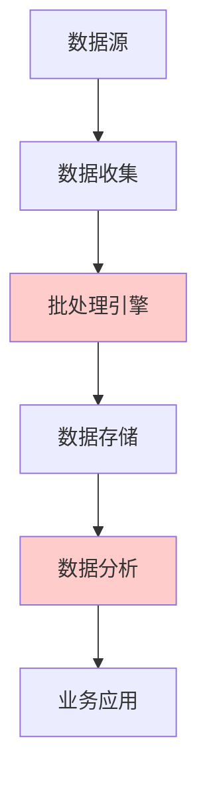
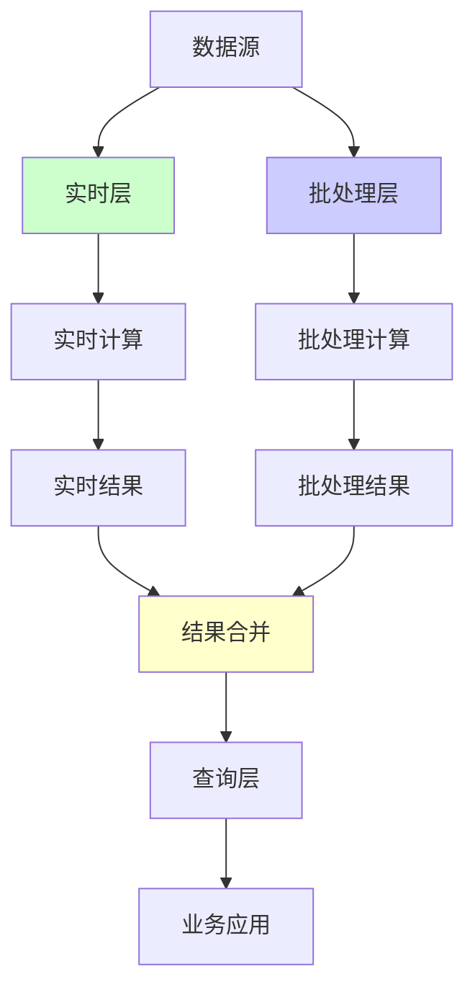
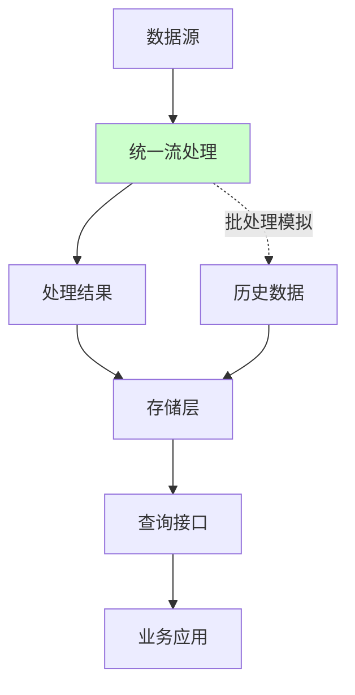

# 第11章：RabbitMQ与实时数据处理集成

## 章节概述

现代数据处理架构中，消息队列作为数据流转的核心基础设施，连接着各种实时处理组件。RabbitMQ作为成熟的企业级消息队列，在实时数据处理生态系统中扮演着重要角色。本章将深入探讨RabbitMQ与主流实时数据处理技术的集成方案，以及构建高性能实时数据平台的最佳实践。

## 目录

- [11.1 流式数据处理架构设计](#111-流式数据处理架构设计)
- [11.2 与主流流处理引擎集成](#112-与主流流处理引擎集成)
- [11.3 事件驱动架构模式](#113-事件驱动架构模式)
- [11.4 实时数据处理平台实战](#114-实时数据处理平台实战)
- [11.5 性能优化与扩展策略](#115-性能优化与扩展策略)

---

## 11.1 流式数据处理架构设计

### 11.1.1 现代数据处理架构演进

#### 传统批处理架构的挑战


**问题**：
- 高延迟：数据处理周期长
- 资源浪费：批处理空闲时资源闲置
- 实时性差：无法满足实时业务需求

#### Lambda架构的引入


**优势**：
- 同时支持实时和批处理
- 容错能力强
- 查询性能好

**劣势**：
- 架构复杂
- 维护成本高
- 数据一致性难以保证

#### Kappa架构的兴起


**特点**：
- 简化架构，只使用流处理
- 统一数据处理范式
- 更好的可维护性

### 11.1.2 RabbitMQ在实时架构中的角色

#### 数据流转中心
```python
# 数据流转示例
class DataFlowOrchestrator:
    def __init__(self):
        self.rabbitmq_config = {
            'host': 'localhost',
            'port': 5672,
            'username': 'admin',
            'password': 'admin',
            'virtual_host': '/realtime_data'
        }
        
    def setup_data_pipeline(self):
        """配置数据流转管道"""
        # 1. 数据源接入
        self.declare_ingestion_exchanges()
        
        # 2. 数据处理队列
        self.declare_processing_queues()
        
        # 3. 结果输出路由
        self.declare_output_routes()
        
    def declare_ingestion_exchanges(self):
        """声明数据接入交换器"""
        pass
        
    def declare_processing_queues(self):
        """声明数据处理队列"""
        pass
```

#### 消息规范化与清洗
```python
class MessageNormalizer:
    def __init__(self, rabbitmq_connector):
        self.rabbitmq = rabbitmq_connector
        
    def normalize_sensor_data(self, raw_message):
        """规范化传感器数据"""
        try:
            # 数据清洗
            cleaned_data = {
                'timestamp': self.normalize_timestamp(raw_message['ts']),
                'device_id': self.validate_device_id(raw_message['device']),
                'sensor_type': self.normalize_sensor_type(raw_message['type']),
                'value': self.validate_numeric_value(raw_message['value']),
                'unit': self.normalize_unit(raw_message['unit']),
                'quality': self.assess_data_quality(raw_message)
            }
            
            # 路由到相应的处理管道
            self.route_to_processing_pipeline(cleaned_data)
            
            return True
        except Exception as e:
            self.handle_normalization_error(raw_message, e)
            return False
```

### 11.1.3 流式处理设计模式

#### 背压处理模式
```python
class BackpressureManager:
    def __init__(self, rabbitmq_connector):
        self.rabbitmq = rabbitmq_connector
        self.metrics_collector = MetricsCollector()
        self.threshold_manager = ThresholdManager()
        
    def handle_backpressure(self, queue_name):
        """处理背压情况"""
        # 1. 监控队列积压
        queue_metrics = self.get_queue_metrics(queue_name)
        
        if queue_metrics['message_count'] > self.get_threshold(queue_name):
            # 2. 触发背压处理策略
            if queue_metrics['consumer_count'] < self.max_consumers:
                # 动态增加消费者
                self.scale_up_consumers(queue_name)
            else:
                # 启用流控机制
                self.enable_flow_control(queue_name)
                
    def enable_flow_control(self, queue_name):
        """启用流控机制"""
        # 设置队列流控参数
        flow_control_config = {
            'max_inflight_messages': 1000,
            'rate_limit': '100msg/sec',
            'priority_levels': {
                'critical': 10,
                'high': 7,
                'normal': 5,
                'low': 1
            }
        }
        
        self.rabbitmq.apply_flow_control(queue_name, flow_control_config)
```

#### 滑动窗口处理模式
```python
class SlidingWindowProcessor:
    def __init__(self, rabbitmq_connector, window_size='1m', slide_interval='10s'):
        self.rabbitmq = rabbitmq_connector
        self.window_size = window_size
        self.slide_interval = slide_interval
        self.window_buffer = defaultdict(list)
        self.aggregation_functions = {
            'avg': self.calculate_average,
            'sum': self.calculate_sum,
            'max': self.calculate_max,
            'min': self.calculate_min,
            'count': self.calculate_count
        }
        
    def process_window_data(self, message):
        """处理滑动窗口数据"""
        message_time = datetime.fromtimestamp(message['timestamp'])
        
        # 计算时间窗口
        current_window = self.get_current_window(message_time)
        
        # 添加数据到窗口缓冲区
        self.window_buffer[current_window].append(message)
        
        # 检查是否需要触发窗口计算
        if self.should_trigger_window_calculation(current_window):
            self.trigger_window_calculation(current_window)
            
    def calculate_window_metrics(self, window_data):
        """计算窗口指标"""
        metrics = {}
        
        for metric_name, values in self.extract_metrics(window_data).items():
            for agg_func in ['avg', 'sum', 'max', 'min', 'count']:
                key = f"{metric_name}_{agg_func}"
                metrics[key] = self.aggregation_functions[agg_func](values)
                
        return metrics
```

---

## 11.2 与主流流处理引擎集成

### 11.2.1 Apache Kafka vs RabbitMQ：选择与互补

#### 性能对比分析
| 特性 | RabbitMQ | Kafka | 适用场景 |
|------|----------|-------|----------|
| 吞吐量 | 中等 (万级/秒) | 高 (百万级/秒) | 极高性能要求选择Kafka |
| 延迟 | 低 (毫秒级) | 低 (毫秒级) | 两者都满足低延迟要求 |
| 消息保留 | 基于队列 TTL | 基于时间/大小 | 长期数据保留选择Kafka |
| 消费模式 | 队列模式 | 分区日志 | 点对点选择RabbitMQ，发布订阅选择Kafka |
| 事务支持 | AMQP事务 | 分布式事务 | 复杂事务选择RabbitMQ |
| 管理复杂度 | 低 | 中等 | 简单部署选择RabbitMQ |

#### 互补使用模式
```python
class HybridMessageSystem:
    def __init__(self):
        self.rabbitmq = RabbitMQConnector()
        self.kafka = KafkaConnector()
        
    def design_hybrid_architecture(self):
        """设计混合架构"""
        # 1. RabbitMQ负责：实时事务处理、工作队列、优先级消息
        real_time_exchanges = {
            'transaction_events': {'type': 'direct', 'priority': True},
            'task_queue': {'type': 'work', 'fair_dispatch': True},
            'notification_events': {'type': 'fanout', 'priority': False}
        }
        
        # 2. Kafka负责：事件流存储、批量处理、实时分析
        kafka_topics = {
            'user_behavior': {'partitions': 12, 'replication': 3},
            'system_metrics': {'partitions': 6, 'replication': 3},
            'business_events': {'partitions': 8, 'replication': 3}
        }
        
        return {
            'rabbitmq_exchanges': real_time_exchanges,
            'kafka_topics': kafka_topics
        }
        
    def route_message(self, message, message_type):
        """智能消息路由"""
        if message_type in ['transaction', 'task', 'notification']:
            # 实时性要求高的消息使用RabbitMQ
            return self.rabbitmq.publish(message)
        elif message_type in ['analytics', 'logging', 'audit']:
            # 大量数据流使用Kafka
            return self.kafka.send(message)
        else:
            # 根据消息特征智能路由
            return self.intelligent_routing(message)
```

### 11.2.2 Apache Flink集成

#### 事件时间处理
```python
from flink.table import StreamTableEnvironment
from flink.streaming.functions import ProcessFunction
import pika

class FlinkRabbitMQConnector:
    def __init__(self):
        self.rabbitmq_connection = self.create_rabbitmq_connection()
        self.table_env = StreamTableEnvironment.create(...)
        
    def setup_flink_rabbitmq_pipeline(self):
        """设置Flink-RabbitMQ处理管道"""
        
        # 1. 定义RabbitMQ数据源
        source_ddl = """
            CREATE TABLE rabbitmq_source (
                id STRING,
                timestamp TIMESTAMP(3),
                event_time AS TO_TIMESTAMP(FROM_UNIXTIME(timestamp/1000)),
                device_id STRING,
                temperature DOUBLE,
                humidity DOUBLE,
                WATERMARK FOR event_time AS event_time - INTERVAL '5' SECOND
            ) WITH (
                'connector' = 'rabbitmq',
                'hostname' = 'localhost',
                'port' = '5672',
                'username' = 'admin',
                'password' = 'admin',
                'virtual-host' = '/flink_data',
                'exchange-name' = 'sensor_data',
                'routing-key-pattern' = 'sensor.*',
                'format' = 'json'
            )
        """
        
        # 2. 执行DDL创建表
        self.table_env.execute_sql(source_ddl)
        
        # 3. 定义实时计算逻辑
        query = """
            SELECT 
                TUMBLE_START(event_time, INTERVAL '1' MINUTE) as window_start,
                device_id,
                AVG(temperature) as avg_temperature,
                MAX(temperature) as max_temperature,
                MIN(temperature) as min_temperature,
                AVG(humidity) as avg_humidity,
                COUNT(*) as message_count
            FROM rabbitmq_source
            GROUP BY 
                TUMBLE(event_time, INTERVAL '1' MINUTE),
                device_id
        """
        
        # 4. 执行查询
        result_table = self.table_env.sql_query(query)
        
        # 5. 输出到下游系统
        self.setup_sink_connectors(result_table)
        
    def setup_sink_connectors(self, result_table):
        """设置输出连接器"""
        
        # 输出到RabbitMQ
        rabbitmq_sink_ddl = """
            CREATE TABLE rabbitmq_sink (
                window_start TIMESTAMP(3),
                device_id STRING,
                avg_temperature DOUBLE,
                max_temperature DOUBLE,
                min_temperature DOUBLE,
                avg_humidity DOUBLE,
                message_count BIGINT
            ) WITH (
                'connector' = 'rabbitmq',
                'hostname' = 'localhost',
                'port' = '5672',
                'username' = 'admin',
                'password' = 'admin',
                'virtual-host' = '/flink_data',
                'exchange-name' = 'aggregated_metrics',
                'routing-key-pattern' = 'metrics.device.{device_id}',
                'format' = 'json'
            )
        """
        
        self.table_env.execute_sql(rabbitmq_sink_ddl)
        result_table.execute_insert("rabbitmq_sink")
```

#### 状态管理集成
```python
from flink.common.state import ValueStateDescriptor, ListStateDescriptor
from flink.common.functions import RichFlatMapFunction

class DeviceAggregationFunction(RichFlatMapFunction):
    def __init__(self):
        self.device_state = None
        self.window_state = None
        
    def open(self, config):
        # 设备状态管理
        device_state_descriptor = ValueStateDescriptor(
            "device_aggregated_state",
            Types.TUPLE([Types.DOUBLE(), Types.DOUBLE(), Types.INT()])
        )
        self.device_state = self.get_runtime_context().get_state(device_state_descriptor)
        
        # 滑动窗口状态管理
        window_state_descriptor = ListStateDescriptor(
            "sliding_window_state",
            Types.LONG()  # timestamp
        )
        self.window_state = self.get_runtime_context().get_list_state(window_state_descriptor)
        
    def flat_map(self, value, collector):
        current_time = value.timestamp
        device_id = value.device_id
        temperature = value.temperature
        
        # 更新设备状态
        current_device_state = self.device_state.value()
        if current_device_state is None:
            current_device_state = (temperature, temperature, 1)
        else:
            avg_temp, max_temp, count = current_device_state
            new_avg = (avg_temp * count + temperature) / (count + 1)
            new_max = max(max_temp, temperature)
            current_device_state = (new_avg, new_max, count + 1)
            
        self.device_state.update(current_device_state)
        
        # 维护滑动窗口
        self.maintain_sliding_window(current_time)
        
        # 输出聚合结果
        avg_temp, max_temp, count = current_device_state
        collector.collect({
            'device_id': device_id,
            'timestamp': current_time,
            'avg_temperature': avg_temp,
            'max_temperature': max_temp,
            'count': count,
            'window_size': self.get_window_size()
        })
        
    def maintain_sliding_window(self, current_time):
        """维护滑动窗口"""
        # 清理过期数据
        expire_time = current_time - 60000  # 1分钟窗口
        
        # 获取当前窗口数据
        current_window = list(self.window_state.get())
        
        # 添加新数据
        current_window.append(current_time)
        
        # 过滤有效数据
        valid_data = [t for t in current_window if t >= expire_time]
        
        # 更新窗口状态
        self.window_state.clear()
        for ts in valid_data:
            self.window_state.add(ts)
            
    def get_window_size(self):
        """获取窗口大小"""
        return len(list(self.window_state.get()))
```

### 11.2.3 Apache Spark Streaming集成

#### 批流一体化处理
```python
from pyspark.sql import SparkSession
from pyspark.sql.functions import *
from pyspark.sql.types import *
import pika
import json

class SparkRabbitMQIntegration:
    def __init__(self):
        self.spark = SparkSession.builder \
            .appName("RabbitMQ-Streaming") \
            .config("spark.sql.streaming.forceDeleteTempCheckpointLocation", "true") \
            .getOrCreate()
            
        self.rabbitmq_config = {
            'host': 'localhost',
            'port': 5672,
            'username': 'admin',
            'password': 'admin',
            'virtual_host': '/spark_data'
        }
        
    def create_streaming_dataframe(self):
        """创建流式DataFrame"""
        
        # 定义消息Schema
        message_schema = StructType([
            StructField("id", StringType(), True),
            StructField("timestamp", LongType(), True),
            StructField("device_id", StringType(), True),
            StructField("sensor_type", StringType(), True),
            StructField("value", DoubleType(), True),
            StructField("unit", StringType(), True)
        ])
        
        # 读取RabbitMQ流数据
        df = self.spark \
            .readStream \
            .format("rabbitmq") \
            .option("host", self.rabbitmq_config['host']) \
            .option("port", self.rabbitmq_config['port']) \
            .option("username", self.rabbitmq_config['username']) \
            .option("password", self.rabbitmq_config['password']) \
            .option("virtualHost", self.rabbitmq_config['virtual_host']) \
            .option("exchangeName", "sensor_data") \
            .option("routingKeyPattern", "sensor.*") \
            .option("schema", json.dumps(message_schema.jsonValue())) \
            .load()
            
        return df
        
    def create_batch_dataframe(self, batch_path):
        """创建批处理DataFrame"""
        
        batch_df = self.spark \
            .read \
            .format("parquet") \
            .load(batch_path)
            
        return batch_df
        
    def unified_processing_pipeline(self, stream_df, batch_df):
        """统一处理管道"""
        
        # 流式处理：实时聚合
        stream_processed = stream_df \
            .withWatermark("timestamp", "10 minutes") \
            .groupBy(
                window(col("timestamp"), "1 minute"),
                col("device_id"),
                col("sensor_type")
            ) \
            .agg(
                avg("value").alias("avg_value"),
                max("value").alias("max_value"),
                min("value").alias("min_value"),
                count("*").alias("count")
            )
            
        # 批处理：历史数据分析
        batch_processed = batch_df \
            .groupBy("device_id", "sensor_type") \
            .agg(
                avg("value").alias("historical_avg"),
                stddev("value").alias("historical_stddev")
            )
            
        # 流批结果合并
        unified_result = stream_processed.alias("stream") \
            .join(batch_processed.alias("batch"), 
                  ["device_id", "sensor_type"]) \
            .select(
                col("stream.window.start").alias("window_start"),
                col("stream.window.end").alias("window_end"),
                col("stream.device_id"),
                col("stream.sensor_type"),
                col("stream.avg_value"),
                col("stream.max_value"),
                col("stream.min_value"),
                col("stream.count"),
                col("batch.historical_avg"),
                col("batch.historical_stddev"),
                # 计算异常分数
                (abs(col("stream.avg_value") - col("batch.historical_avg")) / 
                 col("batch.historical_stddev")).alias("anomaly_score")
            )
            
        return unified_result
        
    def write_results(self, result_df):
        """写入处理结果"""
        
        # 写入RabbitMQ
        query = result_df \
            .writeStream \
            .outputMode("update") \
            .format("rabbitmq") \
            .option("host", self.rabbitmq_config['host']) \
            .option("port", self.rabbitmq_config['port']) \
            .option("username", self.rabbitmq_config['username']) \
            .option("password", self.rabbitmq_config['password']) \
            .option("virtualHost", self.rabbitmq_config['virtual_host']) \
            .option("exchangeName", "processed_metrics") \
            .option("routingKeyPattern", "metrics.{device_id}") \
            .trigger(processingTime='10 seconds') \
            .start()
            
        # 同时写入HDFS作为备份
        hdfs_query = result_df \
            .writeStream \
            .outputMode("append") \
            .format("parquet") \
            .option("path", "/data/processed_metrics") \
            .option("checkpointLocation", "/checkpoints/hdfs_sink") \
            .trigger(processingTime='30 seconds') \
            .start()
            
        return query, hdfs_query
```

---

## 11.3 事件驱动架构模式

### 11.3.1 事件溯源（Event Sourcing）

#### 基础事件存储
```python
from dataclasses import dataclass
from typing import Dict, List, Optional
from datetime import datetime
import json

@dataclass
class DomainEvent:
    event_id: str
    aggregate_id: str
    event_type: str
    event_data: Dict
    timestamp: datetime
    version: int
    metadata: Optional[Dict] = None

class EventStore:
    def __init__(self, rabbitmq_connector):
        self.rabbitmq = rabbitmq_connector
        self.event_stream_exchange = "event_store"
        self.command_queue = "command_queue"
        
    def save_event(self, event: DomainEvent):
        """保存事件到事件存储"""
        # 1. 持久化事件（这里模拟，实际应用中应保存到数据库）
        persisted_event = self.persist_event(event)
        
        # 2. 发布事件到事件流
        self.publish_event_to_stream(persisted_event)
        
        # 3. 触发事件处理
        self.trigger_event_processing(persisted_event)
        
        return persisted_event
        
    def publish_event_to_stream(self, event: DomainEvent):
        """发布事件到事件流"""
        routing_key = f"event.{event.aggregate_id}.{event.event_type}"
        
        message_properties = {
            'message_id': event.event_id,
            'timestamp': int(event.timestamp.timestamp()),
            'correlation_id': event.event_id,
            'headers': {
                'event_type': event.event_type,
                'aggregate_id': event.aggregate_id,
                'version': event.version
            }
        }
        
        self.rabbitmq.publish(
            exchange=self.event_stream_exchange,
            routing_key=routing_key,
            body=json.dumps(event.__dict__),
            properties=message_properties
        )
        
    def get_events_for_aggregate(self, aggregate_id: str, from_version: int = 0) -> List[DomainEvent]:
        """获取聚合的事件列表"""
        # 从事件存储中查询事件
        return self.query_events_from_storage(aggregate_id, from_version)
        
    def replay_events(self, aggregate_id: str, target_version: int):
        """重放事件构建聚合状态"""
        events = self.get_events_for_aggregate(aggregate_id)
        
        # 按版本排序
        events.sort(key=lambda x: x.version)
        
        # 重放到指定版本
        filtered_events = [e for e in events if e.version <= target_version]
        
        return filtered_events
```

#### 聚合根实现
```python
from abc import ABC, abstractmethod
from typing import List, Type

class AggregateRoot(ABC):
    def __init__(self, aggregate_id: str):
        self.aggregate_id = aggregate_id
        self.version = 0
        self._pending_events: List[DomainEvent] = []
        
    def mark_event_as_applied(self, event: DomainEvent):
        """标记事件已应用"""
        self.version = event.version
        self.apply_event(event)
        
    @abstractmethod
    def apply_event(self, event: DomainEvent):
        """应用事件到聚合状态"""
        pass
        
    def add_event(self, event: DomainEvent):
        """添加待处理事件"""
        self._pending_events.append(event)
        
    def get_pending_events(self) -> List[DomainEvent]:
        """获取待处理事件"""
        return self._pending_events.copy()
        
    def clear_pending_events(self):
        """清空待处理事件"""
        self._pending_events.clear()

class OrderAggregate(AggregateRoot):
    def __init__(self, order_id: str):
        super().__init__(order_id)
        self.status = "PENDING"
        self.total_amount = 0.0
        self.items: List[Dict] = []
        self.customer_id: Optional[str] = None
        
    def create_order(self, customer_id: str, items: List[Dict]):
        """创建订单"""
        if self.status != "PENDING":
            raise ValueError("Order already created")
            
        event = DomainEvent(
            event_id=self.generate_event_id(),
            aggregate_id=self.aggregate_id,
            event_type="OrderCreated",
            event_data={
                'customer_id': customer_id,
                'items': items,
                'total_amount': sum(item['price'] * item['quantity'] for item in items)
            },
            timestamp=datetime.now(),
            version=self.version + 1
        )
        
        self.add_event(event)
        
    def add_item(self, item: Dict, quantity: int = 1):
        """添加订单项"""
        if self.status != "PENDING":
            raise ValueError("Cannot add items to confirmed order")
            
        event = DomainEvent(
            event_id=self.generate_event_id(),
            aggregate_id=self.aggregate_id,
            event_type="OrderItemAdded",
            event_data={
                'item': item,
                'quantity': quantity,
                'new_total': self.total_amount + item['price'] * quantity
            },
            timestamp=datetime.now(),
            version=self.version + 1
        )
        
        self.add_event(event)
        
    def confirm_order(self):
        """确认订单"""
        if self.status != "PENDING":
            raise ValueError("Order not in pending state")
            
        event = DomainEvent(
            event_id=self.generate_event_id(),
            aggregate_id=self.aggregate_id,
            event_type="OrderConfirmed",
            event_data={'total_amount': self.total_amount},
            timestamp=datetime.now(),
            version=self.version + 1
        )
        
        self.add_event(event)
        
    def apply_event(self, event: DomainEvent):
        """应用事件到订单状态"""
        if event.event_type == "OrderCreated":
            self.status = "PENDING"
            self.customer_id = event.event_data['customer_id']
            self.items = event.event_data['items']
            self.total_amount = event.event_data['total_amount']
            
        elif event.event_type == "OrderItemAdded":
            self.items.append(event.event_data['item'])
            self.total_amount = event.event_data['new_total']
            
        elif event.event_type == "OrderConfirmed":
            self.status = "CONFIRMED"
            
    def generate_event_id(self) -> str:
        """生成事件ID"""
        import uuid
        return str(uuid.uuid4())
```

### 11.3.2 CQRS（命令查询责任分离）

#### 命令处理
```python
from abc import ABC, abstractmethod
from enum import Enum
from dataclasses import dataclass

class CommandType(Enum):
    CREATE_ORDER = "create_order"
    ADD_ITEM = "add_item"
    CONFIRM_ORDER = "confirm_order"
    CANCEL_ORDER = "cancel_order"

@dataclass
class Command:
    command_id: str
    command_type: CommandType
    aggregate_id: str
    command_data: Dict
    timestamp: datetime
    
class CommandHandler(ABC):
    @abstractmethod
    async def handle(self, command: Command) -> Dict:
        pass

class OrderCommandHandler(CommandHandler):
    def __init__(self, event_store: EventStore, rabbitmq_connector):
        self.event_store = event_store
        self.rabbitmq = rabbitmq_connector
        self.command_queue = "command_queue"
        
    async def handle(self, command: Command) -> Dict:
        """处理订单命令"""
        try:
            # 1. 验证命令
            await self.validate_command(command)
            
            # 2. 加载聚合状态
            aggregate = await self.load_aggregate(command.aggregate_id)
            
            # 3. 执行命令逻辑
            result = await self.execute_command(aggregate, command)
            
            # 4. 保存状态变更
            await self.save_aggregate_changes(aggregate)
            
            return {
                'status': 'success',
                'command_id': command.command_id,
                'result': result
            }
            
        except Exception as e:
            return {
                'status': 'error',
                'command_id': command.command_id,
                'error': str(e)
            }
            
    async def execute_command(self, aggregate: OrderAggregate, command: Command) -> Dict:
        """执行具体命令"""
        if command.command_type == CommandType.CREATE_ORDER:
            aggregate.create_order(
                customer_id=command.command_data['customer_id'],
                items=command.command_data['items']
            )
            return {'status': 'created', 'order_id': aggregate.aggregate_id}
            
        elif command.command_type == CommandType.ADD_ITEM:
            aggregate.add_item(
                item=command.command_data['item'],
                quantity=command.command_data.get('quantity', 1)
            )
            return {'status': 'item_added', 'total_amount': aggregate.total_amount}
            
        elif command.command_type == CommandType.CONFIRM_ORDER:
            aggregate.confirm_order()
            return {'status': 'confirmed', 'total_amount': aggregate.total_amount}
            
        else:
            raise ValueError(f"Unknown command type: {command.command_type}")
            
    async def load_aggregate(self, aggregate_id: str) -> OrderAggregate:
        """加载聚合状态"""
        aggregate = OrderAggregate(aggregate_id)
        
        # 加载事件历史
        events = self.event_store.get_events_for_aggregate(aggregate_id)
        
        # 重放事件
        for event in events:
            aggregate.mark_event_as_applied(event)
            
        return aggregate
        
    async def save_aggregate_changes(self, aggregate: OrderAggregate):
        """保存聚合状态变更"""
        pending_events = aggregate.get_pending_events()
        
        for event in pending_events:
            # 保存事件
            self.event_store.save_event(event)
            
        # 清空待处理事件
        aggregate.clear_pending_events()
```

#### 查询处理
```python
from typing import List, Optional

@dataclass
class Query:
    query_id: str
    query_type: str
    query_data: Dict
    
@dataclass
class QueryResult:
    query_id: str
    status: str
    data: Optional[Dict] = None
    error: Optional[str] = None

class QueryHandler(ABC):
    @abstractmethod
    async def handle(self, query: Query) -> QueryResult:
        pass

class OrderQueryHandler(QueryHandler):
    def __init__(self, read_model_database, rabbitmq_connector):
        self.read_db = read_model_database
        self.rabbitmq = rabbitmq_connector
        
    async def handle(self, query: Query) -> QueryResult:
        """处理订单查询"""
        try:
            if query.query_type == "get_order_by_id":
                result = await self.get_order_by_id(query.query_data['order_id'])
                
            elif query.query_type == "get_orders_by_customer":
                result = await self.get_orders_by_customer(query.query_data['customer_id'])
                
            elif query.query_type == "get_order_statistics":
                result = await self.get_order_statistics(query.query_data)
                
            else:
                raise ValueError(f"Unknown query type: {query.query_type}")
                
            return QueryResult(
                query_id=query.query_id,
                status='success',
                data=result
            )
            
        except Exception as e:
            return QueryResult(
                query_id=query.query_id,
                status='error',
                error=str(e)
            )
            
    async def get_order_by_id(self, order_id: str) -> Optional[Dict]:
        """根据ID查询订单"""
        # 查询读模型数据库
        query = "SELECT * FROM order_read_model WHERE order_id = %s"
        result = await self.read_db.fetch_one(query, (order_id,))
        
        if result:
            return {
                'order_id': result['order_id'],
                'customer_id': result['customer_id'],
                'status': result['status'],
                'total_amount': result['total_amount'],
                'items': json.loads(result['items']),
                'created_at': result['created_at'],
                'updated_at': result['updated_at']
            }
        
        return None
        
    async def get_orders_by_customer(self, customer_id: str, limit: int = 100) -> List[Dict]:
        """根据客户ID查询订单列表"""
        query = """
            SELECT order_id, status, total_amount, created_at
            FROM order_read_model 
            WHERE customer_id = %s 
            ORDER BY created_at DESC 
            LIMIT %s
        """
        
        results = await self.read_db.fetch_all(query, (customer_id, limit))
        
        return [
            {
                'order_id': row['order_id'],
                'status': row['status'],
                'total_amount': float(row['total_amount']),
                'created_at': row['created_at']
            }
            for row in results
        ]
        
    async def get_order_statistics(self, criteria: Dict) -> Dict:
        """获取订单统计信息"""
        # 实时统计查询
        stats_query = await self.calculate_real_time_stats(criteria)
        
        # 从消息队列获取实时指标
        real_time_metrics = await self.get_real_time_metrics()
        
        return {
            'real_time_stats': stats_query,
            'live_metrics': real_time_metrics,
            'generated_at': datetime.now().isoformat()
        }
        
    async def calculate_real_time_stats(self, criteria: Dict) -> Dict:
        """计算实时统计"""
        # 这里可以结合RabbitMQ进行实时数据统计
        pass
        
    async def get_real_time_metrics(self) -> Dict:
        """从RabbitMQ获取实时指标"""
        # 订阅实时指标主题
        return {}
```

### 11.3.3 事件驱动微服务

#### 服务间事件通信
```python
class EventDrivenMicroservice:
    def __init__(self, service_name: str, rabbitmq_connector):
        self.service_name = service_name
        self.rabbitmq = rabbitmq_connector
        self.event_handlers = {}
        self.setup_event_listeners()
        
    def setup_event_listeners(self):
        """设置事件监听器"""
        # 订阅相关事件
        relevant_events = [
            f"user.*.{self.service_name}",
            f"order.*.{self.service_name}",
            f"payment.*.{self.service_name}"
        ]
        
        for event_pattern in relevant_events:
            self.rabbitmq.consume(
                queue=f"{self.service_name}_{event_pattern}",
                exchange="service_events",
                routing_key=event_pattern,
                callback=self.handle_event
            )
            
    def handle_event(self, channel, method, properties, body):
        """统一事件处理器"""
        try:
            event_data = json.loads(body)
            event_type = properties.headers.get('event_type')
            
            if event_type in self.event_handlers:
                self.event_handlers[event_type](event_data)
            else:
                self.log_unhandled_event(event_type, event_data)
                
        except Exception as e:
            self.handle_event_error(event_data, e)
            
    def register_event_handler(self, event_type: str, handler_func):
        """注册事件处理器"""
        self.event_handlers[event_type] = handler_func
        
    def publish_event(self, event_type: str, event_data: Dict, correlation_id: str = None):
        """发布事件"""
        routing_key = f"{self.service_name}.{event_type}"
        
        message_properties = {
            'message_id': str(uuid.uuid4()),
            'timestamp': int(datetime.now().timestamp()),
            'correlation_id': correlation_id,
            'headers': {
                'event_type': event_type,
                'source_service': self.service_name,
                'timestamp': int(datetime.now().timestamp())
            }
        }
        
        self.rabbitmq.publish(
            exchange="service_events",
            routing_key=routing_key,
            body=json.dumps(event_data),
            properties=message_properties
        )

class InventoryService(EventDrivenMicroservice):
    def __init__(self):
        super().__init__("inventory", self.create_rabbitmq_connection())
        self.inventory_db = InventoryDatabase()
        self.register_event_handlers()
        
    def register_event_handlers(self):
        """注册事件处理器"""
        self.register_event_handler("OrderCreated", self.handle_order_created)
        self.register_event_handler("OrderCancelled", self.handle_order_cancelled)
        self.register_event_handler("ProductUpdated", self.handle_product_updated)
        
    async def handle_order_created(self, event_data: Dict):
        """处理订单创建事件"""
        order_id = event_data['order_id']
        items = event_data['items']
        
        # 预留库存
        for item in items:
            product_id = item['product_id']
            quantity = item['quantity']
            
            await self.reserve_inventory(product_id, quantity, order_id)
            
    async def handle_order_cancelled(self, event_data: Dict):
        """处理订单取消事件"""
        order_id = event_data['order_id']
        
        # 释放预留库存
        await self.release_reserved_inventory(order_id)
        
    async def reserve_inventory(self, product_id: str, quantity: int, order_id: str):
        """预留库存"""
        try:
            # 更新库存状态
            await self.inventory_db.reserve_product(product_id, quantity, order_id)
            
            # 发布库存预留事件
            self.publish_event("InventoryReserved", {
                'product_id': product_id,
                'quantity': quantity,
                'order_id': order_id,
                'reserved_at': datetime.now().isoformat()
            })
            
        except Exception as e:
            # 发布库存不足事件
            self.publish_event("InventoryShortage", {
                'product_id': product_id,
                'requested_quantity': quantity,
                'order_id': order_id,
                'error': str(e)
            })
```

---

## 11.4 实时数据处理平台实战

### 11.4.1 平台架构设计

#### 整体架构
```python
class RealtimeDataPlatform:
    def __init__(self):
        self.components = {
            'data_ingestion': DataIngestionLayer(),
            'data_processing': DataProcessingLayer(),
            'data_storage': DataStorageLayer(),
            'data_serving': DataServingLayer(),
            'monitoring': MonitoringLayer(),
            'orchestration': OrchestrationLayer()
        }
        
    def initialize_platform(self):
        """初始化平台"""
        # 1. 初始化数据接入层
        self.setup_data_ingestion()
        
        # 2. 初始化数据处理层
        self.setup_data_processing()
        
        # 3. 初始化数据存储层
        self.setup_data_storage()
        
        # 4. 初始化数据服务层
        self.setup_data_serving()
        
        # 5. 初始化监控层
        self.setup_monitoring()
        
        # 6. 初始化编排层
        self.setup_orchestration()
        
    def setup_data_ingestion(self):
        """设置数据接入层"""
        ingestion_config = {
            'rabbitmq': {
                'exchanges': {
                    'sensor_data': {'type': 'topic', 'durable': True},
                    'user_events': {'type': 'fanout', 'durable': True},
                    'system_metrics': {'type': 'direct', 'durable': True}
                },
                'queues': {
                    'raw_data_queue': {
                        'durable': True,
                        'arguments': {
                            'x-message-ttl': 3600000,  # 1小时
                            'x-dead-letter-exchange': 'dead_letter_exchange'
                        }
                    }
                }
            },
            'kafka': {
                'topics': {
                    'iot_sensors': {'partitions': 12, 'replication': 3},
                    'clickstream': {'partitions': 6, 'replication': 3}
                }
            }
        }
        
        self.components['data_ingestion'].configure(ingestion_config)

class DataIngestionLayer:
    def __init__(self):
        self.rabbitmq_connector = RabbitMQConnector()
        self.kafka_connector = KafkaConnector()
        self.dataValidators = []
        self.dataTransformers = []
        
    def add_data_validator(self, validator):
        """添加数据验证器"""
        self.dataValidators.append(validator)
        
    def add_data_transformer(self, transformer):
        """添加数据转换器"""
        self.dataTransformers.append(transformer)
        
    def process_raw_data(self, raw_message):
        """处理原始数据"""
        try:
            # 1. 数据验证
            for validator in self.dataValidators:
                if not validator.validate(raw_message):
                    raise ValidationError(f"Validation failed by {validator.__class__.__name__}")
                    
            # 2. 数据转换
            transformed_data = raw_message
            for transformer in self.dataTransformers:
                transformed_data = transformer.transform(transformed_data)
                
            # 3. 路由到处理管道
            self.route_to_processing_pipeline(transformed_data)
            
            return True
            
        except Exception as e:
            # 发送到死信队列
            self.send_to_dead_letter_queue(raw_message, e)
            return False
            
    def route_to_processing_pipeline(self, data):
        """路由到处理管道"""
        # 根据数据类型路由
        if data.get('data_type') == 'sensor':
            self.rabbitmq_connector.publish('sensor_processing_queue', data)
        elif data.get('data_type') == 'event':
            self.kafka_connector.send('user_events', data)
        else:
            self.rabbitmq_connector.publish('general_processing_queue', data)
```

#### 数据处理流水线
```python
class DataProcessingPipeline:
    def __init__(self, platform: RealtimeDataPlatform):
        self.platform = platform
        self.processors = []
        self.aggregation_functions = {}
        self.enrichment_services = {}
        
    def add_processor(self, processor):
        """添加处理器"""
        self.processors.append(processor)
        
    def add_aggregation_function(self, window_type, func):
        """添加聚合函数"""
        self.aggregation_functions[window_type] = func
        
    def add_enrichment_service(self, service_name, service):
        """添加数据丰富服务"""
        self.enrichment_services[service_name] = service
        
    def execute_processing_pipeline(self, input_data):
        """执行处理流水线"""
        processed_data = input_data
        
        # 1. 数据丰富
        enriched_data = self.enrich_data(processed_data)
        
        # 2. 数据清洗
        cleaned_data = self.clean_data(enriched_data)
        
        # 3. 数据转换
        transformed_data = self.transform_data(cleaned_data)
        
        # 4. 数据聚合
        aggregated_data = self.aggregate_data(transformed_data)
        
        # 5. 业务逻辑处理
        processed_data = self.apply_business_logic(aggregated_data)
        
        return processed_data
        
    def enrich_data(self, data):
        """数据丰富"""
        enriched_data = data.copy()
        
        # 地理位置丰富
        if 'ip_address' in data:
            geo_info = self.enrichment_services['geolocation'].lookup(data['ip_address'])
            enriched_data['geolocation'] = geo_info
            
        # 用户画像丰富
        if 'user_id' in data:
            user_profile = self.enrichment_services['user_profile'].get_profile(data['user_id'])
            enriched_data['user_profile'] = user_profile
            
        return enriched_data
        
    def clean_data(self, data):
        """数据清洗"""
        cleaned_data = {}
        
        # 移除空值和无效数据
        for key, value in data.items():
            if value is not None and value != '':
                # 数据类型转换和验证
                cleaned_value = self.validate_and_convert_type(key, value)
                if cleaned_value is not None:
                    cleaned_data[key] = cleaned_value
                    
        return cleaned_data
        
    def aggregate_data(self, data):
        """数据聚合"""
        if 'timestamp' not in data:
            return data
            
        timestamp = data['timestamp']
        window_key = self.get_window_key(timestamp)
        
        # 检查是否需要触发聚合
        if self.should_trigger_aggregation(window_key):
            return self.trigger_window_aggregation(window_key)
        else:
            # 增量更新
            self.update_incremental_aggregation(window_key, data)
            return None
            
    def get_window_key(self, timestamp):
        """获取时间窗口键"""
        # 1分钟窗口
        window_start = timestamp - (timestamp % 60000)
        return f"window_{window_start}"
        
    def should_trigger_aggregation(self, window_key):
        """检查是否应该触发聚合"""
        # 实现窗口关闭逻辑
        current_time = int(time.time() * 1000)
        window_start = int(window_key.split('_')[1])
        
        # 窗口关闭条件：窗口结束时间 + 延迟时间
        return current_time > (window_start + 60000 + 5000)  # 1分钟窗口 + 5秒延迟
        
    def trigger_window_aggregation(self, window_key):
        """触发窗口聚合"""
        window_data = self.get_window_data(window_key)
        
        # 执行聚合计算
        aggregated_result = {}
        for metric_name, values in window_data.items():
            if metric_name in self.aggregation_functions:
                aggregated_result[metric_name] = self.aggregation_functions[metric_name](values)
                
        # 添加窗口信息
        aggregated_result['window_start'] = int(window_key.split('_')[1])
        aggregated_result['window_end'] = aggregated_result['window_start'] + 60000
        aggregated_result['record_count'] = sum(len(v) for v in window_data.values())
        
        return aggregated_result
```

### 11.4.2 监控与运维

#### 实时监控指标
```python
class RealtimePlatformMonitor:
    def __init__(self, rabbitmq_connector):
        self.rabbitmq = rabbitmq_connector
        self.metrics_collector = MetricsCollector()
        self.alert_manager = AlertManager()
        self.dashboard = MonitoringDashboard()
        
    def collect_platform_metrics(self):
        """收集平台指标"""
        metrics = {
            # 数据接入指标
            'ingestion_rate': self.get_ingestion_rate(),
            'ingestion_latency': self.get_ingestion_latency(),
            'data_quality_score': self.get_data_quality_score(),
            
            # 数据处理指标
            'processing_rate': self.get_processing_rate(),
            'processing_latency': self.get_processing_latency(),
            'error_rate': self.get_error_rate(),
            
            # 存储指标
            'storage_utilization': self.get_storage_utilization(),
            'query_performance': self.get_query_performance(),
            
            # 资源指标
            'cpu_utilization': self.get_cpu_utilization(),
            'memory_utilization': self.get_memory_utilization(),
            'network_throughput': self.get_network_throughput()
        }
        
        return metrics
        
    def setup_real_time_monitoring(self):
        """设置实时监控"""
        # 1. 定期收集系统指标
        self.schedule_metrics_collection(interval=10)  # 每10秒
        
        # 2. 设置告警规则
        self.setup_alert_rules()
        
        # 3. 启动监控面板
        self.start_monitoring_dashboard()
        
    def setup_alert_rules(self):
        """设置告警规则"""
        alert_rules = [
            {
                'name': 'high_processing_latency',
                'condition': 'processing_latency > 1000',
                'severity': 'warning',
                'action': self.handle_high_latency
            },
            {
                'name': 'low_data_quality',
                'condition': 'data_quality_score < 0.8',
                'severity': 'critical',
                'action': self.handle_low_data_quality
            },
            {
                'name': 'high_error_rate',
                'condition': 'error_rate > 0.05',
                'severity': 'critical',
                'action': self.handle_high_error_rate
            },
            {
                'name': 'resource_exhaustion',
                'condition': 'cpu_utilization > 0.9 or memory_utilization > 0.9',
                'severity': 'critical',
                'action': self.handle_resource_exhaustion
            }
        ]
        
        for rule in alert_rules:
            self.alert_manager.add_rule(rule)
            
    def handle_high_latency(self, metric_data):
        """处理高延迟告警"""
        # 1. 分析延迟原因
        latency_analysis = self.analyze_latency_root_cause()
        
        # 2. 自动扩缩容
        if latency_analysis['bottleneck'] == 'processing_capacity':
            self.trigger_auto_scaling('processing', scale_up=True)
            
        # 3. 发送通知
        self.send_alert_notification('high_latency', {
            'current_latency': metric_data['processing_latency'],
            'analysis': latency_analysis,
            'action_taken': 'auto_scaling_triggered'
        })
        
    def analyze_latency_root_cause(self) -> Dict:
        """分析延迟根本原因"""
        analysis = {
            'bottleneck': 'unknown',
            'contributing_factors': [],
            'recommendations': []
        }
        
        # 检查各个组件的延迟
        component_latencies = {
            'ingestion': self.get_ingestion_latency(),
            'processing': self.get_processing_latency(),
            'storage': self.get_storage_latency(),
            'query': self.get_query_latency()
        }
        
        # 找出瓶颈
        max_latency_component = max(component_latencies, key=component_latencies.get)
        analysis['bottleneck'] = max_latency_component
        
        # 分析原因
        if max_latency_component == 'processing':
            if self.get_queue_size('processing_queue') > 1000:
                analysis['contributing_factors'].append('Queue backlog')
            if self.get_cpu_utilization() > 0.8:
                analysis['contributing_factors'].append('CPU bottleneck')
                
        elif max_latency_component == 'storage':
            if self.get_storage_utilization() > 0.9:
                analysis['contributing_factors'].append('Storage saturation')
                
        return analysis
```

---

## 11.5 性能优化与扩展策略

### 11.5.1 吞吐量优化

#### 批量处理优化
```python
class BatchProcessor:
    def __init__(self, rabbitmq_connector, batch_size=100, flush_interval=5):
        self.rabbitmq = rabbitmq_connector
        self.batch_size = batch_size
        self.flush_interval = flush_interval
        self.current_batch = []
        self.last_flush_time = time.time()
        
    def add_message(self, message):
        """添加消息到批次"""
        self.current_batch.append(message)
        
        # 检查是否需要刷新批次
        if (len(self.current_batch) >= self.batch_size or 
            time.time() - self.last_flush_time > self.flush_interval):
            self.flush_batch()
            
    def flush_batch(self):
        """刷新批次"""
        if not self.current_batch:
            return
            
        try:
            # 批量处理
            self.process_batch(self.current_batch)
            
            # 批量确认
            self.batch_ack()
            
        except Exception as e:
            # 批量拒绝
            self.batch_nack(e)
            
        finally:
            self.current_batch = []
            self.last_flush_time = time.time()
            
    def process_batch(self, batch):
        """处理批次"""
        # 转换为批量处理格式
        processed_batch = []
        for message in batch:
            processed_message = self.process_single_message(message)
            processed_batch.append(processed_message)
            
        # 批量输出
        self.output_batch(processed_batch)
        
    def output_batch(self, processed_batch):
        """批量输出"""
        for message in processed_batch:
            self.rabbitmq.publish(
                exchange='processed_data',
                routing_key=f"processed.{message['type']}",
                body=json.dumps(message)
            )
```

#### 并行处理优化
```python
import asyncio
from concurrent.futures import ThreadPoolExecutor
from queue import Queue
import threading

class ParallelProcessor:
    def __init__(self, rabbitmq_connector, max_workers=10):
        self.rabbitmq = rabbitmq_connector
        self.max_workers = max_workers
        self.message_queue = Queue(maxsize=1000)
        self.result_queue = Queue()
        self.executor = ThreadPoolExecutor(max_workers=max_workers)
        self.is_running = False
        
    def start_processing(self):
        """启动并行处理"""
        self.is_running = True
        
        # 启动工作线程
        for i in range(self.max_workers):
            thread = threading.Thread(target=self.worker_thread, args=(i,))
            thread.daemon = True
            thread.start()
            
        # 启动结果处理线程
        result_thread = threading.Thread(target=self.result_handler)
        result_thread.daemon = True
        result_thread.start()
        
    def worker_thread(self, worker_id):
        """工作线程"""
        while self.is_running:
            try:
                # 从消息队列获取消息
                message = self.message_queue.get(timeout=1)
                
                # 处理消息
                result = self.process_message(message)
                
                # 发送到结果队列
                self.result_queue.put(result)
                
            except Exception as e:
                self.handle_worker_error(worker_id, e)
            finally:
                self.message_queue.task_done()
                
    def process_message(self, message):
        """处理单个消息"""
        # 模拟CPU密集型处理
        processed_data = {
            'original_message': message,
            'processed_at': datetime.now().isoformat(),
            'worker_id': threading.current_thread().ident
        }
        
        # 一些计算密集的操作
        time.sleep(0.1)  # 模拟处理时间
        
        return processed_data
        
    def add_messages(self, messages):
        """添加消息到处理队列"""
        for message in messages:
            self.message_queue.put(message)
            
    def get_results(self, timeout=None):
        """获取处理结果"""
        results = []
        try:
            while True:
                result = self.result_queue.get_nowait()
                results.append(result)
        except:
            pass
        return results
```

### 11.5.2 水平扩展策略

#### 动态负载均衡
```python
class DynamicLoadBalancer:
    def __init__(self, rabbitmq_connector):
        self.rabbitmq = rabbitmq_connector
        self.worker_pools = {}
        self.load_metrics = {}
        self.scaling_policies = {}
        
    def register_worker_pool(self, pool_name, worker_config):
        """注册工作池"""
        self.worker_pools[pool_name] = {
            'workers': [],
            'config': worker_config,
            'current_load': 0,
            'max_capacity': worker_config['max_workers'],
            'min_capacity': worker_config['min_workers']
        }
        
    def route_message(self, message, routing_strategy='least_loaded'):
        """消息路由"""
        if routing_strategy == 'least_loaded':
            return self.route_to_least_loaded(message)
        elif routing_strategy == 'round_robin':
            return self.route_round_robin(message)
        elif routing_strategy == 'weighted':
            return self.route_weighted(message)
        else:
            raise ValueError(f"Unknown routing strategy: {routing_strategy}")
            
    def route_to_least_loaded(self, message):
        """路由到负载最轻的工作池"""
        best_pool = min(self.worker_pools.keys(), 
                       key=lambda x: self.worker_pools[x]['current_load'])
        
        return self.send_to_pool(best_pool, message)
        
    def route_round_robin(self, message):
        """轮询路由"""
        pool_names = list(self.worker_pools.keys())
        if not hasattr(self, '_rr_counter'):
            self._rr_counter = 0
            
        target_pool = pool_names[self._rr_counter % len(pool_names)]
        self._rr_counter += 1
        
        return self.send_to_pool(target_pool, message)
        
    def send_to_pool(self, pool_name, message):
        """发送消息到指定工作池"""
        pool = self.worker_pools[pool_name]
        
        # 选择具体的工作节点
        worker = self.select_worker(pool)
        
        # 发送消息
        routing_key = f"{pool_name}.{worker['id']}"
        
        self.rabbitmq.publish(
            exchange='worker_routing',
            routing_key=routing_key,
            body=json.dumps(message),
            properties={
                'headers': {
                    'target_pool': pool_name,
                    'worker_id': worker['id']
                }
            }
        )
        
        # 更新负载统计
        pool['current_load'] += 1
        
        return True
        
    def select_worker(self, pool):
        """选择工作节点"""
        available_workers = [w for w in pool['workers'] if not w['busy']]
        if not available_workers:
            # 所有工作节点都忙，选择负载最轻的
            return min(pool['workers'], key=lambda x: x['current_load'])
            
        return available_workers[0]
        
    def auto_scale_pools(self):
        """自动扩缩容工作池"""
        for pool_name, pool in self.worker_pools.items():
            current_load = pool['current_load']
            max_capacity = pool['max_capacity']
            min_capacity = pool['min_capacity']
            
            # 计算是否需要扩容
            if current_load > max_capacity * 0.8:  # 负载超过80%
                self.scale_up_pool(pool_name)
            elif current_load < max_capacity * 0.2:  # 负载低于20%
                self.scale_down_pool(pool_name)
                
    def scale_up_pool(self, pool_name):
        """扩容工作池"""
        pool = self.worker_pools[pool_name]
        current_workers = len(pool['workers'])
        
        if current_workers < pool['max_capacity']:
            new_worker_count = min(
                current_workers + 2,  # 每次扩容2个
                pool['max_capacity']
            )
            
            # 添加新的工作节点
            for i in range(current_workers, new_worker_count):
                worker_id = f"{pool_name}_worker_{i}"
                worker_info = {
                    'id': worker_id,
                    'busy': False,
                    'current_load': 0,
                    'created_at': datetime.now()
                }
                pool['workers'].append(worker_info)
                
            # 通知新的工作节点
            self.notify_new_workers(pool_name, current_workers, new_worker_count)
            
    def scale_down_pool(self, pool_name):
        """缩容工作池"""
        pool = self.worker_pools[pool_name]
        current_workers = len(pool['workers'])
        
        if current_workers > pool['min_capacity']:
            # 找到负载最轻的工作节点进行缩容
            workers_to_remove = sorted(
                [w for w in pool['workers'] if w['current_load'] == 0],
                key=lambda x: x['created_at']
            )
            
            if workers_to_remove:
                worker_to_remove = workers_to_remove[0]
                pool['workers'].remove(worker_to_remove)
                
                # 通知工作节点下线
                self.notify_worker_shutdown(pool_name, worker_to_remove['id'])
```

### 11.5.3 缓存与数据分层

#### 多级缓存策略
```python
class MultiLevelCache:
    def __init__(self):
        self.l1_cache = {}  # 内存缓存
        self.l2_cache = RedisCache()  # Redis缓存
        self.l3_cache = RabbitMQCache()  # 消息队列缓存
        self.cache_strategies = {
            'real_time': {'ttl': 60, 'levels': ['l1', 'l2']},
            'aggregated': {'ttl': 300, 'levels': ['l2', 'l3']},
            'historical': {'ttl': 3600, 'levels': ['l3']}
        }
        
    def get(self, key, cache_type='real_time'):
        """获取缓存数据"""
        strategy = self.cache_strategies[cache_type]
        
        for level in strategy['levels']:
            try:
                value = self.get_from_level(level, key)
                if value is not None:
                    # 缓存命中，提升到更高优先级缓存
                    self.promote_to_higher_level(level, key, value)
                    return value
            except Exception as e:
                self.log_cache_error(level, key, e)
                
        return None
        
    def set(self, key, value, cache_type='real_time'):
        """设置缓存数据"""
        strategy = self.cache_strategies[cache_type]
        
        for level in strategy['levels']:
            try:
                self.set_to_level(level, key, value, strategy['ttl'])
            except Exception as e:
                self.log_cache_error(level, key, e)
                
    def get_from_level(self, level, key):
        """从指定级别获取缓存"""
        if level == 'l1':
            return self.l1_cache.get(key)
        elif level == 'l2':
            return self.l2_cache.get(key)
        elif level == 'l3':
            return self.l3_cache.get(key)
        else:
            raise ValueError(f"Unknown cache level: {level}")
            
    def set_to_level(self, level, key, value, ttl):
        """设置指定级别缓存"""
        if level == 'l1':
            self.l1_cache[key] = value
            # L1缓存使用定时清理
            threading.Timer(ttl, lambda: self.l1_cache.pop(key, None)).start()
            
        elif level == 'l2':
            self.l2_cache.set(key, value, ttl)
            
        elif level == 'l3':
            # L3缓存使用RabbitMQ作为临时存储
            cache_message = {
                'cache_key': key,
                'cache_value': value,
                'expires_at': time.time() + ttl
            }
            
            self.l3_cache.publish('cache_updates', cache_message)
            
class DataTieringManager:
    def __init__(self, cache_manager: MultiLevelCache):
        self.cache_manager = cache_manager
        self.data_tiers = {
            'hot_data': {
                'storage': 'memory',
                'replication': 3,
                'backup_frequency': 'real_time',
                'access_pattern': 'read_heavy'
            },
            'warm_data': {
                'storage': 'ssd',
                'replication': 2,
                'backup_frequency': 'hourly',
                'access_pattern': 'mixed'
            },
            'cold_data': {
                'storage': 'hdd',
                'replication': 1,
                'backup_frequency': 'daily',
                'access_pattern': 'write_heavy'
            }
        }
        
    def tier_data(self, data_key, access_metrics):
        """数据分层"""
        # 分析访问模式
        read_frequency = access_metrics.get('read_frequency', 0)
        write_frequency = access_metrics.get('write_frequency', 0)
        last_access = access_metrics.get('last_access', 0)
        
        # 决定数据层级
        if read_frequency > 100 and time.time() - last_access < 3600:
            tier = 'hot_data'
        elif read_frequency > 10 or write_frequency > 50:
            tier = 'warm_data'
        else:
            tier = 'cold_data'
            
        # 执行数据分层
        self.move_to_tier(data_key, tier)
        
        return tier
        
    def move_to_tier(self, data_key, target_tier):
        """移动数据到指定层级"""
        source_tier = self.get_current_tier(data_key)
        if source_tier == target_tier:
            return
            
        # 从源层级读取数据
        data = self.read_from_tier(source_tier, data_key)
        if data is None:
            return
            
        # 写入目标层级
        self.write_to_tier(target_tier, data_key, data)
        
        # 从源层级删除（如果需要）
        if target_tier != source_tier:
            self.delete_from_tier(source_tier, data_key)
            
    def optimize_data_placement(self):
        """优化数据布局"""
        # 定期检查和调整数据分布
        access_patterns = self.analyze_access_patterns()
        
        for data_key, metrics in access_patterns.items():
            if metrics.get('needs_retiering', False):
                new_tier = self.tier_data(data_key, metrics)
                self.schedule_retiering(data_key, new_tier)
```

---

## 本章总结

本章深入探讨了RabbitMQ在现代实时数据处理架构中的核心作用，通过系统性的学习和实践，我们掌握了：

### 核心知识点

1. **流式数据处理架构设计**
   - 理解了Lambda、Kappa等现代架构模式的演进
   - 掌握了RabbitMQ在数据流转中的核心作用
   - 学会了背压处理和滑动窗口等关键设计模式

2. **与主流流处理引擎集成**
   - 对比分析了RabbitMQ与Kafka的互补使用
   - 深入学习了与Flink、Spark的集成方案
   - 掌握了事件时间处理和状态管理技术

3. **事件驱动架构模式**
   - 理解了事件溯源（Event Sourcing）模式的实现
   - 掌握了CQRS（命令查询责任分离）的设计思想
   - 学会了构建事件驱动的微服务架构

4. **实时数据处理平台**
   - 设计了完整的实时数据处理平台架构
   - 实现了数据接入、处理、存储、服务全链路
   - 建立了完善的监控和运维体系

5. **性能优化与扩展策略**
   - 掌握了批量处理和并行处理优化技术
   - 学会了动态负载均衡和水平扩展策略
   - 实现了多级缓存和数据分层管理

### 实践价值

通过本章的学习和代码实践，您将能够：
- 设计高性能的实时数据处理系统
- 构建可扩展的分布式消息处理架构
- 实现企业级的事件驱动应用
- 优化系统性能并确保高可用性

### 下一步学习方向

在掌握本章内容后，建议继续学习：
- **第12章：云原生RabbitMQ部署与运维** - 学习容器化和编排化部署
- **第13章：微服务架构中的消息模式** - 深入企业集成模式
- **第14章：企业级监控与告警系统** - 建立完整的运维体系

下一章将进入云原生专题，学习如何在Kubernetes等容器编排平台上部署和管理RabbitMQ集群，实现真正的企业级应用。

---

> 💡 **学习提示**：本章内容较为复杂，建议结合实际的业务场景进行实践。可以从简单的数据处理管道开始，逐步构建复杂的实时数据平台。