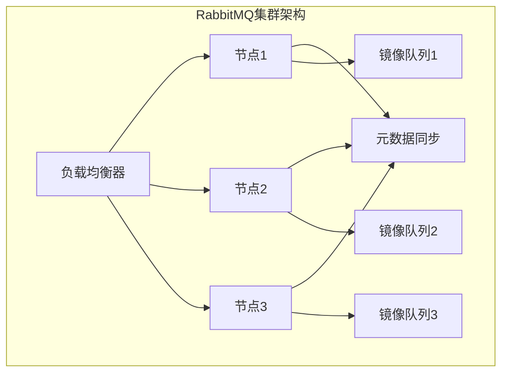

# 第16章 RabbitMQ集群与高可用

## 目录
1. [集群基础概念](#集群基础概念)
2. [RabbitMQ集群架构](#rabbitmq集群架构)
3. [集群部署与配置](#集群部署与配置)
4. [节点管理与维护](#节点管理与维护)
5. [数据同步与复制](#数据同步与复制)
6. [高可用策略](#高可用策略)
7. [负载均衡与路由](#负载均衡与路由)
8. [故障恢复与监控](#故障恢复与监控)
9. [集群性能调优](#集群性能调优)
10. [实际部署案例](#实际部署案例)

---

## 集群基础概念

### 什么是RabbitMQ集群

RabbitMQ集群是多个RabbitMQ服务器节点的集合，提供高可用性、负载均衡和容错能力。在集群中，队列、交换器、绑定关系等元数据在所有节点间复制，而队列内容仅在创建队列的节点上存储（除非使用镜像队列）。

### 集群优势

- **高可用性**：单节点故障不会导致服务中断
- **负载分担**：多个节点分担消息处理负载
- **扩展性**：支持动态添加节点扩展处理能力
- **容错能力**：自动检测和处理节点故障
- **数据持久化**：确保消息不丢失

### 集群架构模式



---

## RabbitMQ集群架构

### 集群组件

1. **Erlang节点**：运行RabbitMQ的Erlang虚拟机实例
2. **集群名称**：标识整个集群的唯一名称
3. **RabenMQ应用**：运行在Erlang节点上的消息代理应用

### 集群通信机制

#### Erlang分布式通信
- Erlang提供天然的分布式通信支持
- 使用Erlang分布式协议进行节点间通信
- 节点间共享相同的cookie文件

#### 集群状态同步
```erlang
% 集群节点状态信息示例
ClusterInfo = [
    #{
        name => 'rabbit@node1',
        running_applications => ['rabbit', 'mnesia'],
        memory => 1234567890,
        partitions => [],
        os_pid => "12345"
    },
    #{
        name => 'rabbit@node2', 
        running_applications => ['rabbit', 'mnesia'],
        memory => 1234567890,
        partitions => [],
        os_pid => "12346"
    }
].
```

### 元数据同步

#### 虚拟主机(VHost)
- 每个vhost的元数据在集群中复制
- 用户权限与vhost关联
- 队列、交换器、绑定关系元数据复制

#### 交换器和绑定关系
- 交换器定义在集群中复制
- 绑定关系作为路由信息复制
- 队列内容仅在主节点存储

---

## 集群部署与配置

### 环境准备

#### 系统要求
```bash
# 最低要求
- 内存：最小2GB，推荐4GB+
- CPU：2核+
- 磁盘：SSD推荐，20GB+
- 网络：千兆以太网

# 高可用要求
- 内存：最小4GB，推荐8GB+
- CPU：4核+
- 磁盘：RAID 1或SSD，50GB+
- 网络：专用内网，千兆+
```

#### 依赖安装
```bash
# Ubuntu/Debian
sudo apt-get update
sudo apt-get install erlang-nox erlang-dev
wget -O- https://dl.cloudsmith.io/public/rabbitmq/rabbitmq-erlang/gpg.9F4587F226208643.key | sudo apt-key add -
wget -O- https://dl.cloudsmith.io/public/rabbitmq/rabbitmq-server/gpg.9F4587F226208643.key | sudo apt-key add -
sudo add-apt-repository 'deb https://dl.cloudsmith.io/public/rabbitmq/rabbitmq-erlang/deb/ubuntu focal main'
sudo add-apt-repository 'deb https://dl.cloudsmith.io/public/rabbitmq/rabbitmq-server/deb/ubuntu focal main'
sudo apt-get update
sudo apt-get install erlang-base erlang-asn1 erlang-crypto erlang-eldap erlang-ftp erlang-inets erlang-mnesia erlang-os-mon erlang-parsetools erlang-public-key erlang-runtime-tools erlang-snmp erlang-ssl erlang-syntax-tools erlang-tftp erlang-tools erlang-xmerl
sudo apt-get install rabbitmq-server

# CentOS/RHEL
sudo yum install epel-release
sudo yum install erlang
sudo rpm --import https://github.com/rabbitmq/signing-keys/releases/download/2.0/rabbitmq-release-signing-key.asc
sudo tee /etc/yum.repos.d/rabbitmq.repo <<EOF
[rabbitmq-server]
name=RabbitMQ Server for RHEL/CentOS 8
baseurl=https://dl.cloudsmith.io/public/rabbitmq/rabbitmq-erlang/rpm/erlang/23/el/8/\$basearch
baseurl=https://dl.cloudsmith.io/public/rabbitmq/rabbitmq-server/rpm/rabbitmq-server/3/el/8/\$basearch
gpgcheck=1
gpgkey=https://dl.cloudsmith.io/public/rabbitmq/rabbitmq-erlang/gpg.9F4587F226208643.key
enabled=1
EOF
sudo yum install rabbitmq-server
```

### 集群配置

#### 基础集群配置
```bash
# 节点1配置 (master)
sudo tee /etc/rabbitmq/rabbitmq-env.conf <<EOF
NODENAME=rabbit@node1
NODE_PORT=5672
MNESIA_BASE=/var/lib/rabbitmq/mnesia/rabbit@node1
LOG_BASE=/var/log/rabbitmq/rabbit@node1
CONFIG_FILE=/etc/rabbitmq/rabbitmq
EOF

# 节点2配置
sudo tee /etc/rabbitmq/rabbitmq-env.conf <<EOF
NODENAME=rabbit@node2
NODE_PORT=5672
MNESIA_BASE=/var/lib/rabbitmq/mnesia/rabbit@node2
LOG_BASE=/var/log/rabbitmq/rabbit@node2
CONFIG_FILE=/etc/rabbitmq/rabbitmq
EOF

# 节点3配置
sudo tee /etc/rabbitmq/rabbitmq-env.conf <<EOF
NODENAME=rabbit@node3
NODE_PORT=5672
MNESIA_BASE=/var/lib/rabbitmq/mnesia/rabbit@node3
LOG_BASE=/var/log/rabbitmq/rabbit@node3
CONFIG_FILE=/etc/rabbitmq/rabbitmq
EOF
```

#### 高级集群配置
```erlang
% /etc/rabbitmq/rabbitmq.conf
% 集群配置
cluster_nodes.1 = rabbit@node2
cluster_nodes.2 = rabbit@node3
cluster_nodes.3 = rabbit@node4

% 镜像队列配置
default_vhost = /
default_user = admin
default_pass = admin123
default_user_tags.administrator

% 内存阈值
vm_memory_high_watermark.relative = 0.6
vm_memory_high_watermark_paging_ratio = 0.5

% 磁盘阈值
disk_free_limit.absolute = 1GB

% 网络配置
listeners.tcp.default = 5672
management.tcp.port = 15672

% 集群配置
cluster_formation.peer_discovery_backend = classic_config
cluster_formation.classic_config.nodes.1 = rabbit@node1
cluster_formation.classic_config.nodes.2 = rabbit@node2
cluster_formation.classic_config.nodes.3 = rabbit@node3

% 队列镜像策略
default_queue_master_locator = min-master-pid

% 心跳设置
heartbeat = 60
```

### 集群初始化

#### 节点1（主节点）
```bash
# 启动服务
sudo systemctl enable rabbitmq-server
sudo systemctl start rabbitmq-server

# 启用管理插件
sudo rabbitmq-plugins enable rabbitmq_management

# 创建管理员用户
sudo rabbitmqctl add_user admin admin123
sudo rabbitmqctl set_user_tags admin administrator
sudo rabbitmqctl set_permissions -p / admin ".*" ".*" ".*"

# 设置集群模式
sudo rabbitmqctl stop_app
sudo rabbitmqctl reset
sudo rabbitmqctl start_app
```

#### 节点2-3（从节点）
```bash
# 在节点2执行
sudo systemctl enable rabbitmq-server
sudo systemctl start rabbitmq-server

# 加入集群
sudo rabbitmqctl stop_app
sudo rabbitmqctl reset
sudo rabbitmqctl join_cluster rabbit@node1
sudo rabbitmqctl start_app

# 在节点3重复相同操作
```

---

## 节点管理与维护

### 集群状态管理

#### 查看集群状态
```bash
# 查看集群状态
sudo rabbitmqctl cluster_status

# 查看节点信息
sudo rabbitmqctl status

# 查看队列状态
sudo rabbitmqctl list_queues name messages consumers durable
sudo rabbitmqctl list_exchanges name type durable

# 查看连接信息
sudo rabbitmqctl list_connections peer_host peer_port user state
```

#### 节点操作
```bash
# 停止应用（保持Erlang节点运行）
sudo rabbitmqctl stop_app

# 启动应用
sudo rabbitmqctl start_app

# 重启节点
sudo systemctl restart rabbitmq-server

# 从集群中移除节点
sudo rabbitmqctl forget_cluster_node rabbit@node3

# 节点重置
sudo rabbitmqctl reset

# 节点归零
sudo rabbitmqctl force_reset
```

### 健康检查

#### 集群健康检查脚本
```bash
#!/bin/bash
# cluster_health_check.sh

NODES=("rabbit@node1" "rabbit@node2" "rabbit@node3")
CLUSTER_NAME="rabbit@node1"

echo "检查集群状态..."
sudo rabbitmqctl cluster_status

echo -e "\n检查节点状态..."
for node in "${NODES[@]}"; do
    echo "检查节点: $node"
    ssh root@${node#*@} "rabbitmqctl status | grep -E '(running_applications|memory|disk_free)'"
done

echo -e "\n检查镜像队列状态..."
sudo rabbitmqctl list_queues name policy master_pid slave_pids

echo -e "\n检查磁盘使用..."
for node in "${NODES[@]}"; do
    echo "磁盘使用 - $node:"
    ssh root@${node#*@} "df -h"
done

echo -e "\n检查内存使用..."
for node in "${NODES[@]}"; do
    echo "内存使用 - $node:"
    ssh root@${node#*@} "free -h"
done
```

---

## 数据同步与复制

### 镜像队列配置

#### 镜像策略设置
```bash
# 设置队列镜像到所有节点
sudo rabbitmqctl set_policy ha-all "^ha\." '{"ha-mode":"all","ha-sync-mode":"automatic"}'

# 设置队列镜像到指定节点
sudo rabbitmqctl set_policy ha-queue "^test\." '{"ha-mode":"nodes","ha-nodes":["rabbit@node1","rabbit@node2"]}'

# 设置镜像队列最少副本数
sudo rabbitmqctl set_policy ha-replica "^replica\." '{"ha-mode":"exactly","ha-params":2}'

# 设置队列镜像同步模式
sudo rabbitmqctl set_policy ha-sync "^sync\." '{"ha-mode":"all","ha-sync-mode":"automatic"}'

# 查看策略
sudo rabbitmqctl list_policies

# 删除策略
sudo rabbitmqctl clear_policy ha-all
```

#### 镜像队列参数详解
```erlang
% 镜像策略配置
{
    "ha-mode": "all",                    % 镜像模式
    "ha-sync-mode": "automatic",         % 同步模式  
    "ha-promote-on-shutdown": "always",  % 主节点关闭时行为
    "ha-promote-on-failure": "always",   % 主节点故障时行为
    "ha-params": 2,                      % 镜像数量
    "ha-mode": "nodes",                  % 指定节点列表
    "ha-nodes": ["rabbit@node1", "rabbit@node2"],
    "ha-mode": "exactly",                % 精确数量模式
    "priority": 1                        % 策略优先级
}
```

### 队列同步

#### 手动同步镜像队列
```bash
# 查看队列同步状态
sudo rabbitmqctl list_queues name policy master_pid slave_pids sync_state

# 手动同步单个队列
sudo rabbitmqctl sync_queue queue_name

# 取消同步
sudo rabbitmqctl cancel_sync_queue queue_name

# 同步所有队列
sudo rabbitmqctl sync_queue --all

# 检查队列详情
sudo rabbitmqctl list_queues name durable messages memory consumer_details policy
```

#### 队列同步监控
```python
#!/usr/bin/env python3
# queue_sync_monitor.py

import pika
import json
import time
from datetime import datetime

class QueueSyncMonitor:
    def __init__(self, hosts, username, password):
        self.hosts = hosts
        self.username = username
        self.password = password
        self.connections = {}
        self.channels = {}
        
    def connect_nodes(self):
        """连接到所有集群节点"""
        for host in self.hosts:
            try:
                credentials = pika.PlainCredentials(self.username, self.password)
                parameters = pika.ConnectionParameters(
                    host=host,
                    port=5672,
                    credentials=credentials,
                    connection_attempts=3,
                    retry_delay=1
                )
                self.connections[host] = pika.BlockingConnection(parameters)
                self.channels[host] = self.connections[host].channel()
                print(f"成功连接到节点: {host}")
            except Exception as e:
                print(f"连接节点 {host} 失败: {e}")
    
    def get_queue_info(self, host):
        """获取队列信息"""
        try:
            channel = self.channels[host]
            result = channel.queue_declare(queue='', passive=True)
            queue_info = {
                'messages': result.method.message_count,
                'consumers': result.method.consumer_count
            }
            return queue_info
        except Exception as e:
            print(f"获取队列信息失败 {host}: {e}")
            return None
    
    def check_queue_sync(self, queue_name):
        """检查队列同步状态"""
        print(f"\n检查队列 '{queue_name}' 的同步状态...")
        queue_data = {}
        
        for host in self.hosts:
            if host in self.channels:
                info = self.get_queue_info(host)
                if info:
                    queue_data[host] = info
        
        # 分析同步状态
        if len(queue_data) > 1:
            messages_counts = [data['messages'] for data in queue_data.values()]
            if len(set(messages_counts)) == 1:
                print(f"✅ 队列 '{queue_name}' 已同步，消息数: {messages_counts[0]}")
            else:
                print(f"❌ 队列 '{queue_name}' 未同步，消息数不一致:")
                for host, data in queue_data.items():
                    print(f"   {host}: {data['messages']} 消息")
        else:
            print(f"⚠️  队列 '{queue_name}' 只在 {len(queue_data)} 个节点上存在")
    
    def monitor_sync(self, queue_name, interval=30):
        """持续监控队列同步状态"""
        print(f"开始监控队列 '{queue_name}' 同步状态，间隔 {interval} 秒...")
        while True:
            self.check_queue_sync(queue_name)
            time.sleep(interval)

if __name__ == "__main__":
    # 集群节点列表
    hosts = ["node1.example.com", "node2.example.com", "node3.example.com"]
    username = "admin"
    password = "admin123"
    
    monitor = QueueSyncMonitor(hosts, username, password)
    monitor.connect_nodes()
    monitor.monitor_sync("test_queue", interval=30)
```

---

## 高可用策略

### 主备模式

#### 故障转移配置
```erlang
% 主备模式配置
{
    clusters, [
        {
            primary_cluster,
            [
                {rabbit@master1, disc},
                {rabbit@master2, disc}
            ]
        },
        {
            standby_cluster, 
            [
                {rabbit@standby1, disc},
                {rabbit@standby2, disc}
            ]
        }
    ]
}
```

#### Keepalived配置
```bash
# /etc/keepalived/keepalived.conf
vrrp_instance VI_RABBITMQ {
    state MASTER
    interface eth0
    virtual_router_id 51
    priority 100
    advert_int 1
    authentication {
        auth_type PASS
        auth_pass rabbitmq123
    }
    virtual_ipaddress {
        192.168.1.100/24
    }
    
    notify_master /etc/keepalived/notify_master.sh
    notify_backup /etc/keepalived/notify_backup.sh
    notify_fault /etc/keepalived/notify_fault.sh
}

# 通知脚本示例
#!/bin/bash
# notify_master.sh
case "$1" in
    master)
        echo "RabbitMQ节点成为主节点" | logger
        sudo rabbitmqctl start_app
        ;;
    backup)
        echo "RabbitMQ节点成为备份节点" | logger
        sudo rabbitmqctl stop_app
        ;;
    fault)
        echo "RabbitMQ节点发生故障" | logger
        sudo rabbitmqctl stop_app
        ;;
esac
```

### 负载均衡配置

#### HAProxy配置
```bash
# /etc/haproxy/haproxy.cfg
global
    log stdout local0
    chroot /var/lib/haproxy
    stats socket /run/haproxy/admin.sock mode 660 level admin
    stats timeout 30s
    user haproxy
    group haproxy
    daemon

defaults
    log     global
    mode    http
    option  httplog
    option  dontlognull
    timeout connect 5000
    timeout client  50000
    timeout server  50000

# RabbitMQ管理界面
frontend rabbitmq_mgmt
    bind *:15672
    default_backend rabbitmq_mgmt_servers

backend rabbitmq_mgmt_servers
    balance roundrobin
    server rabbit1 node1.example.com:15672 check
    server rabbit2 node2.example.com:15672 check
    server rabbit3 node3.example.com:15672 check

# RabbitMQ消息服务
frontend rabbitmq_amqp
    bind *:5672
    mode tcp
    default_backend rabbitmq_servers

backend rabbitmq_servers
    balance roundrobin
    server rabbit1 node1.example.com:5672 check inter 5s rise 2 fall 3
    server rabbit2 node2.example.com:5672 check inter 5s rise 2 fall 3
    server rabbit3 node3.example.com:5672 check inter 5s rise 2 fall 3
```

#### Nginx配置
```nginx
# /etc/nginx/conf.d/rabbitmq.conf
upstream rabbitmq_management {
    least_conn;
    server node1.example.com:15672 max_fails=3 fail_timeout=30s;
    server node2.example.com:15672 max_fails=3 fail_timeout=30s;
    server node3.example.com:15672 max_fails=3 fail_timeout=30s;
}

upstream rabbitmq_amqp {
    least_conn;
    server node1.example.com:5672 max_fails=3 fail_timeout=30s;
    server node2.example.com:5672 max_fails=3 fail_timeout=30s;
    server node3.example.com:5672 max_fails=3 fail_timeout=30s;
}

# 管理界面代理
server {
    listen 15672;
    server_name rabbitmq.example.com;
    
    location / {
        proxy_pass http://rabbitmq_management;
        proxy_set_header Host $host;
        proxy_set_header X-Real-IP $remote_addr;
        proxy_set_header X-Forwarded-For $proxy_add_x_forwarded_for;
        proxy_set_header X-Forwarded-Proto $scheme;
    }
}

# AMQP服务代理
server {
    listen 5672;
    server_name rabbitmq.example.com;
    
    location / {
        proxy_pass http://rabbitmq_amqp;
        proxy_set_header Host $host;
        proxy_set_header Connection "";
        proxy_http_version 1.1;
        proxy_buffering off;
        proxy_read_timeout 60s;
    }
}
```

---

## 负载均衡与路由

### 客户端负载均衡

#### Python客户端负载均衡
```python
import pika
import random
import time
from typing import List, Optional

class RabbitMQLoadBalancer:
    def __init__(self, nodes: List[str], username: str, password: str):
        self.nodes = nodes
        self.username = username
        self.password = password
        self.connections = {}
        self.connection_pool = {node: [] for node in nodes}
        self.health_status = {node: True for node in nodes}
        
    def get_healthy_nodes(self) -> List[str]:
        """获取健康的节点列表"""
        return [node for node, healthy in self.health_status.items() if healthy]
    
    def select_node(self, strategy: str = 'round_robin') -> Optional[str]:
        """选择节点"""
        healthy_nodes = self.get_healthy_nodes()
        if not healthy_nodes:
            return None
            
        if strategy == 'round_robin':
            return random.choice(healthy_nodes)
        elif strategy == 'least_connections':
            return min(healthy_nodes, key=lambda n: len(self.connection_pool[n]))
        elif strategy == 'random':
            return random.choice(healthy_nodes)
        elif strategy == 'weighted':
            # 根据消息处理能力加权
            weights = {'node1.example.com': 1.0, 'node2.example.com': 0.8, 'node3.example.com': 0.6}
            weights_list = [(n, weights.get(n, 1.0)) for n in healthy_nodes]
            total_weight = sum(w for _, w in weights_list)
            random_weight = random.uniform(0, total_weight)
            
            weight_sum = 0
            for node, weight in weights_list:
                weight_sum += weight
                if random_weight <= weight_sum:
                    return node
        
        return random.choice(healthy_nodes)
    
    def create_connection(self, node: str) -> Optional[pika.BlockingConnection]:
        """创建到指定节点的连接"""
        try:
            credentials = pika.PlainCredentials(self.username, self.password)
            parameters = pika.ConnectionParameters(
                host=node,
                port=5672,
                credentials=credentials,
                connection_attempts=3,
                retry_delay=1,
                heartbeat=60
            )
            connection = pika.BlockingConnection(parameters)
            self.health_status[node] = True
            return connection
        except Exception as e:
            print(f"连接节点 {node} 失败: {e}")
            self.health_status[node] = False
            return None
    
    def get_connection(self, strategy: str = 'round_robin') -> Optional[pika.BlockingConnection]:
        """获取连接（带负载均衡）"""
        node = self.select_node(strategy)
        if not node:
            return None
            
        # 检查连接池
        if self.connection_pool[node]:
            return self.connection_pool[node].pop()
        
        # 创建新连接
        return self.create_connection(node)
    
    def return_connection(self, connection: pika.BlockingConnection):
        """归还连接到连接池"""
        node = connection._impl.params.host
        if node in self.connection_pool:
            self.connection_pool[node].append(connection)
            # 限制连接池大小
            if len(self.connection_pool[node]) > 10:
                try:
                    old_conn = self.connection_pool[node].pop(0)
                    old_conn.close()
                except:
                    pass
    
    def health_check(self):
        """健康检查"""
        for node in self.nodes:
            connection = self.create_connection(node)
            if connection:
                try:
                    channel = connection.channel()
                    channel.queue_declare(queue='health_check', passive=True)
                    connection.close()
                except:
                    self.health_status[node] = False
    
    def close_all_connections(self):
        """关闭所有连接"""
        for connections in self.connection_pool.values():
            for conn in connections:
                try:
                    conn.close()
                except:
                    pass
            connections.clear()

# 使用示例
if __name__ == "__main__":
    nodes = ["node1.example.com", "node2.example.com", "node3.example.com"]
    lb = RabbitMQLoadBalancer(nodes, "admin", "admin123")
    
    # 发送消息
    try:
        connection = lb.get_connection('least_connections')
        if connection:
            channel = connection.channel()
            channel.queue_declare(queue='test_queue')
            channel.basic_publish(
                exchange='',
                routing_key='test_queue',
                body='Hello from load balancer!'
            )
            print("消息发送成功")
            lb.return_connection(connection)
    except Exception as e:
        print(f"发送消息失败: {e}")
    
    lb.close_all_connections()
```

### 消费者负载均衡

#### 消费者多节点部署
```python
import pika
import threading
import time
import uuid
from typing import List, Callable

class DistributedConsumer:
    def __init__(self, nodes: List[str], queue_name: str, 
                 username: str, password: str, callback: Callable):
        self.nodes = nodes
        self.queue_name = queue_name
        self.username = username
        self.password = password
        self.callback = callback
        self.consumers = {}
        self.is_running = True
        
    def create_consumer(self, node: str):
        """在指定节点创建消费者"""
        try:
            credentials = pika.PlainCredentials(self.username, self.password)
            parameters = pika.ConnectionParameters(
                host=node,
                port=5672,
                credentials=credentials,
                heartbeat=60
            )
            connection = pika.BlockingConnection(parameters)
            channel = connection.channel()
            
            channel.queue_declare(queue=self.queue_name, durable=True)
            channel.basic_qos(prefetch_count=1)
            
            consumer_tag = f"consumer_{uuid.uuid4().hex}"
            channel.basic_consume(
                queue=self.queue_name,
                on_message_callback=self.message_handler,
                consumer_tag=consumer_tag
            )
            
            self.consumers[node] = {
                'connection': connection,
                'channel': channel,
                'consumer_tag': consumer_tag,
                'thread': threading.Thread(
                    target=channel.start_consuming
                )
            }
            
            self.consumers[node]['thread'].daemon = True
            self.consumers[node]['thread'].start()
            print(f"节点 {node} 消费者启动成功")
            
        except Exception as e:
            print(f"节点 {node} 消费者启动失败: {e}")
    
    def message_handler(self, channel, method, properties, body):
        """消息处理器"""
        try:
            success = self.callback(body, method, properties)
            if success:
                channel.basic_ack(delivery_tag=method.delivery_tag)
            else:
                channel.basic_nack(delivery_tag=method.delivery_tag, requeue=True)
        except Exception as e:
            print(f"消息处理异常: {e}")
            channel.basic_nack(delivery_tag=method.delivery_tag, requeue=True)
    
    def start_consumers(self):
        """启动所有节点消费者"""
        for node in self.nodes:
            self.create_consumer(node)
    
    def stop_consumers(self):
        """停止所有消费者"""
        self.is_running = False
        for node, consumer_info in self.consumers.items():
            try:
                consumer_info['channel'].basic_cancel(consumer_info['consumer_tag'])
                consumer_info['connection'].close()
            except Exception as e:
                print(f"停止节点 {node} 消费者失败: {e}")
        self.consumers.clear()
    
    def add_node(self, node: str):
        """动态添加节点"""
        if node not in self.nodes:
            self.nodes.append(node)
            self.create_consumer(node)
    
    def remove_node(self, node: str):
        """动态移除节点"""
        if node in self.consumers:
            try:
                self.consumers[node]['channel'].basic_cancel(self.consumers[node]['consumer_tag'])
                self.consumers[node]['connection'].close()
                del self.consumers[node]
            except Exception as e:
                print(f"移除节点 {node} 失败: {e}")
        
        if node in self.nodes:
            self.nodes.remove(node)

# 使用示例
def message_processor(body, method, properties):
    """消息处理回调函数"""
    try:
        print(f"处理消息: {body.decode()}")
        # 模拟处理时间
        time.sleep(1)
        return True
    except Exception as e:
        print(f"处理消息失败: {e}")
        return False

if __name__ == "__main__":
    nodes = ["node1.example.com", "node2.example.com", "node3.example.com"]
    consumer = DistributedConsumer(nodes, "test_queue", "admin", "admin123", message_processor)
    
    try:
        consumer.start_consumers()
        print("分布式消费者启动，运行中...")
        while True:
            time.sleep(10)
    except KeyboardInterrupt:
        print("正在停止分布式消费者...")
        consumer.stop_consumers()
```

---

## 故障恢复与监控

### 故障检测与恢复

#### 集群故障检测
```python
#!/usr/bin/env python3
# cluster_failure_detector.py

import pika
import time
import json
import logging
from datetime import datetime, timedelta
from typing import Dict, List, Optional
import smtplib
from email.mime.text import MIMEText

class ClusterFailureDetector:
    def __init__(self, nodes: List[str], username: str, password: str, 
                 smtp_config: Dict):
        self.nodes = nodes
        self.username = username
        self.password = password
        self.smtp_config = smtp_config
        self.logger = self._setup_logging()
        self.failure_history = {}
        
    def _setup_logging(self) -> logging.Logger:
        """设置日志记录"""
        logger = logging.getLogger('ClusterFailureDetector')
        logger.setLevel(logging.INFO)
        
        handler = logging.FileHandler('/var/log/rabbitmq/cluster_detector.log')
        formatter = logging.Formatter(
            '%(asctime)s - %(name)s - %(levelname)s - %(message)s'
        )
        handler.setFormatter(formatter)
        logger.addHandler(handler)
        
        return logger
    
    def test_node_health(self, node: str) -> bool:
        """测试节点健康状态"""
        try:
            credentials = pika.PlainCredentials(self.username, self.password)
            parameters = pika.ConnectionParameters(
                host=node,
                port=5672,
                credentials=credentials,
                connection_attempts=2,
                retry_delay=1,
                heartbeat=10
            )
            connection = pika.BlockingConnection(parameters)
            channel = connection.channel()
            
            # 测试基本操作
            channel.queue_declare(queue='health_check', passive=True)
            
            connection.close()
            return True
            
        except Exception as e:
            self.logger.warning(f"节点 {node} 健康检查失败: {e}")
            return False
    
    def get_cluster_status(self) -> Dict:
        """获取集群状态信息"""
        status = {
            'timestamp': datetime.now().isoformat(),
            'nodes': {},
            'cluster_name': None,
            'partitions': [],
            'alarms': []
        }
        
        for node in self.nodes:
            node_status = {
                'healthy': False,
                'applications': [],
                'memory_usage': 0,
                'disk_free': 0,
                'connections': 0,
                'queues': 0
            }
            
            try:
                credentials = pika.PlainCredentials(self.username, self.password)
                parameters = pika.ConnectionParameters(
                    host=node,
                    port=15672,
                    credentials=pika.PlainCredentials(self.username, self.password),
                    connection_attempts=2
                )
                
                import requests
                response = requests.get(
                    f'http://{node}:15672/api/overview',
                    auth=(self.username, self.password),
                    timeout=5
                )
                
                if response.status_code == 200:
                    data = response.json()
                    node_status['healthy'] = True
                    node_status['applications'] = data.get('running_applications', [])
                    node_status['memory_usage'] = data.get('memory_used', 0)
                    node_status['connections'] = data.get('connection_totals', {}).get('current', 0)
                    
                    # 获取队列信息
                    queue_response = requests.get(
                        f'http://{node}:15672/api/queues',
                        auth=(self.username, self.password),
                        timeout=5
                    )
                    if queue_response.status_code == 200:
                        queues = queue_response.json()
                        node_status['queues'] = len(queues)
                    
                    # 获取节点信息
                    nodes_response = requests.get(
                        f'http://{node}:15672/api/nodes',
                        auth=(self.username, self.password),
                        timeout=5
                    )
                    if nodes_response.status_code == 200:
                        nodes_data = nodes_response.json()
                        for node_info in nodes_data:
                            if node_info.get('name') == f'rabbit@{node.split(".")[0]}':
                                node_status['disk_free'] = node_info.get('disk_free', 0)
            
            except Exception as e:
                self.logger.error(f"获取节点 {node} 状态失败: {e}")
            
            status['nodes'][node] = node_status
        
        return status
    
    def detect_partition(self, status: Dict) -> List[str]:
        """检测网络分区"""
        healthy_nodes = [
            node for node, info in status['nodes'].items() 
            if info['healthy']
        ]
        
        if len(healthy_nodes) < len(self.nodes):
            failed_nodes = [
                node for node in self.nodes 
                if not status['nodes'][node]['healthy']
            ]
            self.logger.warning(f"检测到节点故障: {failed_nodes}")
            return failed_nodes
        
        return []
    
    def send_alert(self, alert_type: str, message: str, recipients: List[str]):
        """发送告警通知"""
        try:
            msg = MIMEText(message)
            msg['Subject'] = f"RabbitMQ集群告警: {alert_type}"
            msg['From'] = self.smtp_config['from']
            msg['To'] = ', '.join(recipients)
            
            server = smtplib.SMTP(
                self.smtp_config['host'], 
                self.smtp_config['port']
            )
            server.starttls()
            server.login(
                self.smtp_config['username'], 
                self.smtp_config['password']
            )
            server.send_message(msg)
            server.quit()
            
            self.logger.info(f"告警通知发送成功: {alert_type}")
            
        except Exception as e:
            self.logger.error(f"发送告警失败: {e}")
    
    def check_failure_threshold(self, node: str, failure_count: int = 3) -> bool:
        """检查故障阈值"""
        if node not in self.failure_history:
            self.failure_history[node] = []
        
        now = datetime.now()
        self.failure_history[node].append(now)
        
        # 清理1小时前的记录
        hour_ago = now - timedelta(hours=1)
        self.failure_history[node] = [
            timestamp for timestamp in self.failure_history[node]
            if timestamp > hour_ago
        ]
        
        return len(self.failure_history[node]) >= failure_count
    
    def auto_recovery(self, failed_node: str):
        """自动恢复节点"""
        try:
            self.logger.info(f"尝试自动恢复节点: {failed_node}")
            
            # 1. 重启RabbitMQ服务
            import subprocess
            subprocess.run([
                'ssh', '-o', 'ConnectTimeout=10',
                f'root@{failed_node.split(".")[0]}',
                'systemctl', 'restart', 'rabbitmq-server'
            ], check=True)
            
            # 2. 等待服务启动
            time.sleep(30)
            
            # 3. 检查服务状态
            if self.test_node_health(failed_node):
                self.logger.info(f"节点 {failed_node} 自动恢复成功")
                
                # 4. 重新加入集群（如果需要）
                master_node = self.nodes[0]  # 假设第一个节点为主节点
                subprocess.run([
                    'ssh', '-o', 'ConnectTimeout=10',
                    f'root@{failed_node.split(".")[0]}',
                    'rabbitmqctl', 'join_cluster', f'rabbit@{master_node.split(".")[0]}'
                ], check=True)
                
                self.logger.info(f"节点 {failed_node} 已重新加入集群")
                return True
            else:
                self.logger.error(f"节点 {failed_node} 自动恢复失败")
                return False
                
        except Exception as e:
            self.logger.error(f"自动恢复节点 {failed_node} 异常: {e}")
            return False
    
    def run_monitoring(self, interval: int = 60, alert_recipients: List[str] = None):
        """运行监控循环"""
        self.logger.info("开始集群故障检测监控")
        
        while True:
            try:
                # 获取集群状态
                status = self.get_cluster_status()
                
                # 检测分区
                failed_nodes = self.detect_partition(status)
                
                # 处理失败节点
                for node in self.nodes:
                    is_healthy = status['nodes'][node]['healthy']
                    
                    if not is_healthy:
                        if self.check_failure_threshold(node):
                            alert_message = f"""
                            节点 {node} 持续故障超过阈值
                            集群状态: {json.dumps(status, indent=2)}
                            时间: {datetime.now().isoformat()}
                            """
                            
                            if alert_recipients:
                                self.send_alert('NODE_FAILURE', alert_message, alert_recipients)
                            
                            # 尝试自动恢复
                            if self.auto_recovery(node):
                                # 清理故障历史
                                self.failure_history.pop(node, None)
                    
                    # 记录状态
                    status_text = "健康" if is_healthy else "故障"
                    self.logger.info(f"节点 {node}: {status_text}")
                
                # 记录整体状态
                total_nodes = len(self.nodes)
                healthy_count = sum(1 for node in self.nodes if status['nodes'][node]['healthy'])
                self.logger.info(f"集群状态: {healthy_count}/{total_nodes} 节点健康")
                
                time.sleep(interval)
                
            except Exception as e:
                self.logger.error(f"监控循环异常: {e}")
                time.sleep(interval)

if __name__ == "__main__":
    # 配置参数
    nodes = ["node1.example.com", "node2.example.com", "node3.example.com"]
    username = "admin"
    password = "admin123"
    
    smtp_config = {
        'host': 'smtp.example.com',
        'port': 587,
        'username': 'alert@example.com',
        'password': 'password123',
        'from': 'alert@example.com'
    }
    
    # 启动监控
    detector = ClusterFailureDetector(nodes, username, password, smtp_config)
    detector.run_monitoring(
        interval=60,
        alert_recipients=['admin@example.com']
    )
```

### 集群监控仪表板

#### Prometheus + Grafana监控
```yaml
# prometheus.yml
global:
  scrape_interval: 15s
  evaluation_interval: 15s

rule_files:
  - "rabbitmq_rules.yml"

scrape_configs:
  - job_name: 'rabbitmq'
    static_configs:
      - targets: ['node1.example.com:15692', 'node2.example.com:15692', 'node3.example.com:15692']
    scrape_interval: 10s
    metrics_path: /metrics
```

```yaml
# rabbitmq_rules.yml
groups:
- name: rabbitmq.rules
  rules:
  - alert: RabbitMQDown
    expr: up{job="rabbitmq"} == 0
    for: 1m
    labels:
      severity: critical
    annotations:
      summary: "RabbitMQ节点 {{ $labels.instance }} 宕机"
      
  - alert: RabbitMQHighMemoryUsage
    expr: rabbitmq_process_resident_memory_bytes / 1024 / 1024 > 4000
    for: 5m
    labels:
      severity: warning
    annotations:
      summary: "RabbitMQ内存使用率过高"
      
  - alert: RabbitMQDiskSpaceLow
    expr: node_filesystem_free_bytes{mountpoint="/"} / 1024 / 1024 < 1000
    for: 2m
    labels:
      severity: critical
    annotations:
      summary: "RabbitMQ磁盘空间不足"
      
  - alert: RabbitMQQueueLengthHigh
    expr: rabbitmq_queue_messages > 10000
    for: 5m
    labels:
      severity: warning
    annotations:
      summary: "队列 {{ $labels.queue }} 消息积压严重"
```

#### Grafana仪表板配置
```json
{
  "dashboard": {
    "id": null,
    "title": "RabbitMQ集群监控",
    "tags": ["rabbitmq", "cluster"],
    "timezone": "browser",
    "panels": [
      {
        "id": 1,
        "title": "集群节点状态",
        "type": "stat",
        "targets": [
          {
            "expr": "up{job=\"rabbitmq\"}",
            "legendFormat": "{{ instance }}"
          }
        ],
        "fieldConfig": {
          "defaults": {
            "mappings": [
              {
                "options": {
                  "0": {"text": "下线", "color": "red"},
                  "1": {"text": "上线", "color": "green"}
                },
                "type": "value"
              }
            ]
          }
        }
      },
      {
        "id": 2,
        "title": "消息处理速率",
        "type": "graph",
        "targets": [
          {
            "expr": "rate(rabbitmq_channel_messages_published_total[5m])",
            "legendFormat": "发布速率 - {{ instance }}"
          },
          {
            "expr": "rate(rabbitmq_queue_messages_delivered_total[5m])",
            "legendFormat": "消费速率 - {{ instance }}"
          }
        ]
      },
      {
        "id": 3,
        "title": "队列消息数量",
        "type": "graph",
        "targets": [
          {
            "expr": "rabbitmq_queue_messages",
            "legendFormat": "{{ queue }} - {{ vhost }}"
          }
        ]
      },
      {
        "id": 4,
        "title": "内存使用情况",
        "type": "graph",
        "targets": [
          {
            "expr": "rabbitmq_process_resident_memory_bytes / 1024 / 1024",
            "legendFormat": "{{ instance }} - {{ job }}"
          }
        ]
      },
      {
        "id": 5,
        "title": "连接数统计",
        "type": "graph",
        "targets": [
          {
            "expr": "rabbitmq_connections",
            "legendFormat": "{{ instance }} - {{ state }}"
          }
        ]
      }
    ]
  }
}
```

---

## 集群性能调优

### 系统级调优

#### 内核参数优化
```bash
# /etc/sysctl.conf
# 网络参数
net.core.somaxconn = 4096
net.core.netdev_max_backlog = 5000
net.ipv4.tcp_max_syn_backlog = 4096
net.ipv4.tcp_fin_timeout = 30
net.ipv4.tcp_keepalive_time = 1800
net.ipv4.tcp_keepalive_probes = 3
net.ipv4.tcp_keepalive_intvl = 15
net.ipv4.tcp_tw_reuse = 1
net.ipv4.tcp_tw_recycle = 1

# 文件描述符限制
fs.file-max = 2097152
fs.nr_open = 1048576

# 内存管理
vm.swappiness = 1
vm.dirty_ratio = 15
vm.dirty_background_ratio = 5
vm.vfs_cache_pressure = 50

# 应用参数
net.ipv4.tcp_mem = 786432 1048576 1572864
net.ipv4.tcp_rmem = 4096 87380 16777216
net.ipv4.tcp_wmem = 4096 65536 16777216
```

#### 文件描述符限制
```bash
# /etc/security/limits.conf
* soft nofile 65536
* hard nofile 1048576
rabbitmq soft nofile 65536
rabbitmq hard nofile 1048576

# /etc/systemd/system/rabbitmq-server.service.d/override.conf
[Service]
LimitNOFILE=65536
LimitNPROC=4096
LimitAS=infinity
LimitMEMLOCK=infinity
```

### RabbitMQ配置优化

#### 性能调优参数
```erlang
% /etc/rabbitmq/rabbitmq.conf

% 内存和磁盘设置
vm_memory_high_watermark.relative = 0.6
vm_memory_high_watermark_paging_ratio = 0.5
disk_free_limit.absolute = 1GB

% 网络连接设置
connection_max_channels = 128
heartbeat = 60
back_log = 1000

% 队列设置
default_queue_prefetch_count = 10
default_queue_exclusive_owners_consumers = true

% 集群设置
cluster_partition_handling = pause_minority

% 镜像队列设置
default_queue_master_locator = min-master-pid

% 性能统计
collect_statistics = fine
collect_statistics_interval = 5000

% TCP优化
tcp_listen_options.backlog = 128
tcp_listen_options.nodelay = true
tcp_listen_options.exit_on_close = false

% 环境变量
RABBITMQ_SERVER_ADDITIONAL_ERL_ARGS = -env RABBITMQ_SERVER_ADDITIONAL_ERL_ARGS "-kernel net_ticktime 120"
```

#### Erlang虚拟机优化
```erlang
% /etc/rabbitmq/rabbitmq-env.conf
CONFIG_FILE=/etc/rabbitmq/rabbitmq
MNESIA_BASE=/var/lib/rabbitmq/mnesia
LOG_BASE=/var/log/rabbitmq
SERVICES_LOGS_DIR=${LOG_BASE}/services

% Erlang VM参数
SERVER_START_ARGS="+A 16 +P 1048576 +K true +S 8:16 +e 100000"

% 垃圾回收优化
SERVER_START_ARGS="+c +h 1048576 +Msmb 131072 +Mmb 16384"

% 网络优化
SERVER_START_ARGS="+K true +R 16 +zdbbl 100000"
```

### 性能监控与分析

#### 性能基准测试
```python
#!/usr/bin/env python3
# cluster_performance_test.py

import pika
import time
import threading
import statistics
import json
from datetime import datetime, timedelta
from typing import List, Dict, Callable
import concurrent.futures

class ClusterPerformanceTest:
    def __init__(self, nodes: List[str], username: str, password: str):
        self.nodes = nodes
        self.username = username
        self.password = password
        self.results = {
            'latency': [],
            'throughput': [],
            'error_count': 0,
            'success_count': 0
        }
        
    def test_connection_latency(self, test_duration: int = 60) -> Dict:
        """测试连接延迟"""
        latencies = []
        errors = 0
        
        def single_latency_test():
            nonlocal errors
            try:
                start_time = time.time()
                credentials = pika.PlainCredentials(self.username, self.password)
                parameters = pika.ConnectionParameters(
                    host=self.nodes[0],
                    port=5672,
                    credentials=credentials
                )
                connection = pika.BlockingConnection(parameters)
                channel = connection.channel()
                end_time = time.time()
                
                latency = (end_time - start_time) * 1000  # ms
                latencies.append(latency)
                connection.close()
                
            except Exception as e:
                errors += 1
        
        # 持续测试
        start_time = time.time()
        while time.time() - start_time < test_duration:
            single_latency_test()
            time.sleep(0.1)  # 每100ms测试一次
        
        return {
            'avg_latency': statistics.mean(latencies) if latencies else 0,
            'min_latency': min(latencies) if latencies else 0,
            'max_latency': max(latencies) if latencies else 0,
            'p95_latency': statistics.quantiles(latencies, n=20)[18] if len(latencies) > 20 else 0,
            'errors': errors
        }
    
    def test_publish_throughput(self, 
                               message_count: int = 10000,
                               batch_size: int = 100,
                               concurrent_producers: int = 4) -> Dict:
        """测试发布吞吐量"""
        queue_name = f"perf_test_{int(time.time())}"
        results = {
            'total_messages': message_count,
            'successful_publishes': 0,
            'failed_publishes': 0,
            'start_time': None,
            'end_time': None,
            'duration': 0,
            'messages_per_second': 0,
            'latencies': []
        }
        
        def publish_batch(batch_messages: int):
            try:
                credentials = pika.PlainCredentials(self.username, self.password)
                parameters = pika.ConnectionParameters(
                    host=self.nodes[0],
                    port=5672,
                    credentials=credentials
                )
                connection = pika.BlockingConnection(parameters)
                channel = connection.channel()
                channel.queue_declare(queue=queue_name, durable=True)
                
                latencies = []
                for i in range(batch_messages):
                    message = f"test_message_{i}_{threading.current_thread().ident}"
                    
                    start_time = time.time()
                    channel.basic_publish(
                        exchange='',
                        routing_key=queue_name,
                        body=message,
                        properties=pika.BasicProperties(
                            delivery_mode=2,  # 持久化
                        )
                    )
                    end_time = time.time()
                    
                    latency = (end_time - start_time) * 1000  # ms
                    latencies.append(latency)
                    results['successful_publishes'] += 1
                
                connection.close()
                return latencies
                
            except Exception as e:
                results['failed_publishes'] += batch_messages
                print(f"发布失败: {e}")
                return []
        
        # 启动测试
        results['start_time'] = time.time()
        messages_per_producer = message_count // concurrent_producers
        
        with concurrent.futures.ThreadPoolExecutor(max_workers=concurrent_producers) as executor:
            futures = []
            for _ in range(concurrent_producers):
                batch_count = min(messages_per_producer, batch_size)
                while messages_per_producer > 0:
                    batch = min(batch_size, messages_per_producer)
                    messages_per_producer -= batch
                    futures.append(executor.submit(publish_batch, batch))
                    time.sleep(0.01)  # 短暂延迟
            
            # 等待所有任务完成
            for future in concurrent.futures.as_completed(futures):
                latencies = future.result()
                results['latencies'].extend(latencies)
        
        results['end_time'] = time.time()
        results['duration'] = results['end_time'] - results['start_time']
        results['messages_per_second'] = results['successful_publishes'] / results['duration']
        
        if results['latencies']:
            results['avg_latency'] = statistics.mean(results['latencies'])
            results['p95_latency'] = statistics.quantiles(results['latencies'], n=20)[18]
            results['max_latency'] = max(results['latencies'])
        
        return results
    
    def test_consume_throughput(self, 
                               message_count: int = 10000,
                               concurrent_consumers: int = 4) -> Dict:
        """测试消费吞吐量"""
        queue_name = f"consume_perf_test_{int(time.time())}"
        consumed_messages = {'count': 0, 'errors': 0}
        consumed_messages_lock = threading.Lock()
        
        def consumer_thread(worker_id: int):
            try:
                credentials = pika.PlainCredentials(self.username, self.password)
                parameters = pika.ConnectionParameters(
                    host=self.nodes[0],
                    port=5672,
                    credentials=credentials
                )
                connection = pika.BlockingConnection(parameters)
                channel = connection.channel()
                channel.queue_declare(queue=queue_name, durable=True)
                channel.basic_qos(prefetch_count=100)
                
                def callback(ch, method, properties, body):
                    nonlocal consumed_messages
                    with consumed_messages_lock:
                        consumed_messages['count'] += 1
                        if consumed_messages['count'] >= message_count:
                            ch.stop_consuming()
                
                channel.basic_consume(
                    queue=queue_name,
                    on_message_callback=callback,
                    auto_ack=True
                )
                
                channel.start_consuming()
                connection.close()
                
            except Exception as e:
                with consumed_messages_lock:
                    consumed_messages['errors'] += 1
                print(f"消费者 {worker_id} 错误: {e}")
        
        # 预填充队列
        self._prefill_queue(queue_name, message_count)
        
        # 启动消费者
        start_time = time.time()
        threads = []
        for i in range(concurrent_consumers):
            thread = threading.Thread(target=consumer_thread, args=(i,))
            thread.start()
            threads.append(thread)
        
        # 等待所有消费者完成
        for thread in threads:
            thread.join()
        
        end_time = time.time()
        duration = end_time - start_time
        
        return {
            'total_messages': message_count,
            'consumed_messages': consumed_messages['count'],
            'consumption_errors': consumed_messages['errors'],
            'duration': duration,
            'messages_per_second': consumed_messages['count'] / duration if duration > 0 else 0
        }
    
    def _prefill_queue(self, queue_name: str, message_count: int):
        """预填充测试队列"""
        try:
            credentials = pika.PlainCredentials(self.username, self.password)
            parameters = pika.ConnectionParameters(
                host=self.nodes[0],
                port=5672,
                credentials=credentials
            )
            connection = pika.BlockingConnection(parameters)
            channel = connection.channel()
            channel.queue_declare(queue=queue_name, durable=True)
            
            for i in range(message_count):
                message = f"test_message_{i}"
                channel.basic_publish(
                    exchange='',
                    routing_key=queue_name,
                    body=message,
                    properties=pika.BasicProperties(delivery_mode=2)
                )
            
            connection.close()
            print(f"预填充队列 {queue_name} 完成，共 {message_count} 条消息")
            
        except Exception as e:
            print(f"预填充队列失败: {e}")
    
    def run_comprehensive_test(self) -> Dict:
        """运行综合性能测试"""
        print("开始RabbitMQ集群性能测试...")
        
        test_results = {
            'timestamp': datetime.now().isoformat(),
            'cluster_nodes': self.nodes,
            'connection_test': {},
            'publish_test': {},
            'consume_test': {}
        }
        
        try:
            # 1. 连接延迟测试
            print("1. 测试连接延迟...")
            test_results['connection_test'] = self.test_connection_latency(30)
            print(f"   平均延迟: {test_results['connection_test']['avg_latency']:.2f}ms")
            
            # 2. 发布吞吐量测试
            print("2. 测试发布吞吐量...")
            test_results['publish_test'] = self.test_publish_throughput(
                message_count=5000,
                batch_size=50,
                concurrent_producers=2
            )
            print(f"   发布速率: {test_results['publish_test']['messages_per_second']:.2f} msg/s")
            
            # 3. 消费吞吐量测试
            print("3. 测试消费吞吐量...")
            test_results['consume_test'] = self.test_consume_throughput(
                message_count=5000,
                concurrent_consumers=2
            )
            print(f"   消费速率: {test_results['consume_test']['messages_per_second']:.2f} msg/s")
            
        except Exception as e:
            print(f"测试过程中发生错误: {e}")
            test_results['error'] = str(e)
        
        return test_results
    
    def save_results(self, results: Dict, filename: str = None):
        """保存测试结果"""
        if not filename:
            timestamp = datetime.now().strftime("%Y%m%d_%H%M%S")
            filename = f"rabbitmq_performance_test_{timestamp}.json"
        
        with open(filename, 'w') as f:
            json.dump(results, f, indent=2, default=str)
        
        print(f"测试结果已保存到: {filename}")

if __name__ == "__main__":
    # 测试配置
    nodes = ["node1.example.com", "node2.example.com", "node3.example.com"]
    username = "admin"
    password = "admin123"
    
    # 运行测试
    tester = ClusterPerformanceTest(nodes, username, password)
    results = tester.run_comprehensive_test()
    tester.save_results(results)
    
    print("\n=== 性能测试总结 ===")
    if 'connection_test' in results:
        print(f"连接延迟: {results['connection_test']['avg_latency']:.2f}ms")
    if 'publish_test' in results:
        print(f"发布吞吐量: {results['publish_test']['messages_per_second']:.2f} msg/s")
    if 'consume_test' in results:
        print(f"消费吞吐量: {results['consume_test']['messages_per_second']:.2f} msg/s")
```

---

## 实际部署案例

### 金融交易系统集群部署

#### 业务需求分析
- **高可用性**：99.99%服务可用性
- **低延迟**：消息处理延迟 < 10ms
- **高吞吐量**：10万TPS
- **数据一致性**：强一致性要求
- **容灾能力**：跨机房容灾

#### 架构设计
```yaml
# 部署拓扑
clusters:
  - name: trading_cluster_primary
    location: "机房A"
    nodes:
      - rabbitmq-trading-01. datacenter-a.com
      - rabbitmq-trading-02. datacenter-a.com  
      - rabbitmq-trading-03. datacenter-a.com
    configuration:
      mirror_policy: "ha-all"
      sync_mode: "automatic"
      prefetch_count: 100
      memory_threshold: 0.7
      
  - name: trading_cluster_standby
    location: "机房B"
    nodes:
      - rabbitmq-trading-dr-01. datacenter-b.com
      - rabbitmq-trading-dr-02. datacenter-b.com
      - rabbitmq-trading-dr-03. datacenter-b.com
    configuration:
      mirror_policy: "ha-dr"
      sync_mode: "automatic"
      
load_balancers:
  - name: "trading-lb"
    algorithm: "least_connections"
    health_check_interval: 10s
    servers:
      - rabbitmq-trading-01. datacenter-a.com:5672
      - rabbitmq-trading-02. datacenter-a.com:5672
      - rabbitmq-trading-03. datacenter-a.com:5672

vhosts:
  - name: "trading"
    users:
      - name: "trading_producer"
        permissions: "write"
      - name: "trading_consumer" 
        permissions: "read"
      - name: "trading_admin"
        permissions: ".*"
    
queues:
  - name: "order.audit"
    durable: true
    max_length: 1000000
    overflow: drop_head
    
  - name: "trading.execution"
    durable: true
    max_length: 500000
    overflow: drop_head
    arguments:
      x-dead-letter-exchange: "trading.dlx"
      x-dead-letter-routing-key: "execution.retry"
```

#### 部署脚本
```bash
#!/bin/bash
# deploy_trading_cluster.sh

set -e

CLUSTER_NAME="trading_cluster"
NODES=("trading-01" "trading-02" "trading-03")
DC_LOCATION="datacenter-a"

echo "开始部署金融交易RabbitMQ集群..."

# 1. 环境准备
for node in "${NODES[@]}"; do
    echo "配置节点: $node"
    ssh root@${node}.${DC_LOCATION}.com << EOF
        # 安装依赖
        yum install -y erlang rabbitmq-server
        
        # 配置环境变量
        cat > /etc/rabbitmq/rabbitmq-env.conf << EOL
NODENAME=rabbit@\$(hostname -s)
NODE_PORT=5672
MNESIA_BASE=/var/lib/rabbitmq/mnesia
LOG_BASE=/var/log/rabbitmq
CONFIG_FILE=/etc/rabbitmq/rabbitmq
EOL
        
        # 启用插件
        rabbitmq-plugins enable rabbitmq_management
        rabbitmq-plugins enable rabbitmq_tracing
        rabbitmq-plugins enable rabbitmq_shovel
        rabbitmq-plugins enable rabbitmq_shovel_management
        
        # 启动服务
        systemctl enable rabbitmq-server
        systemctl start rabbitmq-server
        
        # 等待服务启动
        sleep 30
EOF
done

# 2. 集群初始化
echo "初始化集群..."
ssh root@${NODES[0]}.${DC_LOCATION}.com << EOF
    # 设置集群名称
    rabbitmqctl set_cluster_name ${CLUSTER_NAME}
    
    # 创建管理员用户
    rabbitmqctl add_user admin SecureAdminPass123
    rabbitmqctl set_user_tags admin administrator
    rabbitmqctl set_permissions -p / admin ".*" ".*" ".*"
    
    # 创建业务用户
    rabbitmqctl add_user trading_producer TradingPass123
    rabbitmqctl set_user_tags trading_producer management
    rabbitmqctl set_permissions -p / trading_producer "^trading\..*" ".*" ".*"
    
    rabbitmqctl add_user trading_consumer TradingPass123
    rabbitmqctl set_user_tags trading_consumer management
    rabbitmqctl set_permissions -p / trading_consumer "^trading\..*" ".*" ".*"
    
    # 创建虚拟主机
    rabbitmqctl add_vhost trading
    rabbitmqctl set_permissions -p trading admin ".*" ".*" ".*"
    rabbitmqctl set_permissions -p trading trading_producer "^.*" "^.*" ".*"
    rabbitmqctl set_permissions -p trading trading_consumer "^.*" "^.*" ".*"
    
    # 设置镜像策略
    rabbitmqctl set_policy -p trading ha-all "^trading\." \\
        '{"ha-mode":"all","ha-sync-mode":"automatic","ha-promote-on-shutdown":"always"}'
    
    # 创建交换器
    rabbitmqctl set_policy -p trading exchange-sync "^trading\.exchange\." \\
        '{"federation-upstream-set":"all"}'
EOF

# 3. 加入集群
for i in {1..2}; do
    node=${NODES[$i]}
    echo "加入节点: $node"
    ssh root@${node}.${DC_LOCATION}.com << EOF
        rabbitmqctl stop_app
        rabbitmqctl reset
        rabbitmqctl join_cluster rabbit@${NODES[0]}
        rabbitmqctl start_app
EOF
done

# 4. 配置监控
echo "配置集群监控..."
for node in "${NODES[@]}"; do
    ssh root@${node}.${DC_LOCATION}.com << EOF
        # 安装prometheus exporter
        wget -O /usr/local/bin/rabbitmq_exporter \\
            https://github.com/kbudde/rabbitmq_exporter/releases/download/v1.0.0-RC19/rabbitmq_exporter-1.0.0-RC19.linux-amd64.tar.gz
        tar -xzf rabbitmq_exporter-1.0.0-RC19.linux-amd64.tar.gz
        mv rabbitmq_exporter /usr/local/bin/
        rm -f rabbitmq_exporter-1.0.0-RC19.linux-amd64.tar.gz
        
        # 创建systemd服务
        cat > /etc/systemd/system/rabbitmq_exporter.service << EOL
[Unit]
Description=RabbitMQ Prometheus Exporter
After=network.target

[Service]
Type=simple
User=rabbitmq
Group=rabbitmq
Environment=SKIP_VHOST_CHECK=true
Environment=RABBIT_URL=http://localhost:15672
Environment=RABBIT_USER=admin
Environment=RABBIT_PASSWORD=SecureAdminPass123
Environment=OUTPUT_FORMAT=TEXT
Environment=INCLUDE_QUEUES=.*
Environment=INCLUDE_EXCHANGES=.*
Environment=INCLUDE_USERINFO=.*
Environment=INCLUDE_VHOST=.*
Environment=INCLUDE_NODE=.*
Environment=SKIP_VHOST_CHECK=true
ExecStart=/usr/local/bin/rabbitmq_exporter
Restart=on-failure

[Install]
WantedBy=multi-user.target
EOL
        
        systemctl daemon-reload
        systemctl enable rabbitmq_exporter
        systemctl start rabbitmq_exporter
EOF
done

# 5. 性能调优
echo "应用性能调优..."
for node in "${NODES[@]}"; do
    ssh root@${node}.${DC_LOCATION}.com << EOF
        # 系统调优
        sysctl -w net.core.somaxconn=4096
        sysctl -w net.ipv4.tcp_max_syn_backlog=4096
        sysctl -w vm.swappiness=1
        sysctl -w vm.dirty_ratio=15
        
        # 应用RabbitMQ调优
        rabbitmqctl set_vm_memory_high_watermark 0.7
        rabbitmqctl set_disk_free_limit 2GB
        rabbitmqctl set_connection_limits hard 10000
EOF
done

# 6. 健康检查
echo "执行集群健康检查..."
sleep 30
ssh root@${NODES[0]}.${DC_LOCATION}.com << EOF
    echo "=== 集群状态 ==="
    rabbitmqctl cluster_status
    
    echo "=== 用户列表 ==="
    rabbitmqctl list_users
    
    echo "=== 虚拟主机列表 ==="
    rabbitmqctl list_vhosts
    
    echo "=== 镜像策略 ==="
    rabbitmqctl list_policies
    
    echo "=== 队列状态 ==="
    rabbitmqctl list_queues name messages durable policy
EOF

echo "金融交易RabbitMQ集群部署完成！"
echo "集群节点: ${NODES[*]}"
echo "管理界面: http://${NODES[0]}.${DC_LOCATION}.com:15672"
echo "用户名: admin"
echo "密码: SecureAdminPass123"
```

### 电商订单系统集群

#### 部署架构
```yaml
# Docker Compose配置
version: '3.8'

services:
  rabbitmq1:
    image: rabbitmq:3.8-management-alpine
    hostname: rabbitmq1
    environment:
      RABBITMQ_ERLANG_COOKIE: 'RABBITMQ_CLUSTER_SECRET'
      RABBITMQ_DEFAULT_USER: 'admin'
      RABBITMQ_DEFAULT_PASS: 'admin123'
      RABBITMQ_DEFAULT_VHOST: '/'
    ports:
      - "5672:5672"
      - "15672:15672"
      - "15692:15692"
    volumes:
      - rabbitmq1_data:/var/lib/rabbitmq
      - rabbitmq1_logs:/var/log/rabbitmq
    networks:
      - rabbitmq_cluster
    deploy:
      resources:
        limits:
          memory: 2G
        reservations:
          memory: 1G

  rabbitmq2:
    image: rabbitmq:3.8-management-alpine
    hostname: rabbitmq2
    environment:
      RABBITMQ_ERLANG_COOKIE: 'RABBITMQ_CLUSTER_SECRET'
      RABBITMQ_DEFAULT_USER: 'admin'
      RABBITMQ_DEFAULT_PASS: 'admin123'
      RABBITMQ_DEFAULT_VHOST: '/'
    ports:
      - "5673:5672"
      - "15673:15672"
      - "15693:15692"
    volumes:
      - rabbitmq2_data:/var/lib/rabbitmq
      - rabbitmq2_logs:/var/log/rabbitmq
    networks:
      - rabbitmq_cluster
    deploy:
      resources:
        limits:
          memory: 2G
        reservations:
          memory: 1G

  rabbitmq3:
    image: rabbitmq:3.8-management-alpine
    hostname: rabbitmq3
    environment:
      RABBITMQ_ERLANG_COOKIE: 'RABBITMQ_CLUSTER_SECRET'
      RABBITMQ_DEFAULT_USER: 'admin'
      RABBITMQ_DEFAULT_PASS: 'admin123'
      RABBITMQ_DEFAULT_VHOST: '/'
    ports:
      - "5674:5672"
      - "15674:15672"
      - "15694:15692"
    volumes:
      - rabbitmq3_data:/var/lib/rabbitmq
      - rabbitmq3_logs:/var/log/rabbitmq
    networks:
      - rabbitmq_cluster
    deploy:
      resources:
        limits:
          memory: 2G
        reservations:
          memory: 1G

  haproxy:
    image: haproxy:2.4-alpine
    hostname: haproxy
    ports:
      - "80:80"
      - "8080:8080"
    volumes:
      - ./haproxy.cfg:/usr/local/etc/haproxy/haproxy.cfg:ro
    networks:
      - rabbitmq_cluster
    depends_on:
      - rabbitmq1
      - rabbitmq2
      - rabbitmq3

volumes:
  rabbitmq1_data:
  rabbitmq1_logs:
  rabbitmq2_data:
  rabbitmq2_logs:
  rabbitmq3_data:
  rabbitmq3_logs:

networks:
  rabbitmq_cluster:
    driver: bridge
```

#### HAProxy配置
```bash
# haproxy.cfg
global
    log stdout local0
    chroot /var/lib/haproxy
    stats socket /run/haproxy/admin.sock mode 660 level admin
    stats timeout 30s
    user haproxy
    group haproxy
    daemon

defaults
    log     global
    mode    http
    option  httplog
    option  dontlognull
    option  redispatch
    retries 3
    timeout connect 5000
    timeout client  50000
    timeout server  50000

# RabbitMQ AMQP服务
frontend rabbitmq_frontend
    bind *:80
    default_backend rabbitmq_servers

backend rabbitmq_servers
    balance roundrobin
    option httpchk GET /api/overview
    http-check expect status 200
    server rabbitmq1 rabbitmq1:15672 check inter 5s rise 2 fall 3
    server rabbitmq2 rabbitmq2:15672 check inter 5s rise 2 fall 3  
    server rabbitmq3 rabbitmq3:15672 check inter 5s rise 2 fall 3

# 监控统计页面
listen stats
    bind *:8080
    stats enable
    stats uri /stats
    stats refresh 30s
    stats admin if TRUE
```

### 容灾备份策略

#### 跨地域集群部署
```yaml
# 异地灾备配置
datacenters:
  primary:
    name: "beijing-dc"
    region: "cn-north-1"
    clusters:
      - name: "beijing-rabbitmq"
        nodes: 3
        mirror_policy: "ha-all"
        sync_mode: "automatic"
        
  standby:
    name: "shanghai-dc"  
    region: "cn-east-1"
    clusters:
      - name: "shanghai-rabbitmq"
        nodes: 3
        mirror_policy: "ha-dr"
        sync_mode: "automatic