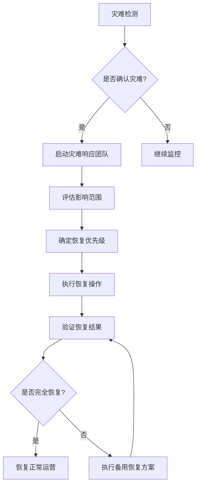

# Apache Airflow 灾难恢复计划

## 1. 概述

### 1.1 目的
本文档旨在为Apache Airflow生产环境提供全面的灾难恢复计划，确保在发生系统故障、自然灾害、安全事件或其他灾难性事件时，能够快速恢复服务并最小化业务影响。

### 1.2 适用范围
本计划适用于所有运行Apache Airflow的生产环境，包括开发、测试、预生产和生产环境。

### 1.3 关键术语
- **RTO (Recovery Time Objective)**: 恢复时间目标，系统从故障到恢复正常运行所需的最大时间
- **RPO (Recovery Point Objective)**: 恢复点目标，可接受的数据丢失最大时间窗口
- **MTTR (Mean Time To Recovery)**: 平均恢复时间
- **BCP (Business Continuity Plan)**: 业务连续性计划
- **DRP (Disaster Recovery Plan)**: 灾难恢复计划

## 2. 灾难恢复策略

### 2.1 多区域部署
```yaml
# 多区域部署配置
multi_region_deployment:
  primary_region:
    name: us-west-2
    components:
      - webserver
      - scheduler
      - database
      - redis
      - monitoring
      
  secondary_region:
    name: us-east-1
    components:
      - standby_webserver
      - standby_scheduler
      - standby_database
      - standby_redis
      - standby_monitoring
      
  tertiary_region:
    name: eu-west-1
    components:
      - dr_webserver
      - dr_scheduler
      - dr_database
      - dr_redis
```

### 2.2 数据备份策略
```bash
#!/bin/bash
# backup-strategy.sh

# 数据库备份脚本
backup_database() {
    local timestamp=$(date +%Y%m%d_%H%M%S)
    local backup_file="airflow_db_backup_${timestamp}.sql"
    
    # 执行数据库备份
    pg_dump -h $DB_HOST -U $DB_USER -d $DB_NAME > $backup_file
    
    # 压缩备份文件
    gzip $backup_file
    
    # 上传到S3
    aws s3 cp ${backup_file}.gz s3://airflow-backups/database/
    
    # 删除本地备份文件
    rm ${backup_file}.gz
    
    echo "Database backup completed: ${backup_file}.gz"
}

# DAG备份脚本
backup_dags() {
    local timestamp=$(date +%Y%m%d_%H%M%S)
    local backup_file="airflow_dags_backup_${timestamp}.tar.gz"
    
    # 创建DAG备份
    tar -czf $backup_file -C /opt/airflow dags/
    
    # 上传到S3
    aws s3 cp $backup_file s3://airflow-backups/dags/
    
    # 删除本地备份文件
    rm $backup_file
    
    echo "DAGs backup completed: $backup_file"
}

# 配置备份脚本
backup_config() {
    local timestamp=$(date +%Y%m%d_%H%M%S)
    local backup_file="airflow_config_backup_${timestamp}.tar.gz"
    
    # 创建配置备份
    tar -czf $backup_file \
        -C /opt/airflow airflow.cfg \
        -C /opt/airflow connections.json \
        -C /opt/airflow variables.json
    
    # 上传到S3
    aws s3 cp $backup_file s3://airflow-backups/config/
    
    # 删除本地备份文件
    rm $backup_file
    
    echo "Configuration backup completed: $backup_file"
}
```

### 2.3 自动故障转移
```yaml
# 自动故障转移配置
automatic_failover:
  health_check:
    interval: 30  # 秒
    timeout: 10   # 秒
    threshold: 3  # 连续失败次数
    
  failover_triggers:
    - type: database_unavailable
      condition: database_connection_failed
      action: switch_to_standby
      
    - type: webserver_down
      condition: http_5xx_errors > 50%
      action: switch_to_standby
      
    - type: scheduler_stopped
      condition: scheduler_not_responding
      action: restart_scheduler
      
  failover_procedures:
    database_failover:
      steps:
        - stop_primary_database
        - promote_standby_database
        - update_connection_strings
        - restart_airflow_services
        - verify_database_connectivity
        
    webserver_failover:
      steps:
        - stop_primary_webserver
        - start_standby_webserver
        - update_dns_records
        - verify_web_accessibility
        - notify_stakeholders
```

## 3. 灾难恢复流程

### 3.1 灾难识别和评估
```python
# disaster_detection.py
import logging
import requests
import smtplib
from datetime import datetime, timedelta

class DisasterDetector:
    def __init__(self):
        self.logger = logging.getLogger(__name__)
        self.alert_thresholds = {
            'database_down': 3,
            'webserver_errors': 0.5,  # 50% error rate
            'scheduler_stopped': 5,   # 5 minutes
        }
        
    def check_database_health(self):
        """检查数据库健康状态"""
        try:
            # 模拟数据库连接检查
            response = requests.get('http://airflow-db:5432/health')
            if response.status_code == 200:
                return True, "Database is healthy"
            else:
                return False, f"Database health check failed: {response.status_code}"
        except Exception as e:
            return False, f"Database connection error: {str(e)}"
            
    def check_webserver_health(self):
        """检查Webserver健康状态"""
        try:
            # 检查Webserver响应时间和错误率
            response = requests.get('http://airflow-webserver:8080/health', timeout=10)
            if response.status_code == 200:
                return True, "Webserver is healthy"
            else:
                return False, f"Webserver health check failed: {response.status_code}"
        except Exception as e:
            return False, f"Webserver connection error: {str(e)}"
            
    def check_scheduler_health(self):
        """检查调度器健康状态"""
        try:
            # 检查调度器最后心跳时间
            from airflow.models import DagRun
            last_dag_run = DagRun.find_recent_dag_runs(limit=1)
            if last_dag_run:
                last_run_time = last_dag_run[0].execution_date
                time_diff = datetime.utcnow() - last_run_time
                if time_diff > timedelta(minutes=10):
                    return False, f"Scheduler appears stopped, last run: {time_diff} ago"
                else:
                    return True, "Scheduler is running"
            else:
                return False, "No recent DAG runs found"
        except Exception as e:
            return False, f"Scheduler health check error: {str(e)}"
            
    def detect_disaster(self):
        """检测灾难事件"""
        issues = []
        
        # 检查各个组件健康状态
        db_healthy, db_message = self.check_database_health()
        if not db_healthy:
            issues.append(f"Database issue: {db_message}")
            
        web_healthy, web_message = self.check_webserver_health()
        if not web_healthy:
            issues.append(f"Webserver issue: {web_message}")
            
        sched_healthy, sched_message = self.check_scheduler_health()
        if not sched_healthy:
            issues.append(f"Scheduler issue: {sched_message}")
            
        # 如果发现问题，触发告警
        if issues:
            self.trigger_alert(issues)
            return True, issues
        else:
            return False, "No issues detected"
            
    def trigger_alert(self, issues):
        """触发告警"""
        self.logger.critical(f"Disaster detected: {', '.join(issues)}")
        
        # 发送邮件告警
        self.send_email_alert(issues)
        
        # 发送Slack告警
        self.send_slack_alert(issues)
        
    def send_email_alert(self, issues):
        """发送邮件告警"""
        try:
            server = smtplib.SMTP('smtp.company.com', 587)
            server.starttls()
            server.login("airflow-alerts@company.com", "password")
            
            message = f"""Subject: Airflow Disaster Alert

Critical issues detected in Airflow environment:
{chr(10).join(issues)}

Please initiate disaster recovery procedures immediately.

Time: {datetime.now().isoformat()}
"""
            
            server.sendmail("airflow-alerts@company.com", 
                          ["airflow-team@company.com", "ops-team@company.com"], 
                          message)
            server.quit()
        except Exception as e:
            self.logger.error(f"Failed to send email alert: {str(e)}")
            
    def send_slack_alert(self, issues):
        """发送Slack告警"""
        try:
            webhook_url = "https://hooks.slack.com/services/YOUR/SLACK/WEBHOOK"
            payload = {
                "channel": "#airflow-alerts",
                "username": "Airflow Disaster Detector",
                "text": f"🚨 *Airflow Disaster Alert*\n\n{' '.join(issues)}",
                "icon_emoji": ":rotating_light:"
            }
            
            requests.post(webhook_url, json=payload)
        except Exception as e:
            self.logger.error(f"Failed to send Slack alert: {str(e)}")
```

### 3.2 灾难响应流程


### 3.3 数据恢复流程
```bash
#!/bin/bash
# data_recovery.sh

# 数据库恢复函数
recover_database() {
    local backup_file=$1
    local target_host=$2
    
    echo "Starting database recovery from $backup_file to $target_host..."
    
    # 下载备份文件
    aws s3 cp s3://airflow-backups/database/$backup_file ./temp_backup.sql.gz
    
    # 解压备份文件
    gunzip ./temp_backup.sql.gz
    
    # 恢复数据库
    psql -h $target_host -U $DB_USER -d $DB_NAME -f ./temp_backup.sql
    
    # 清理临时文件
    rm ./temp_backup.sql
    
    echo "Database recovery completed"
}

# DAG恢复函数
recover_dags() {
    local backup_file=$1
    local target_path=$2
    
    echo "Starting DAG recovery from $backup_file to $target_path..."
    
    # 下载备份文件
    aws s3 cp s3://airflow-backups/dags/$backup_file ./temp_dags.tar.gz
    
    # 解压备份文件
    mkdir -p $target_path
    tar -xzf ./temp_dags.tar.gz -C $target_path
    
    # 清理临时文件
    rm ./temp_dags.tar.gz
    
    echo "DAG recovery completed"
}

# 配置恢复函数
recover_config() {
    local backup_file=$1
    local target_path=$2
    
    echo "Starting configuration recovery from $backup_file to $target_path..."
    
    # 下载备份文件
    aws s3 cp s3://airflow-backups/config/$backup_file ./temp_config.tar.gz
    
    # 解压备份文件
    mkdir -p $target_path
    tar -xzf ./temp_config.tar.gz -C $target_path
    
    # 清理临时文件
    rm ./temp_config.tar.gz
    
    echo "Configuration recovery completed"
}
```

## 4. 灾难恢复测试

### 4.1 定期测试计划
```yaml
# 灾难恢复测试计划
disaster_recovery_testing:
  schedule:
    # 季度测试
    quarterly_test:
      frequency: quarterly
      scope: partial_environment
      rto_target: 2_hours
      rpo_target: 1_hour
      participants:
        - airflow_admin
        - devops_engineer
        - qa_engineer
        
    # 年度测试
    annual_test:
      frequency: annually
      scope: full_environment
      rto_target: 4_hours
      rpo_target: 30_minutes
      participants:
        - airflow_admin
        - devops_engineer
        - qa_engineer
        - security_team
        - business_stakeholders
        
  test_scenarios:
    # 数据库故障
    database_failure:
      description: "模拟主数据库完全不可用"
      steps:
        - stop_primary_database_service
        - verify_failover_to_standby
        - measure_recovery_time
        - validate_data_integrity
        - document_findings
        
    # Webserver故障
    webserver_failure:
      description: "模拟Webserver完全不可用"
      steps:
        - stop_webserver_service
        - verify_dns_switch_to_standby
        - measure_recovery_time
        - validate_user_access
        - document_findings
        
    # 网络分区
    network_partition:
      description: "模拟网络分区导致部分服务不可达"
      steps:
        - simulate_network_partition
        - verify_service_discovery
        - measure_failover_time
        - validate_system_resilience
        - document_findings
        
    # 安全事件
    security_incident:
      description: "模拟安全事件导致数据泄露"
      steps:
        - simulate_data_compromise
        - execute_incident_response
        - restore_from_clean_backup
        - validate_system_security
        - document_findings
```

### 4.2 测试执行脚本
```python
# dr_test_runner.py
import unittest
import time
import subprocess
import logging
from datetime import datetime

class DisasterRecoveryTest(unittest.TestCase):
    def setUp(self):
        self.logger = logging.getLogger(__name__)
        self.start_time = datetime.now()
        
    def tearDown(self):
        end_time = datetime.now()
        duration = end_time - self.start_time
        self.logger.info(f"Test completed in {duration.total_seconds()} seconds")
        
    def test_database_failover(self):
        """测试数据库故障转移"""
        self.logger.info("Starting database failover test")
        
        # 停止主数据库
        result = subprocess.run(["systemctl", "stop", "postgresql"], 
                              capture_output=True, text=True)
        self.assertEqual(result.returncode, 0, "Failed to stop primary database")
        
        # 等待故障转移
        time.sleep(60)
        
        # 验证备用数据库是否激活
        result = subprocess.run(["psql", "-h", "standby-db", "-U", "airflow", 
                               "-c", "SELECT 1;"], 
                              capture_output=True, text=True)
        self.assertEqual(result.returncode, 0, "Standby database is not responding")
        
        self.logger.info("Database failover test passed")
        
    def test_webserver_failover(self):
        """测试Webserver故障转移"""
        self.logger.info("Starting webserver failover test")
        
        # 停止主Webserver
        result = subprocess.run(["systemctl", "stop", "airflow-webserver"], 
                              capture_output=True, text=True)
        self.assertEqual(result.returncode, 0, "Failed to stop primary webserver")
        
        # 等待DNS更新
        time.sleep(300)
        
        # 验证备用Webserver是否可访问
        import requests
        try:
            response = requests.get("http://airflow.company.com/health", timeout=30)
            self.assertEqual(response.status_code, 200, 
                           "Standby webserver is not accessible")
        except requests.exceptions.RequestException as e:
            self.fail(f"Failed to access standby webserver: {str(e)}")
            
        self.logger.info("Webserver failover test passed")
        
    def test_data_integrity(self):
        """测试数据完整性"""
        self.logger.info("Starting data integrity test")
        
        # 比较主备数据库数据
        primary_count = self.get_table_count("primary-db", "dag_run")
        standby_count = self.get_table_count("standby-db", "dag_run")
        
        self.assertEqual(primary_count, standby_count, 
                        "Data mismatch between primary and standby databases")
        
        self.logger.info("Data integrity test passed")
        
    def get_table_count(self, host, table):
        """获取表记录数"""
        result = subprocess.run([
            "psql", "-h", host, "-U", "airflow", "-t", "-c", 
            f"SELECT COUNT(*) FROM {table};"
        ], capture_output=True, text=True)
        
        if result.returncode == 0:
            return int(result.stdout.strip())
        else:
            raise Exception(f"Failed to get table count: {result.stderr}")

if __name__ == "__main__":
    # 配置日志
    logging.basicConfig(
        level=logging.INFO,
        format='%(asctime)s - %(name)s - %(levelname)s - %(message)s',
        handlers=[
            logging.FileHandler('dr_test.log'),
            logging.StreamHandler()
        ]
    )
    
    # 运行测试
    unittest.main()
```

## 5. 灾难恢复资源

### 5.1 人员职责
```yaml
# 灾难恢复团队职责
disaster_recovery_team:
  incident_manager:
    role: "总体协调和决策"
    responsibilities:
      - 启动灾难恢复程序
      - 协调各团队工作
      - 与业务部门沟通
      - 向管理层汇报进展
    contact:
      phone: "+1-555-0123"
      email: "incident-manager@company.com"
      
  technical_lead:
    role: "技术实施和故障排除"
    responsibilities:
      - 执行恢复操作
      - 解决技术问题
      - 验证恢复结果
      - 记录技术细节
    contact:
      phone: "+1-555-0124"
      email: "tech-lead@company.com"
      
  database_admin:
    role: "数据库恢复专家"
    responsibilities:
      - 数据库备份和恢复
      - 数据完整性验证
      - 性能调优
    contact:
      phone: "+1-555-0125"
      email: "dba@company.com"
      
  network_admin:
    role: "网络基础设施专家"
    responsibilities:
      - 网络连接恢复
      - 安全策略实施
      - 负载均衡配置
    contact:
      phone: "+1-555-0126"
      email: "network-admin@company.com"
      
  application_admin:
    role: "应用层恢复专家"
    responsibilities:
      - Airflow服务恢复
      - DAG部署和验证
      - 用户权限管理
    contact:
      phone: "+1-555-0127"
      email: "app-admin@company.com"
```

### 5.2 联系信息
```markdown
## 紧急联系信息

### 内部联系
- **IT服务台**: +1-555-0100
- **系统管理员**: +1-555-0101
- **数据库管理员**: +1-555-0102
- **网络管理员**: +1-555-0103

### 外部联系
- **云服务提供商支持**:
  - AWS Support: https://aws.amazon.com/support
  - GCP Support: https://cloud.google.com/support
  - Azure Support: https://azure.microsoft.com/support

- **关键供应商**:
  - Airflow Support: https://airflow.apache.org/community/
  - Monitoring Tools Support: [具体供应商联系方式]

### 备用通信方式
- **Slack频道**: #airflow-disaster-recovery
- **邮件组**: airflow-dr@company.com
- **备用电话**: +1-555-0199
```

### 5.3 恢复工具清单
```yaml
# 灾难恢复工具清单
recovery_tools:
  database_tools:
    - name: "pg_dump"
      version: "13.3"
      purpose: "数据库备份"
      location: "/usr/bin/pg_dump"
      
    - name: "pg_restore"
      version: "13.3"
      purpose: "数据库恢复"
      location: "/usr/bin/pg_restore"
      
    - name: "wal-g"
      version: "0.2.19"
      purpose: "WAL日志备份和恢复"
      location: "/usr/local/bin/wal-g"
      
  file_sync_tools:
    - name: "rsync"
      version: "3.1.2"
      purpose: "文件同步"
      location: "/usr/bin/rsync"
      
    - name: "aws-cli"
      version: "2.2.30"
      purpose: "AWS资源管理"
      location: "/usr/local/bin/aws"
      
    - name: "kubectl"
      version: "1.21.2"
      purpose: "Kubernetes集群管理"
      location: "/usr/local/bin/kubectl"
      
  monitoring_tools:
    - name: "prometheus"
      version: "2.28.1"
      purpose: "系统监控"
      location: "https://prometheus.company.com"
      
    - name: "grafana"
      version: "8.0.4"
      purpose: "数据可视化"
      location: "https://grafana.company.com"
      
    - name: "alertmanager"
      version: "0.23.0"
      purpose: "告警管理"
      location: "https://alertmanager.company.com"
```

## 6. 灾难恢复文档

### 6.1 恢复检查清单
```markdown
# 灾难恢复检查清单

## 预备阶段
- [ ] 确认灾难恢复团队成员到位
- [ ] 检查所有备份文件的完整性
- [ ] 验证备用环境的可用性
- [ ] 准备必要的恢复工具和脚本
- [ ] 通知相关业务部门

## 执行阶段
- [ ] 停止受损环境的所有服务
- [ ] 启动备用环境的服务
- [ ] 恢复最新的数据库备份
- [ ] 部署最新的DAG文件
- [ ] 配置用户权限和连接信息
- [ ] 验证系统功能完整性

## 验证阶段
- [ ] 测试关键DAG的执行
- [ ] 验证数据完整性和一致性
- [ ] 检查用户访问权限
- [ ] 确认监控和告警系统正常工作
- [ ] 验证日志收集和分析功能

## 恢复阶段
- [ ] 逐步将流量切换到恢复环境
- [ ] 监控系统性能和稳定性
- [ ] 通知用户系统已恢复正常
- [ ] 记录恢复过程和时间点
- [ ] 更新灾难恢复文档
```

### 6.2 事后分析报告模板
```markdown
# 灾难恢复事后分析报告

## 基本信息
- **事件时间**: [YYYY-MM-DD HH:MM:SS]
- **事件类型**: [数据库故障/Webserver故障/安全事件等]
- **影响范围**: [受影响的系统和服务]
- **恢复时间**: [从事件发生到完全恢复的时间]
- **RTO达成情况**: [实际RTO vs 目标RTO]
- **RPO达成情况**: [实际RPO vs 目标RPO]

## 事件详情
### 事件描述
[详细描述事件的发生过程、影响和发现方式]

### 根本原因分析
[分析导致事件发生的根本原因]

### 影响评估
[评估事件对业务的影响程度]

## 恢复过程
### 响应时间线
```