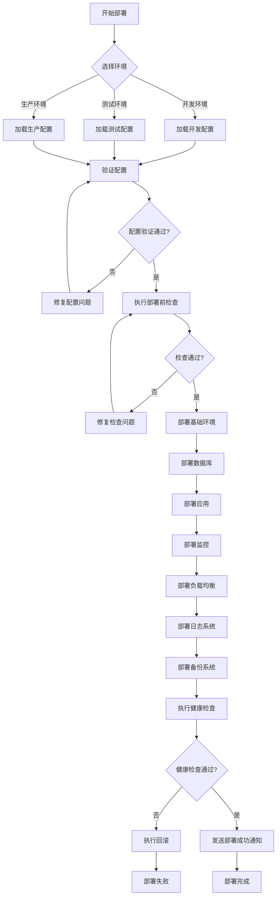
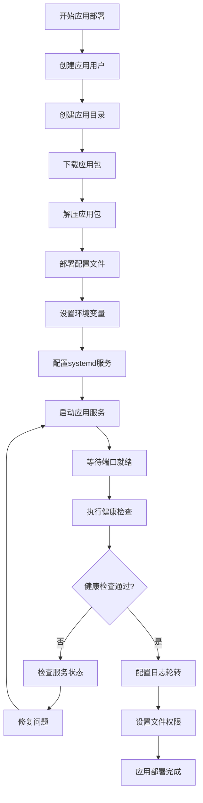
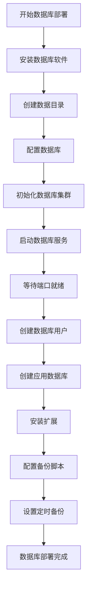
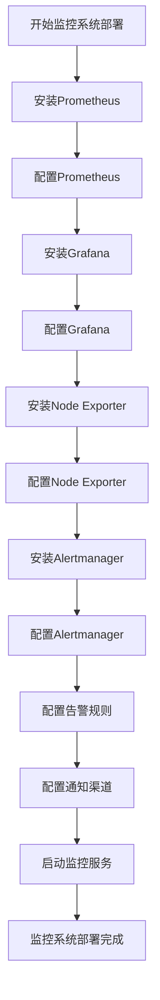
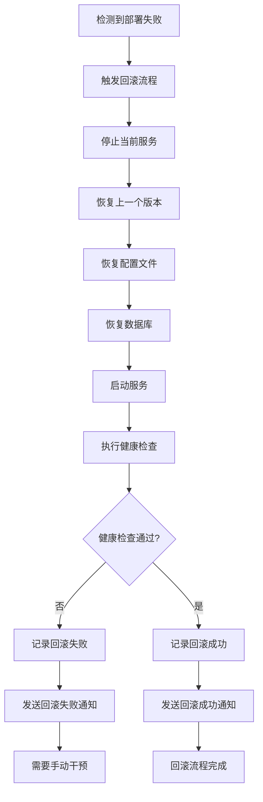

# 部署流程图

## 整体部署流程

```mermaid
graph TD
    A[开始部署] --> B{选择环境}
    B -->|开发环境| C[加载开发配置]
    B -->|测试环境| D[加载测试配置]
    B -->|生产环境| E[加载生产配置]
    
    C --> F[验证配置]
    D --> F
    E --> F
    
    F --> G{配置验证通过?}
    G -->|否| H[修复配置问题]
    H --> F
    
    G -->|是| I[执行部署前检查]
    I --> J{检查通过?}
    J -->|否| K[修复检查问题]
    K --> I
    
    J -->|是| L[部署基础环境]
    L --> M[部署数据库]
    M --> N[部署应用]
    N --> O[部署监控]
    O --> P[部署负载均衡]
    P --> Q[部署日志系统]
    Q --> R[部署备份系统]
    
    R --> S[执行健康检查]
    S --> T{健康检查通过?}
    T -->|否| U[执行回滚]
    U --> V[部署失败]
    
    T -->|是| W[发送部署成功通知]
    W --> X[部署完成]
```

## 应用部署流程

```mermaid
graph TD
    A[开始应用部署] --> B[创建应用用户]
    B --> C[创建应用目录]
    C --> D[下载应用包]
    D --> E[解压应用包]
    E --> F[部署配置文件]
    F --> G[设置环境变量]
    G --> H[配置systemd服务]
    H --> I[启动应用服务]
    I --> J[等待端口就绪]
    J --> K[执行健康检查]
    K --> L{健康检查通过?}
    L -->|否| M[检查服务状态]
    M --> N[修复问题]
    N --> I
    
    L -->|是| O[配置日志轮转]
    O --> P[设置文件权限]
    P --> Q[应用部署完成]
```

## 数据库部署流程

```mermaid
graph TD
    A[开始数据库部署] --> B[安装数据库软件]
    B --> C[创建数据目录]
    C --> D[配置数据库]
    D --> E[初始化数据库集群]
    E --> F[启动数据库服务]
    F --> G[等待端口就绪]
    G --> H[创建数据库用户]
    H --> I[创建应用数据库]
    I --> J[安装扩展]
    J --> K[配置备份脚本]
    K --> L[设置定时备份]
    L --> M[数据库部署完成]
```

## 监控系统部署流程

```mermaid
graph TD
    A[开始监控系统部署] --> B[安装Prometheus]
    B --> C[配置Prometheus]
    C --> D[安装Grafana]
    D --> E[配置Grafana]
    E --> F[安装Node Exporter]
    F --> G[配置Node Exporter]
    G --> H[安装Alertmanager]
    H --> I[配置Alertmanager]
    I --> J[配置告警规则]
    J --> K[配置通知渠道]
    K --> L[启动监控服务]
    L --> M[监控系统部署完成]
```

## 回滚流程

```mermaid
graph TD
    A[检测到部署失败] --> B[触发回滚流程]
    B --> C[停止当前服务]
    C --> D[恢复上一个版本]
    D --> E[恢复配置文件]
    E --> F[恢复数据库]
    F --> G[启动服务]
    G --> H[执行健康检查]
    H --> I{健康检查通过?}
    I -->|否| J[记录回滚失败]
    I -->|是| K[记录回滚成功]
    
    J --> L[发送回滚失败通知]
    K --> M[发送回滚成功通知]
    
    L --> N[需要手动干预]
    M --> O[回滚流程完成]
```