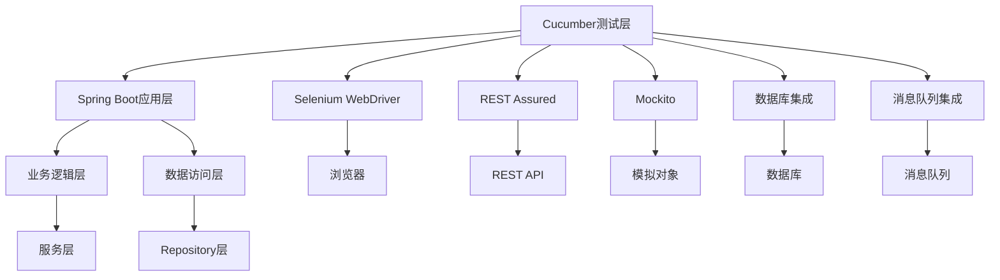

# 7.8 Cucumber与多框架集成

## 引言

在现代企业级应用中，通常需要同时使用多个框架来实现不同的功能需求。Cucumber作为BDD测试框架，可以与多种框架无缝集成，实现全面的端到端测试。本章将深入探讨如何将Cucumber与多个框架（如Spring Boot、Selenium、REST Assured、Mockito、数据库和消息队列）进行集成，构建全面的测试解决方案。

## 多框架集成架构

### 整体架构设计



### 依赖管理

#### Maven依赖配置

```xml
<dependencies>
    <!-- Cucumber核心依赖 -->
    <dependency>
        <groupId>io.cucumber</groupId>
        <artifactId>cucumber-java</artifactId>
        <version>7.11.0</version>
        <scope>test</scope>
    </dependency>
    
    <dependency>
        <groupId>io.cucumber</groupId>
        <artifactId>cucumber-junit</artifactId>
        <version>7.11.0</version>
        <scope>test</scope>
    </dependency>
    
    <dependency>
        <groupId>io.cucumber</groupId>
        <artifactId>cucumber-spring</artifactId>
        <version>7.11.0</version>
        <scope>test</scope>
    </dependency>
    
    <!-- Spring Boot测试依赖 -->
    <dependency>
        <groupId>org.springframework.boot</groupId>
        <artifactId>spring-boot-starter-test</artifactId>
        <version>3.0.5</version>
        <scope>test</scope>
    </dependency>
    
    <!-- Selenium WebDriver依赖 -->
    <dependency>
        <groupId>org.seleniumhq.selenium</groupId>
        <artifactId>selenium-java</artifactId>
        <version>4.8.1</version>
        <scope>test</scope>
    </dependency>
    
    <dependency>
        <groupId>org.seleniumhq.selenium</groupId>
        <artifactId>selenium-chrome-driver</artifactId>
        <version>4.8.1</version>
        <scope>test</scope>
    </dependency>
    
    <!-- REST Assured依赖 -->
    <dependency>
        <groupId>io.rest-assured</groupId>
        <artifactId>rest-assured</artifactId>
        <version>5.3.0</version>
        <scope>test</scope>
    </dependency>
    
    <!-- Mockito依赖 -->
    <dependency>
        <groupId>org.mockito</groupId>
        <artifactId>mockito-core</artifactId>
        <version>5.1.1</version>
        <scope>test</scope>
    </dependency>
    
    <!-- 数据库依赖 -->
    <dependency>
        <groupId>org.springframework.boot</groupId>
        <artifactId>spring-boot-starter-data-jpa</artifactId>
        <version>3.0.5</version>
        <scope>test</scope>
    </dependency>
    
    <dependency>
        <groupId>com.h2database</groupId>
        <artifactId>h2</artifactId>
        <version>2.1.214</version>
        <scope>test</scope>
    </dependency>
    
    <!-- 消息队列依赖 -->
    <dependency>
        <groupId>org.springframework.boot</groupId>
        <artifactId>spring-boot-starter-amqp</artifactId>
        <version>3.0.5</version>
        <scope>test</scope>
    </dependency>
    
    <!-- Testcontainers依赖 -->
    <dependency>
        <groupId>org.testcontainers</groupId>
        <artifactId>junit-jupiter</artifactId>
        <version>1.17.6</version>
        <scope>test</scope>
    </dependency>
    
    <dependency>
        <groupId>org.testcontainers</groupId>
        <artifactId>selenium</artifactId>
        <version>1.17.6</version>
        <scope>test</scope>
    </dependency>
    
    <!-- Awaitility依赖 -->
    <dependency>
        <groupId>org.awaitility</groupId>
        <artifactId>awaitility</artifactId>
        <version>4.2.0</version>
        <scope>test</scope>
    </dependency>
</dependencies>
```

## 集成测试配置

### 测试配置类

#### 主测试配置类

```java
package com.example.gherkin.config;

import org.springframework.boot.test.context.SpringBootTest;
import org.springframework.context.annotation.Bean;
import org.springframework.context.annotation.Configuration;
import org.springframework.context.annotation.Primary;
import org.springframework.context.annotation.Profile;
import org.springframework.boot.test.web.server.LocalServerPort;

import io.restassured.RestAssured;
import io.restassured.builder.RequestSpecBuilder;
import io.restassured.specification.RequestSpecification;

@SpringBootTest(webEnvironment = SpringBootTest.WebEnvironment.RANDOM_PORT)
@Configuration
@Profile("test")
public class MultiFrameworkTestConfig {
    
    @LocalServerPort
    private int port;
    
    @Bean
    @Primary
    public RequestSpecification requestSpecification() {
        return new RequestSpecBuilder()
                .setPort(port)
                .setBasePath("/api")
                .addHeader("Content-Type", "application/json")
                .build();
    }
    
    @Bean
    public WebDriverConfig webDriverConfig() {
        return new WebDriverConfig();
    }
}
```

#### WebDriver配置

```java
package com.example.gherkin.config;

import org.openqa.selenium.WebDriver;
import org.openqa.selenium.chrome.ChromeDriver;
import org.openqa.selenium.chrome.ChromeOptions;
import org.openqa.selenium.support.ui.WebDriverWait;
import org.springframework.context.annotation.Bean;
import org.springframework.context.annotation.Configuration;

import java.time.Duration;

@Configuration
public class WebDriverConfig {
    
    @Bean(destroyMethod = "quit")
    public WebDriver webDriver() {
        ChromeOptions options = new ChromeOptions();
        options.addArguments("--headless");
        options.addArguments("--no-sandbox");
        options.addArguments("--disable-dev-shm-usage");
        options.addArguments("--disable-gpu");
        options.addArguments("--window-size=1920,1080");
        
        return new ChromeDriver(options);
    }
    
    @Bean
    public WebDriverWait webDriverWait(WebDriver webDriver) {
        return new WebDriverWait(webDriver, Duration.ofSeconds(10));
    }
}
```

#### 测试数据配置

```java
package com.example.gherkin.config;

import org.springframework.boot.test.context.TestConfiguration;
import org.springframework.context.annotation.Bean;
import org.springframework.context.annotation.Primary;
import org.springframework.boot.test.mock.mockito.MockBean;
import com.example.gherkin.repositories.UserRepository;
import com.example.gherkin.services.EmailService;
import com.example.gherkin.services.NotificationService;

@TestConfiguration
public class TestDataConfig {
    
    @MockBean
    @Primary
    private UserRepository userRepository;
    
    @MockBean
    @Primary
    private EmailService emailService;
    
    @MockBean
    @Primary
    private NotificationService notificationService;
}
```

## 集成测试上下文

### 测试上下文类

#### 主测试上下文

```java
package com.example.gherkin.context;

import io.cucumber.spring.ScenarioScope;
import org.openqa.selenium.WebDriver;
import org.springframework.beans.factory.annotation.Autowired;
import org.springframework.stereotype.Component;
import io.restassured.specification.RequestSpecification;
import com.example.gherkin.models.User;
import com.example.gherkin.models.Order;
import com.example.gherkin.models.Product;

import java.util.ArrayList;
import java.util.HashMap;
import java.util.List;
import java.util.Map;

@ScenarioScope
@Component
public class TestContext {
    
    @Autowired
    private WebDriver webDriver;
    
    @Autowired
    private RequestSpecification requestSpecification;
    
    private User currentUser;
    private Order currentOrder;
    private Product currentProduct;
    private List<User> users = new ArrayList<>();
    private List<Order> orders = new ArrayList<>();
    private List<Product> products = new ArrayList<>();
    private Map<String, Object> scenarioData = new HashMap<>();
    private String lastApiResponse;
    private int lastApiStatusCode;
    
    // WebDriver相关方法
    public WebDriver getWebDriver() {
        return webDriver;
    }
    
    public void navigateTo(String url) {
        webDriver.get(url);
    }
    
    public String getCurrentUrl() {
        return webDriver.getCurrentUrl();
    }
    
    public String getTitle() {
        return webDriver.getTitle();
    }
    
    // REST Assured相关方法
    public RequestSpecification getRequestSpecification() {
        return requestSpecification;
    }
    
    public void setLastApiResponse(String response) {
        this.lastApiResponse = response;
    }
    
    public String getLastApiResponse() {
        return lastApiResponse;
    }
    
    public void setLastApiStatusCode(int statusCode) {
        this.lastApiStatusCode = statusCode;
    }
    
    public int getLastApiStatusCode() {
        return lastApiStatusCode;
    }
    
    // 用户相关方法
    public User getCurrentUser() {
        return currentUser;
    }
    
    public void setCurrentUser(User user) {
        this.currentUser = user;
        if (!users.contains(user)) {
            users.add(user);
        }
    }
    
    public List<User> getUsers() {
        return new ArrayList<>(users);
    }
    
    public void addUser(User user) {
        users.add(user);
    }
    
    public User findUserByUsername(String username) {
        return users.stream()
                .filter(u -> u.getUsername().equals(username))
                .findFirst()
                .orElse(null);
    }
    
    // 订单相关方法
    public Order getCurrentOrder() {
        return currentOrder;
    }
    
    public void setCurrentOrder(Order order) {
        this.currentOrder = order;
        if (!orders.contains(order)) {
            orders.add(order);
        }
    }
    
    public List<Order> getOrders() {
        return new ArrayList<>(orders);
    }
    
    public void addOrder(Order order) {
        orders.add(order);
    }
    
    // 产品相关方法
    public Product getCurrentProduct() {
        return currentProduct;
    }
    
    public void setCurrentProduct(Product product) {
        this.currentProduct = product;
        if (!products.contains(product)) {
            products.add(product);
        }
    }
    
    public List<Product> getProducts() {
        return new ArrayList<>(products);
    }
    
    public void addProduct(Product product) {
        products.add(product);
    }
    
    public Product findProductByName(String name) {
        return products.stream()
                .filter(p -> p.getName().equals(name))
                .findFirst()
                .orElse(null);
    }
    
    // 场景数据相关方法
    public void setScenarioData(String key, Object value) {
        scenarioData.put(key, value);
    }
    
    public Object getScenarioData(String key) {
        return scenarioData.get(key);
    }
    
    @SuppressWarnings("unchecked")
    public <T> T getScenarioData(String key, Class<T> type) {
        Object value = scenarioData.get(key);
        return value != null && type.isInstance(value) ? (T) value : null;
    }
    
    public void clearScenarioData() {
        scenarioData.clear();
    }
    
    // 清理方法
    public void reset() {
        currentUser = null;
        currentOrder = null;
        currentProduct = null;
        users.clear();
        orders.clear();
        products.clear();
        scenarioData.clear();
        lastApiResponse = null;
        lastApiStatusCode = 0;
    }
}
```

## 多框架步骤定义

### 综合步骤定义

#### 用户管理步骤定义

```java
package com.example.gherkin.stepdefinitions.integration;

import io.cucumber.java.en.*;
import org.openqa.selenium.By;
import org.openqa.selenium.WebDriver;
import org.openqa.selenium.WebElement;
import org.openqa.selenium.support.ui.WebDriverWait;
import org.springframework.beans.factory.annotation.Autowired;
import org.springframework.boot.test.context.SpringBootTest;
import com.example.gherkin.context.TestContext;
import com.example.gherkin.models.User;
import com.example.gherkin.repositories.UserRepository;
import com.fasterxml.jackson.databind.ObjectMapper;

import io.restassured.response.Response;
import io.restassured.http.ContentType;

import static io.restassured.RestAssured.given;
import static org.junit.Assert.*;
import static org.mockito.Mockito.*;

@SpringBootTest
public class UserManagementSteps {
    
    @Autowired
    private TestContext testContext;
    
    @Autowired
    private UserRepository userRepository;
    
    @Autowired
    private WebDriverWait webDriverWait;
    
    private final ObjectMapper objectMapper = new ObjectMapper();
    
    @Given("用户管理系统已启动")
    public void userManagementSystemIsStarted() {
        assertNotNull("测试上下文不应为空", testContext);
        assertNotNull("用户仓库不应为空", userRepository);
    }
    
    @Given("创建用户数据，用户名为 {string}，邮箱为 {string}")
    public void createUserData(String username, String email) {
        User user = new User();
        user.setUsername(username);
        user.setEmail(email);
        testContext.setCurrentUser(user);
    }
    
    @When("通过API创建用户")
    public void createUserViaAPI() throws Exception {
        User user = testContext.getCurrentUser();
        String userJson = objectMapper.writeValueAsString(user);
        
        Response response = given()
                .spec(testContext.getRequestSpecification())
                .contentType(ContentType.JSON)
                .body(userJson)
                .when()
                .post("/users");
        
        testContext.setLastApiResponse(response.asString());
        testContext.setLastApiStatusCode(response.getStatusCode());
        
        if (response.getStatusCode() == 201) {
            User createdUser = response.as(User.class);
            testContext.setCurrentUser(createdUser);
        }
    }
    
    @When("通过Web界面创建用户")
    public void createUserViaWeb() {
        WebDriver driver = testContext.getWebDriver();
        User user = testContext.getCurrentUser();
        
        testContext.navigateTo("http://localhost:" + testContext.getWebDriver().getCurrentUrl().split(":")[1] + "/users/create");
        
        WebElement usernameField = driver.findElement(By.id("username"));
        WebElement emailField = driver.findElement(By.id("email"));
        WebElement submitButton = driver.findElement(By.id("submit"));
        
        usernameField.sendKeys(user.getUsername());
        emailField.sendKeys(user.getEmail());
        submitButton.click();
    }
    
    @When("通过API查询用户 {string}")
    public void queryUserViaAPI(String username) {
        Response response = given()
                .spec(testContext.getRequestSpecification())
                .pathParam("username", username)
                .when()
                .get("/users/{username}");
        
        testContext.setLastApiResponse(response.asString());
        testContext.setLastApiStatusCode(response.getStatusCode());
        
        if (response.getStatusCode() == 200) {
            User user = response.as(User.class);
            testContext.setCurrentUser(user);
        }
    }
    
    @Then("API响应状态码应该为 {int}")
    public void apiResponseStatusCodeShouldBe(int statusCode) {
        assertEquals("API状态码应该匹配", statusCode, testContext.getLastApiStatusCode());
    }
    
    @Then("API响应中应该包含用户名 {string}")
    public void apiResponseShouldContainUsername(String username) {
        String response = testContext.getLastApiResponse();
        assertTrue("API响应应该包含用户名", response.contains(username));
    }
    
    @Then("Web页面应该显示用户创建成功消息")
    public void webPageShouldDisplayUserCreationSuccessMessage() {
        WebDriver driver = testContext.getWebDriver();
        WebElement successMessage = driver.findElement(By.className("success-message"));
        assertTrue("应该显示成功消息", successMessage.isDisplayed());
        assertTrue("成功消息应该包含'创建成功'", successMessage.getText().contains("创建成功"));
    }
    
    @Then("数据库中应该存在用户 {string}")
    public void userShouldExistInDatabase(String username) {
        when(userRepository.findByUsername(username)).thenReturn(testContext.getCurrentUser());
        User user = userRepository.findByUsername(username);
        assertNotNull("用户应该存在于数据库中", user);
        assertEquals("用户名应该匹配", username, user.getUsername());
    }
}
```

#### 订单处理步骤定义

```java
package com.example.gherkin.stepdefinitions.integration;

import io.cucumber.java.en.*;
import org.openqa.selenium.By;
import org.openqa.selenium.WebDriver;
import org.openqa.selenium.WebElement;
import org.springframework.beans.factory.annotation.Autowired;
import org.springframework.boot.test.context.SpringBootTest;
import com.example.gherkin.context.TestContext;
import com.example.gherkin.models.Order;
import com.example.gherkin.models.User;
import com.example.gherkin.models.Product;
import com.example.gherkin.services.OrderService;
import com.example.gherkin.producers.OrderMessageProducer;
import com.example.gherkin.consumers.OrderMessageConsumer;

import io.restassured.response.Response;
import io.restassured.http.ContentType;

import static io.restassured.RestAssured.given;
import static org.junit.Assert.*;
import static org.mockito.Mockito.*;
import static org.awaitility.Awaitility.await;
import java.util.concurrent.TimeUnit;

@SpringBootTest
public class OrderProcessingSteps {
    
    @Autowired
    private TestContext testContext;
    
    @Autowired
    private OrderService orderService;
    
    @Autowired
    private OrderMessageProducer orderMessageProducer;
    
    @Autowired
    private OrderMessageConsumer orderMessageConsumer;
    
    @Given("用户 {string} 已登录")
    public void userIsLoggedIn(String username) {
        User user = testContext.findUserByUsername(username);
        if (user == null) {
            user = new User();
            user.setUsername(username);
            user.setEmail(username + "@example.com");
            testContext.setCurrentUser(user);
        }
        
        // 模拟用户登录
        WebDriver driver = testContext.getWebDriver();
        testContext.navigateTo("http://localhost:" + testContext.getWebDriver().getCurrentUrl().split(":")[1] + "/login");
        
        WebElement usernameField = driver.findElement(By.id("username"));
        WebElement passwordField = driver.findElement(By.id("password"));
        WebElement loginButton = driver.findElement(By.id("login-button"));
        
        usernameField.sendKeys(username);
        passwordField.sendKeys("password");
        loginButton.click();
    }
    
    @Given("产品 {string} 可用，价格为 {double}")
    public void productIsAvailable(String productName, double price) {
        Product product = new Product();
        product.setName(productName);
        product.setPrice(price);
        testContext.setCurrentProduct(product);
        testContext.addProduct(product);
    }
    
    @Given("创建订单，包含产品 {string}，数量为 {int}")
    public void createOrder(String productName, int quantity) {
        User user = testContext.getCurrentUser();
        Product product = testContext.findProductByName(productName);
        
        Order order = new Order();
        order.setUser(user);
        order.addProduct(product, quantity);
        order.calculateTotal();
        
        testContext.setCurrentOrder(order);
    }
    
    @When("通过API提交订单")
    public void submitOrderViaAPI() throws Exception {
        Order order = testContext.getCurrentOrder();
        
        Response response = given()
                .spec(testContext.getRequestSpecification())
                .contentType(ContentType.JSON)
                .body(order)
                .when()
                .post("/orders");
        
        testContext.setLastApiResponse(response.asString());
        testContext.setLastApiStatusCode(response.getStatusCode());
        
        if (response.getStatusCode() == 201) {
            Order createdOrder = response.as(Order.class);
            testContext.setCurrentOrder(createdOrder);
        }
    }
    
    @When("通过Web界面提交订单")
    public void submitOrderViaWeb() {
        WebDriver driver = testContext.getWebDriver();
        Order order = testContext.getCurrentOrder();
        
        testContext.navigateTo("http://localhost:" + testContext.getWebDriver().getCurrentUrl().split(":")[1] + "/orders/create");
        
        WebElement productSelect = driver.findElement(By.id("product"));
        WebElement quantityField = driver.findElement(By.id("quantity"));
        WebElement submitButton = driver.findElement(By.id("submit"));
        
        productSelect.sendKeys(order.getProducts().get(0).getName());
        quantityField.sendKeys(String.valueOf(order.getQuantities().get(0)));
        submitButton.click();
    }
    
    @When("发送订单消息到消息队列")
    public void sendOrderMessageToQueue() {
        Order order = testContext.getCurrentOrder();
        orderMessageProducer.sendOrderMessage(order);
    }
    
    @When("等待订单消息被处理")
    public void waitForOrderMessageToBeProcessed() {
        await().atMost(5, TimeUnit.SECONDS).until(() -> 
            orderMessageConsumer.hasProcessedOrder(testContext.getCurrentOrder().getId())
        );
    }
    
    @Then("订单状态应该为 {string}")
    public void orderStatusShouldBe(String status) {
        Order order = testContext.getCurrentOrder();
        assertEquals("订单状态应该匹配", status, order.getStatus());
    }
    
    @Then("订单应该被发送到消息队列")
    public void orderShouldBeSentToMessageQueue() {
        Order order = testContext.getCurrentOrder();
        verify(orderMessageProducer, times(1)).sendOrderMessage(order);
    }
    
    @Then("订单消息应该被成功处理")
    public void orderMessageShouldBeSuccessfullyProcessed() {
        Order order = testContext.getCurrentOrder();
        assertTrue("订单消息应该被处理", 
            orderMessageConsumer.hasProcessedOrder(order.getId()));
    }
    
    @Then("Web页面应该显示订单创建成功消息")
    public void webPageShouldDisplayOrderCreationSuccessMessage() {
        WebDriver driver = testContext.getWebDriver();
        WebElement successMessage = driver.findElement(By.className("success-message"));
        assertTrue("应该显示成功消息", successMessage.isDisplayed());
        assertTrue("成功消息应该包含'订单创建成功'", 
            successMessage.getText().contains("订单创建成功"));
    }
}
```

## 集成测试运行器

### 多框架集成测试运行器

```java
package com.example.gherkin;

import io.cucumber.junit.Cucumber;
import io.cucumber.junit.CucumberOptions;
import org.junit.runner.RunWith;

@RunWith(Cucumber.class)
@CucumberOptions(
    features = {"src/test/resources/features/integration"},
    glue = {"com.example.gherkin.stepdefinitions.integration"},
    plugin = {
        "pretty",
        "html:target/cucumber-reports",
        "json:target/cucumber-reports/cucumber.json"
    },
    monochrome = true,
    tags = "@multi-framework"
)
public class CucumberMultiFrameworkIntegrationTest {
}
```

### Testcontainers集成测试运行器

```java
package com.example.gherkin;

import io.cucumber.junit.Cucumber;
import io.cucumber.junit.CucumberOptions;
import org.junit.runner.RunWith;
import org.testcontainers.containers.BrowserWebDriverContainer;
import org.testcontainers.containers.RabbitMQContainer;
import org.testcontainers.containers.KafkaContainer;
import org.testcontainers.containers.PostgreSQLContainer;
import org.testcontainers.junit.jupiter.Container;
import org.testcontainers.junit.jupiter.Testcontainers;
import org.testcontainers.utility.DockerImageName;

import org.springframework.boot.test.context.SpringBootTest;
import org.springframework.test.context.ActiveProfiles;

import java.io.File;

@SpringBootTest
@ActiveProfiles("integration-test")
@Testcontainers
@RunWith(Cucumber.class)
@CucumberOptions(
    features = {"src/test/resources/features/integration"},
    glue = {"com.example.gherkin.stepdefinitions.integration"},
    plugin = {
        "pretty",
        "html:target/cucumber-reports",
        "json:target/cucumber-reports/cucumber.json"
    },
    monochrome = true,
    tags = "@testcontainers"
)
public class CucumberTestcontainersIntegrationTest {
    
    @Container
    static PostgreSQLContainer<?> postgres = new PostgreSQLContainer<>("postgres:15")
            .withDatabaseName("testdb")
            .withUsername("test")
            .withPassword("test")
            .withReuse(true);
    
    @Container
    static RabbitMQContainer rabbitmq = new RabbitMQContainer("rabbitmq:3.11-management")
            .withReuse(true);
    
    @Container
    static KafkaContainer kafka = new KafkaContainer(DockerImageName.parse("confluentinc/cp-kafka:7.2.1"))
            .withReuse(true);
    
    @Container
    static BrowserWebDriverContainer<?> chrome = new BrowserWebDriverContainer<>()
            .withCapabilities(new org.openqa.selenium.chrome.ChromeOptions())
            .withRecordingMode(BrowserWebDriverContainer.VncRecordingMode.RECORD_ALL, new File("target"))
            .withReuse(true);
}
```

## 集成测试特性文件

### 多框架集成特性文件

#### user_order_integration.feature

```gherkin
Feature: 用户与订单集成测试
  作为系统用户
  我希望能够创建账户并下订单
  以便完成完整的购物流程

  Background:
    Given 用户管理系统已启动

  Scenario: 通过API创建用户并下订单
    Given 创建用户数据，用户名为 "john_doe"，邮箱为 "john@example.com"
    When 通过API创建用户
    Then API响应状态码应该为 201
    And API响应中应该包含用户名 "john_doe"
    And 数据库中应该存在用户 "john_doe"
    
    Given 用户 "john_doe" 已登录
    And 产品 "Laptop" 可用，价格为 999.99
    And 创建订单，包含产品 "Laptop"，数量为 1
    When 通过API提交订单
    Then API响应状态码应该为 201
    And 订单状态应该为 "PENDING"
    And 发送订单消息到消息队列
    And 等待订单消息被处理
    Then 订单消息应该被成功处理

  Scenario: 通过Web界面创建用户并下订单
    Given 创建用户数据，用户名为 "jane_doe"，邮箱为 "jane@example.com"
    When 通过Web界面创建用户
    Then Web页面应该显示用户创建成功消息
    And 数据库中应该存在用户 "jane_doe"
    
    Given 用户 "jane_doe" 已登录
    And 产品 "Smartphone" 可用，价格为 699.99
    And 创建订单，包含产品 "Smartphone"，数量为 2
    When 通过Web界面提交订单
    Then Web页面应该显示订单创建成功消息
    And 订单状态应该为 "PENDING"
```

## 最佳实践

### 1. 合理组织测试结构

**原则**：按照功能模块和测试类型组织测试结构，提高可维护性。

**指导**：
- 按功能模块组织特性文件
- 按测试类型组织步骤定义
- 使用标签区分不同类型的测试

### 2. 使用测试上下文管理状态

**原则**：使用测试上下文管理测试状态，避免步骤定义之间共享状态。

**指导**：
- 使用@ScenarioScope注解确保场景隔离
- 在测试上下文中存储和检索测试数据
- 在每个场景开始前清理测试上下文

### 3. 合理使用Mock和真实服务

**原则**：根据测试需求合理使用Mock对象和真实服务。

**指导**：
- 使用Mock对象模拟外部依赖
- 使用Testcontainers进行集成测试
- 在单元测试中使用Mock，在集成测试中使用真实服务

### 4. 使用Testcontainers进行集成测试

**原则**：使用Testcontainers进行集成测试，模拟真实环境。

**指导**：
- 配置必要的Testcontainers容器
- 使用容器重用提高测试速度
- 配置容器网络和数据共享

### 5. 使用Awaitility处理异步操作

**原则**：使用Awaitility处理异步操作，确保测试的稳定性。

**指导**：
- 使用await().atMost()设置超时时间
- 使用until()条件等待异步操作完成
- 避免使用Thread.sleep()进行硬编码等待

### 6. 合理使用标签组织测试

**原则**：使用标签组织不同类型的测试，提高测试执行效率。

**指导**：
- 使用@integration标记集成测试
- 使用@ui标记UI测试
- 使用@api标记API测试
- 使用@slow标记耗时较长的测试

## 总结

Cucumber与多框架的集成为BDD测试提供了全面的能力，通过Spring Boot、Selenium、REST Assured、Mockito、数据库和消息队列的集成，我们可以构建端到端的测试解决方案。

在实际项目中，应该根据项目需求选择合适的框架集成策略，并遵循最佳实践。通过合理的配置和设计，Cucumber与多框架的集成可以大大提高测试覆盖率，确保应用程序的各个组件协同工作正常。