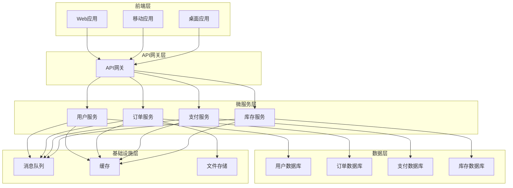
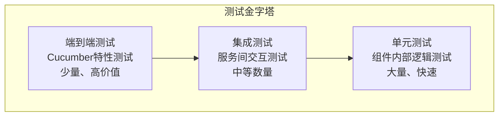
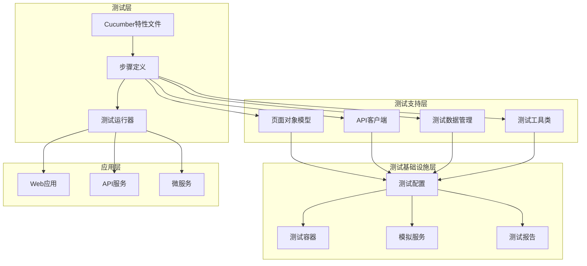

# 8.1 企业级应用概述

## 引言

企业级应用通常具有复杂的架构、高并发需求、严格的安全要求和长期维护需求。在这样的环境中，自动化测试不仅是质量保证的手段，更是持续交付和DevOps实践的关键组成部分。Cucumber作为一种行为驱动开发(BDD)测试框架，在企业级应用中扮演着连接业务需求与技术实现的重要角色。本章将探讨Cucumber在企业级应用中的应用场景、挑战和解决方案。

## 企业级应用特点

### 1. 复杂的系统架构

企业级应用通常采用分层架构、微服务架构或混合架构，包含多个相互依赖的组件和服务。



### 2. 高并发和性能要求

企业级应用需要处理大量并发请求，保证系统响应时间和吞吐量满足业务需求。

### 3. 严格的安全要求

企业级应用需要满足各种安全标准，如数据加密、身份认证、授权控制、审计日志等。

### 4. 长期维护需求

企业级应用通常需要长期运行和维护，要求代码具有良好的可扩展性、可维护性和可测试性。

## Cucumber在企业级应用中的价值

### 1. 业务需求与技术实现的桥梁

Cucumber使用自然语言描述业务需求，使非技术人员能够理解和验证测试用例，同时为开发人员提供明确的实现指导。

#### 示例：用户注册业务需求

```gherkin
Feature: 用户注册
  作为新用户
  我希望能够创建账户
  以便使用系统提供的各项服务

  Background:
    Given 用户注册服务已启动
    And 验证码服务已启动
    And 邮件服务已启动

  Scenario: 成功注册新用户
    Given 用户访问注册页面
    When 用户输入有效的用户名 "testuser"
    And 用户输入有效的邮箱 "testuser@example.com"
    And 用户输入有效的密码 "SecurePassword123"
    And 用户输入确认密码 "SecurePassword123"
    And 用户同意服务条款和隐私政策
    And 用户点击注册按钮
    Then 系统应该显示注册成功消息
    And 系统应该向用户邮箱发送验证邮件
    And 系统应该创建用户账户
    And 系统应该记录用户注册日志

  Scenario: 注册失败 - 用户名已存在
    Given 用户 "existinguser" 已存在
    And 用户访问注册页面
    When 用户输入已存在的用户名 "existinguser"
    And 用户输入有效的邮箱 "newuser@example.com"
    And 用户输入有效的密码 "SecurePassword123"
    And 用户输入确认密码 "SecurePassword123"
    And 用户同意服务条款和隐私政策
    And 用户点击注册按钮
    Then 系统应该显示用户名已存在的错误消息
    And 系统不应该创建用户账户
    And 系统不应该发送验证邮件
```

### 2. 活文档

Cucumber特性文件作为活文档，始终保持与系统功能同步，为团队提供准确的功能描述。

### 3. 回归测试保障

Cucumber测试套件可以作为回归测试的基础，确保新功能不会破坏现有功能。

### 4. 持续集成支持

Cucumber测试可以集成到CI/CD流水线中，实现自动化测试和持续交付。

## 企业级应用中的测试策略

### 1. 测试金字塔

在企业级应用中，采用测试金字塔策略，平衡不同层次的测试：



### 2. 测试分类

根据测试目的和范围，将测试分为不同类别：

- **验收测试**：验证系统是否满足业务需求
- **功能测试**：验证系统功能是否正确实现
- **集成测试**：验证组件间交互是否正常
- **性能测试**：验证系统性能是否满足要求
- **安全测试**：验证系统安全性是否符合标准

### 3. 测试环境管理

管理多个测试环境，确保测试的可靠性和一致性：

- **开发环境**：开发人员日常测试使用
- **测试环境**：QA团队功能测试使用
- **预生产环境**：生产前验证使用
- **生产环境**：实际运行环境

## 企业级应用中的Cucumber架构

### 1. 测试架构设计



### 2. 项目结构

```
src/
├── main/
│   ├── java/
│   │   └── com/example/gherkin/
│   │       ├── config/
│   │       ├── controllers/
│   │       ├── services/
│   │       ├── repositories/
│   │       └── models/
│   └── resources/
│       ├── application.yml
│       └── static/
└── test/
    ├── java/
    │   └── com/example/gherkin/
    │       ├── CucumberTestSuite.java
    │       ├── config/
    │       │   ├── TestConfig.java
    │       │   ├── WebDriverConfig.java
    │       │   └── TestContainersConfig.java
    │       ├── stepdefinitions/
    │       │   ├── user/
    │       │   ├── order/
    │       │   └── payment/
    │       ├── pages/
    │       │   ├── HomePage.java
    │       │   ├── LoginPage.java
    │       │   └── RegistrationPage.java
    │       ├── clients/
    │       │   ├── UserApiClient.java
    │       │   ├── OrderApiClient.java
    │       │   └── PaymentApiClient.java
    │       ├── utils/
    │       │   ├── TestDataGenerator.java
    │       │   ├── DatabaseUtils.java
    │       │   └── FileUtils.java
    │       └── context/
    │           └── TestContext.java
    └── resources/
        ├── features/
        │   ├── user/
        │   │   ├── user-registration.feature
        │   │   ├── user-login.feature
        │   │   └── user-profile.feature
        │   ├── order/
        │   │   ├── order-creation.feature
        │   │   ├── order-payment.feature
        │   │   └── order-history.feature
        │   └── payment/
        │       ├── payment-processing.feature
        │       └── payment-refund.feature
        └── application-test.yml
```

## 企业级应用中的挑战与解决方案

### 1. 测试数据管理

**挑战**：企业级应用通常需要大量测试数据，且数据关系复杂。

**解决方案**：
- 使用测试数据工厂模式生成测试数据
- 使用数据库快照和回滚机制
- 使用Testcontainers进行隔离测试

#### 示例：测试数据工厂

```java
package com.example.gherkin.utils;

import com.example.gherkin.models.User;
import com.example.gherkin.models.Order;
import com.example.gherkin.models.Product;
import com.example.gherkin.models.Address;
import com.example.gherkin.repositories.UserRepository;
import com.example.gherkin.repositories.OrderRepository;
import com.example.gherkin.repositories.ProductRepository;

import org.springframework.beans.factory.annotation.Autowired;
import org.springframework.stereotype.Component;

import java.math.BigDecimal;
import java.time.LocalDateTime;
import java.util.List;
import java.util.Random;
import java.util.stream.Collectors;
import java.util.stream.IntStream;

@Component
public class TestDataFactory {
    
    @Autowired
    private UserRepository userRepository;
    
    @Autowired
    private OrderRepository orderRepository;
    
    @Autowired
    private ProductRepository productRepository;
    
    private final Random random = new Random();
    
    public User createTestUser(String username, String email) {
        User user = new User();
        user.setUsername(username);
        user.setEmail(email);
        user.setPassword("SecurePassword123");
        user.setFirstName("Test");
        user.setLastName("User");
        user.setPhone("+1234567890");
        user.setCreatedAt(LocalDateTime.now());
        user.setUpdatedAt(LocalDateTime.now());
        
        return userRepository.save(user);
    }
    
    public User createRandomTestUser() {
        String username = "testuser_" + random.nextInt(10000);
        String email = username + "@example.com";
        return createTestUser(username, email);
    }
    
    public List<User> createTestUsers(int count) {
        return IntStream.range(0, count)
                .mapToObj(i -> createRandomTestUser())
                .collect(Collectors.toList());
    }
    
    public Product createTestProduct(String name, BigDecimal price) {
        Product product = new Product();
        product.setName(name);
        product.setDescription("Test product: " + name);
        product.setPrice(price);
        product.setSku("SKU_" + random.nextInt(10000));
        product.setStock(100);
        product.setCreatedAt(LocalDateTime.now());
        product.setUpdatedAt(LocalDateTime.now());
        
        return productRepository.save(product);
    }
    
    public Product createRandomTestProduct() {
        String name = "Test Product " + random.nextInt(10000);
        BigDecimal price = new BigDecimal("10.00").add(
            new BigDecimal(random.nextInt(1000)).divide(new BigDecimal("100"))
        );
        return createTestProduct(name, price);
    }
    
    public List<Product> createTestProducts(int count) {
        return IntStream.range(0, count)
                .mapToObj(i -> createRandomTestProduct())
                .collect(Collectors.toList());
    }
    
    public Order createTestOrder(User user, List<Product> products) {
        Order order = new Order();
        order.setUser(user);
        order.setStatus(Order.Status.PENDING);
        order.setCreatedAt(LocalDateTime.now());
        order.setUpdatedAt(LocalDateTime.now());
        
        // 添加产品到订单
        for (Product product : products) {
            order.addProduct(product, 1); // 每个产品数量为1
        }
        
        order.calculateTotal();
        
        return orderRepository.save(order);
    }
    
    public Order createTestOrderWithRandomProducts(User user, int productCount) {
        List<Product> products = createTestProducts(productCount);
        return createTestOrder(user, products);
    }
    
    public Address createTestAddress(User user) {
        Address address = new Address();
        address.setUser(user);
        address.setStreet("123 Test Street");
        address.setCity("Test City");
        address.setState("Test State");
        address.setZipCode("12345");
        address.setCountry("Test Country");
        address.setIsDefault(true);
        address.setCreatedAt(LocalDateTime.now());
        address.setUpdatedAt(LocalDateTime.now());
        
        return address;
    }
}
```

### 2. 测试环境一致性

**挑战**：确保不同测试环境的一致性，避免环境差异导致测试失败。

**解决方案**：
- 使用基础设施即代码(IaC)管理测试环境
- 使用Docker容器化测试环境
- 使用配置管理工具统一配置

#### 示例：Docker Compose测试环境

```yaml
# docker-compose.test.yml
version: '3.8'

services:
  app:
    build:
      context: .
      dockerfile: Dockerfile.test
    environment:
      - SPRING_PROFILES_ACTIVE=test
      - DB_HOST=postgres
      - DB_PORT=5432
      - DB_NAME=testdb
      - DB_USER=test
      - DB_PASSWORD=test
      - RABBITMQ_HOST=rabbitmq
      - RABBITMQ_PORT=5672
      - RABBITMQ_USER=guest
      - RABBITMQ_PASSWORD=guest
    depends_on:
      - postgres
      - rabbitmq
    ports:
      - "8080:8080"
    volumes:
      - ./target:/app/target
    command: ["./wait-for-it.sh", "postgres:5432", "--", "java", "-jar", "app.jar"]

  postgres:
    image: postgres:15
    environment:
      - POSTGRES_DB=testdb
      - POSTGRES_USER=test
      - POSTGRES_PASSWORD=test
    ports:
      - "5432:5432"
    volumes:
      - postgres_data:/var/lib/postgresql/data
      - ./src/test/resources/db/init.sql:/docker-entrypoint-initdb.d/init.sql

  rabbitmq:
    image: rabbitmq:3.11-management
    environment:
      - RABBITMQ_DEFAULT_USER=guest
      - RABBITMQ_DEFAULT_PASS=guest
    ports:
      - "5672:5672"
      - "15672:15672"
    volumes:
      - rabbitmq_data:/var/lib/rabbitmq

  redis:
    image: redis:7-alpine
    ports:
      - "6379:6379"
    volumes:
      - redis_data:/data

volumes:
  postgres_data:
  rabbitmq_data:
  redis_data:
```

### 3. 测试执行时间

**挑战**：企业级应用的测试套件可能非常庞大，执行时间较长。

**解决方案**：
- 并行执行测试
- 使用测试标签分类执行
- 优化测试数据准备和清理
- 使用测试缓存和快照

#### 示例：并行测试配置

```java
package com.example.gherkin.config;

import io.cucumber.junit.Cucumber;
import io.cucumber.junit.CucumberOptions;
import org.junit.runner.RunWith;
import org.junit.experimental.ParallelComputer;

@RunWith(Cucumber.class)
@CucumberOptions(
    features = {"src/test/resources/features"},
    glue = {"com.example.gherkin.stepdefinitions"},
    plugin = {
        "pretty",
        "html:target/cucumber-reports",
        "json:target/cucumber-reports/cucumber.json",
        "junit:target/cucumber-reports/cucumber.xml"
    },
    monochrome = true,
    tags = "not @skip"
)
public class ParallelCucumberTestSuite {
    
    // 使用JUnit的ParallelComputer实现并行执行
    public static void main(String[] args) {
        Class<?>[] classes = {ParallelCucumberTestSuite.class};
        JUnitCore.runClasses(new ParallelComputer(true, true), classes);
    }
}
```

### 4. 测试稳定性

**挑战**：测试不稳定，偶尔失败，影响CI/CD流水线的可靠性。

**解决方案**：
- 使用重试机制处理偶发性失败
- 优化等待策略，避免硬编码等待
- 使用测试隔离和清理机制
- 分析和修复不稳定的测试

#### 示例：测试重试机制

```java
package com.example.gherkin.utils;

import org.junit.rules.TestRule;
import org.junit.runner.Description;
import org.junit.runners.model.Statement;

public class RetryRule implements TestRule {
    
    private final int retryCount;
    
    public RetryRule(int retryCount) {
        this.retryCount = retryCount;
    }
    
    @Override
    public Statement apply(Statement base, Description description) {
        return statement(base, description);
    }
    
    private Statement statement(final Statement base, final Description description) {
        return new Statement() {
            @Override
            public void evaluate() throws Throwable {
                Throwable caughtThrowable = null;
                
                for (int i = 0; i < retryCount; i++) {
                    try {
                        base.evaluate();
                        return;
                    } catch (Throwable t) {
                        caughtThrowable = t;
                        System.err.println(description.getDisplayName() + ": run " + (i + 1) + " failed");
                    }
                }
                
                System.err.println(description.getDisplayName() + ": giving up after " + retryCount + " failures");
                throw caughtThrowable;
            }
        };
    }
}
```

## 企业级应用中的最佳实践

### 1. 测试策略规划

- 制定全面的测试策略，明确测试范围和目标
- 平衡不同层次的测试，避免过度测试或测试不足
- 定期审查和优化测试策略，适应业务变化

### 2. 测试用例设计

- 使用业务语言编写测试用例，提高可读性
- 保持测试用例独立，避免相互依赖
- 使用数据驱动测试，提高测试覆盖率

### 3. 测试数据管理

- 使用测试数据工厂生成测试数据
- 实现测试数据的版本控制
- 定期清理过期测试数据

### 4. 测试环境管理

- 使用基础设施即代码管理测试环境
- 实现测试环境的自动化部署
- 确保测试环境的一致性和稳定性

### 5. 测试报告与分析

- 生成详细的测试报告，包括测试结果和覆盖率
- 分析测试趋势，识别潜在问题
- 将测试结果与业务指标关联

## 总结

Cucumber在企业级应用中扮演着连接业务需求与技术实现的重要角色。通过合理的测试策略、架构设计和最佳实践，Cucumber可以为企业级应用提供全面、可靠的自动化测试支持。

在实际项目中，应该根据企业级应用的特点和需求，选择合适的Cucumber集成策略，并持续优化测试流程。通过有效的测试实践，企业可以提高软件质量，加速交付速度，降低维护成本。