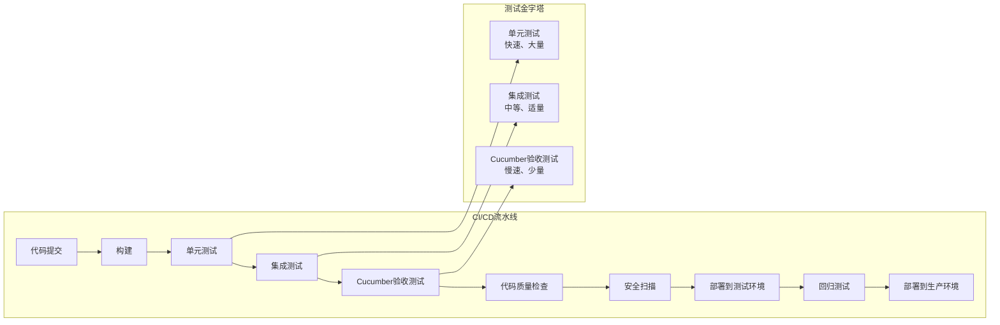

# 8.2 CI/CD集成概述

## 引言

持续集成(CI)和持续交付/部署(CD)是现代软件开发的核心实践，旨在通过自动化构建、测试和部署流程，提高软件交付的速度和质量。Cucumber作为行为驱动开发(BDD)测试框架，可以无缝集成到CI/CD流水线中，提供自动化验收测试能力。本章将深入探讨Cucumber与CI/CD系统的集成方式、最佳实践和常见解决方案。

## CI/CD基础概念

### 1. 持续集成(Continuous Integration, CI)

持续集成是一种开发实践，要求开发人员频繁地将代码集成到共享仓库中，每次集成都通过自动化构建和测试来验证。

#### CI的核心价值

- **早期发现缺陷**：通过频繁集成和测试，尽早发现和修复问题
- **减少集成风险**：避免"集成地狱"，降低集成复杂性
- **提高代码质量**：通过自动化测试和代码审查，提高代码质量
- **加速反馈循环**：快速反馈开发人员代码变更的影响

### 2. 持续交付(Continuous Delivery, CD)

持续交付是在持续集成的基础上，确保代码可以随时部署到生产环境的一种实践。

#### CD的核心价值

- **随时可部署**：确保代码始终处于可部署状态
- **降低部署风险**：通过小批量、频繁部署，降低部署风险
- **提高部署频率**：支持更频繁的部署，加速价值交付
- **增强业务灵活性**：快速响应市场变化和客户需求

### 3. 持续部署(Continuous Deployment)

持续部署是持续交付的延伸，自动将通过所有测试的代码部署到生产环境。

#### CD的核心价值

- **完全自动化**：从代码提交到生产部署的完全自动化
- **最短交付周期**：实现从代码到生产的最短交付周期
- **快速反馈**：快速获取生产环境反馈，支持快速迭代

## CI/CD流水线中的Cucumber角色

### 1. 测试金字塔中的Cucumber

在CI/CD流水线中，Cucumber通常位于测试金字塔的顶层，负责端到端和验收测试：



### 2. Cucumber测试在CI/CD中的执行时机

- **提交阶段**：执行快速Cucumber测试，验证核心功能
- **集成阶段**：执行完整Cucumber测试套件，验证系统集成
- **预发布阶段**：执行生产环境Cucumber测试，验证生产就绪性
- **部署后阶段**：执行冒烟测试，验证部署成功

## 主流CI/CD工具与Cucumber集成

### 1. Jenkins集成

Jenkins是最流行的开源CI/CD工具，提供了丰富的插件生态系统，支持Cucumber测试集成。

#### Jenkins Pipeline配置

```groovy
pipeline {
    agent any
    
    environment {
        MAVEN_HOME = tool 'Maven 3.8.6'
        JAVA_HOME = tool 'JDK 11'
    }
    
    stages {
        stage('Checkout') {
            steps {
                checkout scm
            }
        }
        
        stage('Build') {
            steps {
                sh "${MAVEN_HOME}/bin/mvn clean compile"
            }
        }
        
        stage('Unit Tests') {
            steps {
                sh "${MAVEN_HOME}/bin/mvn test"
            }
            post {
                always {
                    junit 'target/surefire-reports/**/*.xml'
                }
            }
        }
        
        stage('Cucumber Tests') {
            steps {
                sh "${MAVEN_HOME}/bin/mvn verify -P cucumber"
            }
            post {
                always {
                    publishHTML([
                        allowMissing: false,
                        alwaysLinkToLastBuild: true,
                        keepAll: true,
                        reportDir: 'target/cucumber-reports',
                        reportFiles: 'cucumber-html-reports.html',
                        reportName: 'Cucumber Report'
                    ])
                    
                    cucumber 'target/cucumber-reports/cucumber.json'
                }
            }
        }
        
        stage('Code Quality') {
            steps {
                withSonarQubeEnv('SonarQube') {
                    sh "${MAVEN_HOME}/bin/mvn sonar:sonar"
                }
            }
        }
        
        stage('Deploy to Staging') {
            steps {
                sh "${MAVEN_HOME}/bin/mvn deploy -P staging"
            }
        }
        
        stage('Smoke Tests') {
            steps {
                sh "${MAVEN_HOME}/bin/mvn verify -P smoke-tests"
            }
        }
        
        stage('Deploy to Production') {
            when {
                branch 'main'
            }
            steps {
                sh "${MAVEN_HOME}/bin/mvn deploy -P production"
            }
        }
    }
    
    post {
        always {
            cleanWs()
        }
        success {
            emailext (
                subject: "Build Success: ${env.JOB_NAME} - ${env.BUILD_NUMBER}",
                body: "Build successful. Check ${env.BUILD_URL} for details.",
                to: "${env.CHANGE_AUTHOR_EMAIL}"
            )
        }
        failure {
            emailext (
                subject: "Build Failed: ${env.JOB_NAME} - ${env.BUILD_NUMBER}",
                body: "Build failed. Check ${env.BUILD_URL} for details.",
                to: "${env.CHANGE_AUTHOR_EMAIL}"
            )
        }
    }
}
```

#### Jenkinsfile声明式流水线

```groovy
pipeline {
    agent {
        docker {
            image 'maven:3.8.6-openjdk-11'
            args '-v /root/.m2:/root/.m2'
        }
    }
    
    stages {
        stage('Checkout') {
            steps {
                checkout scm
            }
        }
        
        stage('Run Cucumber Tests') {
            parallel {
                stage('API Tests') {
                    steps {
                        sh 'mvn test -P api-tests -Dcucumber.options="--tags @api"'
                    }
                    post {
                        always {
                            cucumber 'target/cucumber-reports/api-cucumber.json'
                        }
                    }
                }
                
                stage('UI Tests') {
                    steps {
                        sh 'mvn test -P ui-tests -Dcucumber.options="--tags @ui"'
                    }
                    post {
                        always {
                            cucumber 'target/cucumber-reports/ui-cucumber.json'
                        }
                    }
                }
                
                stage('Integration Tests') {
                    steps {
                        sh 'mvn test -P integration-tests -Dcucumber.options="--tags @integration"'
                    }
                    post {
                        always {
                            cucumber 'target/cucumber-reports/integration-cucumber.json'
                        }
                    }
                }
            }
        }
    }
    
    post {
        always {
            archiveArtifacts artifacts: 'target/cucumber-reports/**/*', fingerprint: true
        }
    }
}
```

### 2. GitHub Actions集成

GitHub Actions是GitHub提供的CI/CD服务，与GitHub仓库紧密集成，支持YAML配置文件定义工作流。

#### GitHub Actions工作流配置

```yaml
# .github/workflows/cucumber.yml
name: Cucumber Tests

on:
  push:
    branches: [ main, develop ]
  pull_request:
    branches: [ main ]

jobs:
  test:
    runs-on: ubuntu-latest
    
    services:
      postgres:
        image: postgres:15
        env:
          POSTGRES_PASSWORD: postgres
          POSTGRES_DB: testdb
        options: >-
          --health-cmd pg_isready
          --health-interval 10s
          --health-timeout 5s
          --health-retries 5
        ports:
          - 5432:5432
      
      rabbitmq:
        image: rabbitmq:3.11-management
        env:
          RABBITMQ_DEFAULT_USER: guest
          RABBITMQ_DEFAULT_PASS: guest
        options: >-
          --health-cmd "rabbitmq-diagnostics -q ping"
          --health-interval 10s
          --health-timeout 5s
          --health-retries 5
        ports:
          - 5672:5672
          - 15672:15672
    
    steps:
    - name: Checkout code
      uses: actions/checkout@v3
    
    - name: Set up JDK 11
      uses: actions/setup-java@v3
      with:
        java-version: '11'
        distribution: 'temurin'
    
    - name: Cache Maven dependencies
      uses: actions/cache@v3
      with:
        path: ~/.m2
        key: ${{ runner.os }}-m2-${{ hashFiles('**/pom.xml') }}
        restore-keys: ${{ runner.os }}-m2
    
    - name: Run unit tests
      run: mvn test
    
    - name: Run Cucumber tests
      run: mvn verify -P cucumber
      env:
        SPRING_PROFILES_ACTIVE: test
        DB_HOST: localhost
        DB_PORT: 5432
        DB_NAME: testdb
        DB_USER: postgres
        DB_PASSWORD: postgres
        RABBITMQ_HOST: localhost
        RABBITMQ_PORT: 5672
        RABBITMQ_USER: guest
        RABBITMQ_PASSWORD: guest
    
    - name: Publish Cucumber Report
      uses: actions/upload-artifact@v3
      if: always()
      with:
        name: cucumber-reports
        path: target/cucumber-reports/
    
    - name: Send notification on failure
      if: failure()
      uses: actions/github-script@v6
      with:
        script: |
          github.rest.issues.createComment({
            issue_number: context.issue.number,
            owner: context.repo.owner,
            repo: context.repo.repo,
            body: '❌ Cucumber tests failed. Please check the [workflow run](${context.payload.repository.html_url}/actions/runs/${context.runId}) for details.'
          })
```

#### 多环境测试工作流

```yaml
# .github/workflows/multi-environment.yml
name: Multi-Environment Tests

on:
  push:
    branches: [ main ]
  schedule:
    - cron: '0 2 * * *'  # 每天凌晨2点运行

jobs:
  test-matrix:
    runs-on: ubuntu-latest
    strategy:
      fail-fast: false
      matrix:
        environment: [dev, staging, production]
        browser: [chrome, firefox]
        include:
          - environment: dev
            url: https://dev.example.com
          - environment: staging
            url: https://staging.example.com
          - environment: production
            url: https://example.com
    
    steps:
    - name: Checkout code
      uses: actions/checkout@v3
    
    - name: Set up JDK 11
      uses: actions/setup-java@v3
      with:
        java-version: '11'
        distribution: 'temurin'
    
    - name: Set up Node.js
      uses: actions/setup-node@v3
      with:
        node-version: '16'
    
    - name: Install browsers
      run: |
        sudo apt-get update
        sudo apt-get install -y firefox
        wget -q -O - https://dl-ssl.google.com/linux/linux_signing_key.pub | sudo apt-key add -
        sudo sh -c 'echo "deb [arch=amd64] http://dl.google.com/linux/chrome/deb/ stable main" >> /etc/apt/sources.list.d/google.list'
        sudo apt-get update
        sudo apt-get install -y google-chrome-stable
    
    - name: Run Cucumber tests
      run: mvn verify -P cucumber -Dbrowser=${{ matrix.browser }} -DbaseUrl=${{ matrix.url }}
      env:
        SPRING_PROFILES_ACTIVE: test
    
    - name: Publish Test Report
      uses: actions/upload-artifact@v3
      if: always()
      with:
        name: cucumber-report-${{ matrix.environment }}-${{ matrix.browser }}
        path: target/cucumber-reports/
```

### 3. GitLab CI/CD集成

GitLab CI/CD是GitLab提供的内置CI/CD服务，通过.gitlab-ci.yml文件定义流水线。

#### GitLab CI/CD配置

```yaml
# .gitlab-ci.yml
stages:
  - build
  - test
  - quality
  - deploy

variables:
  MAVEN_OPTS: "-Dmaven.repo.local=$CI_PROJECT_DIR/.m2/repository"
  MAVEN_CLI_OPTS: "--batch-mode --errors --fail-at-end --show-version"

cache:
  paths:
    - .m2/repository/

build:
  stage: build
  image: maven:3.8.6-openjdk-11
  script:
    - mvn $MAVEN_CLI_OPTS compile

unit-test:
  stage: test
  image: maven:3.8.6-openjdk-11
  script:
    - mvn $MAVEN_CLI_OPTS test
  artifacts:
    reports:
      junit: target/surefire-reports/TEST-*.xml

cucumber-test:
  stage: test
  image: maven:3.8.6-openjdk-11
  services:
    - postgres:15
    - rabbitmq:3.11-management
  variables:
    POSTGRES_DB: testdb
    POSTGRES_USER: test
    POSTGRES_PASSWORD: test
    SPRING_PROFILES_ACTIVE: test
    DB_HOST: postgres
    DB_PORT: 5432
    DB_NAME: testdb
    DB_USER: test
    DB_PASSWORD: test
    RABBITMQ_HOST: rabbitmq
    RABBITMQ_PORT: 5672
    RABBITMQ_USER: guest
    RABBITMQ_PASSWORD: guest
  script:
    - mvn $MAVEN_CLI_OPTS verify -P cucumber
  artifacts:
    reports:
      junit: target/cucumber-reports/cucumber.xml
    paths:
      - target/cucumber-reports/
    expire_in: 1 week
  coverage: '/Total.*?([0-9]{1,3})%/'
  only:
    - merge_requests
    - main
    - develop

code-quality:
  stage: quality
  image: maven:3.8.6-openjdk-11
  script:
    - mvn $MAVEN_CLI_OPTS sonar:sonar -Dsonar.projectKey=$CI_PROJECT_NAME -Dsonar.host_url=$SONAR_HOST_URL -Dsonar.login=$SONAR_TOKEN
  only:
    - merge_requests
    - main
    - develop

deploy-staging:
  stage: deploy
  image: alpine:latest
  before_script:
    - apk add --no-cache openssh-client
    - eval $(ssh-agent -s)
    - echo "$SSH_PRIVATE_KEY" | tr -d '\r' | ssh-add -
    - mkdir -p ~/.ssh
    - chmod 700 ~/.ssh
    - ssh-keyscan $STAGING_SERVER >> ~/.ssh/known_hosts
    - chmod 644 ~/.ssh/known_hosts
  script:
    - ssh $STAGING_USER@$STAGING_SERVER "cd /opt/app && ./deploy.sh staging"
  environment:
    name: staging
    url: https://staging.example.com
  only:
    - main

deploy-production:
  stage: deploy
  image: alpine:latest
  before_script:
    - apk add --no-cache openssh-client
    - eval $(ssh-agent -s)
    - echo "$SSH_PRIVATE_KEY" | tr -d '\r' | ssh-add -
    - mkdir -p ~/.ssh
    - chmod 700 ~/.ssh
    - ssh-keyscan $PRODUCTION_SERVER >> ~/.ssh/known_hosts
    - chmod 644 ~/.ssh/known_hosts
  script:
    - ssh $PRODUCTION_USER@$PRODUCTION_SERVER "cd /opt/app && ./deploy.sh production"
  environment:
    name: production
    url: https://example.com
  when: manual
  only:
    - main
```

### 4. Azure DevOps集成

Azure DevOps是微软提供的DevOps工具集，支持完整的CI/CD流水线。

#### Azure DevOps Pipeline配置

```yaml
# azure-pipelines.yml
trigger:
- main
- develop

pool:
  vmImage: 'ubuntu-latest'

variables:
  MAVEN_CACHE_FOLDER: $(Pipeline.Workspace)/.m2/repository
  MAVEN_OPTS: '-Dmaven.repo.local=$(MAVEN_CACHE_FOLDER)'

stages:
- stage: Build
  displayName: 'Build Stage'
  jobs:
  - job: Build
    displayName: 'Build Job'
    steps:
    - task: Cache@2
      displayName: 'Cache Maven dependencies'
      inputs:
        key: 'maven | "$(Agent.OS)" | **/pom.xml'
        restoreKeys: |
          maven | "$(Agent.OS)"
          maven
        path: $(MAVEN_CACHE_FOLDER)
    
    - task: Maven@3
      displayName: 'Maven Build'
      inputs:
        mavenPomFile: 'pom.xml'
        mavenOptions: '-Xmx3072m $(MAVEN_OPTS)'
        javaHomeOption: 'JDKVersion'
        jdkVersionOption: '1.11'
        jdkArchitectureOption: 'x64'
        publishJUnitResults: true
        testResultsFiles: '**/surefire-reports/TEST-*.xml'
        goals: 'compile'

- stage: Test
  displayName: 'Test Stage'
  dependsOn: Build
  jobs:
  - job: UnitTests
    displayName: 'Unit Tests'
    steps:
    - task: Cache@2
      displayName: 'Cache Maven dependencies'
      inputs:
        key: 'maven | "$(Agent.OS)" | **/pom.xml'
        restoreKeys: |
          maven | "$(Agent.OS)"
          maven
        path: $(MAVEN_CACHE_FOLDER)
    
    - task: Maven@3
      displayName: 'Maven Unit Tests'
      inputs:
        mavenPomFile: 'pom.xml'
        mavenOptions: '-Xmx3072m $(MAVEN_OPTS)'
        javaHomeOption: 'JDKVersion'
        jdkVersionOption: '1.11'
        jdkArchitectureOption: 'x64'
        publishJUnitResults: true
        testResultsFiles: '**/surefire-reports/TEST-*.xml'
        goals: 'test'
    
  - job: CucumberTests
    displayName: 'Cucumber Tests'
    timeoutInMinutes: 30
    strategy:
      parallel: 3
    steps:
    - task: Cache@2
      displayName: 'Cache Maven dependencies'
      inputs:
        key: 'maven | "$(Agent.OS)" | **/pom.xml'
        restoreKeys: |
          maven | "$(Agent.OS)"
          maven
        path: $(MAVEN_CACHE_FOLDER)
    
    - task: Maven@3
      displayName: 'Maven Cucumber Tests'
      inputs:
        mavenPomFile: 'pom.xml'
        mavenOptions: '-Xmx3072m $(MAVEN_OPTS)'
        javaHomeOption: 'JDKVersion'
        jdkVersionOption: '1.11'
        jdkArchitectureOption: 'x64'
        publishJUnitResults: true
        testResultsFiles: '**/cucumber-reports/cucumber.xml'
        goals: 'verify -P cucumber'
    
    - task: PublishBuildArtifacts@1
      displayName: 'Publish Cucumber Reports'
      inputs:
        PathtoPublish: 'target/cucumber-reports'
        ArtifactName: 'cucumber-reports'
        publishLocation: 'Container'

- stage: Deploy
  displayName: 'Deploy Stage'
  dependsOn: Test
  condition: and(succeeded(), eq(variables['Build.SourceBranch'], 'refs/heads/main'))
  jobs:
  - deployment: DeployToStaging
    displayName: 'Deploy to Staging'
    environment: 'staging'
    strategy:
      runOnce:
        deploy:
          steps:
          - task: Maven@3
            displayName: 'Maven Deploy'
            inputs:
              mavenPomFile: 'pom.xml'
              mavenOptions: '-Xmx3072m $(MAVEN_OPTS)'
              javaHomeOption: 'JDKVersion'
              jdkVersionOption: '1.11'
              jdkArchitectureOption: 'x64'
              goals: 'deploy -P staging'
```

## Cucumber测试报告集成

### 1. Cucumber报告插件

大多数CI/CD工具都提供了Cucumber报告插件或集成方式，用于可视化测试结果。

#### Jenkins Cucumber插件

```groovy
pipeline {
    agent any
    
    stages {
        stage('Cucumber Tests') {
            steps {
                sh 'mvn verify -P cucumber'
            }
            post {
                always {
                    // 发布Cucumber JSON报告
                    cucumber 'target/cucumber-reports/cucumber.json'
                    
                    // 发布HTML报告
                    publishHTML([
                        allowMissing: false,
                        alwaysLinkToLastBuild: true,
                        keepAll: true,
                        reportDir: 'target/cucumber-reports',
                        reportFiles: 'cucumber-html-reports.html',
                        reportName: 'Cucumber HTML Report'
                    ])
                }
            }
        }
    }
}
```

#### GitHub Actions报告发布

```yaml
- name: Publish Cucumber Report
  uses: actions/upload-artifact@v3
  if: always()
  with:
    name: cucumber-reports
    path: target/cucumber-reports/

- name: Deploy to GitHub Pages
  uses: peaceiris/actions-gh-pages@v3
  if: github.ref == 'refs/heads/main'
  with:
    github_token: ${{ secrets.GITHUB_TOKEN }}
    publish_dir: ./target/cucumber-reports
    destination_dir: cucumber-reports
```

### 2. 测试结果通知

集成测试结果通知，及时反馈测试状态。

#### Slack通知

```groovy
pipeline {
    agent any
    
    stages {
        stage('Cucumber Tests') {
            steps {
                sh 'mvn verify -P cucumber'
            }
            post {
                always {
                    script {
                        def cucumberReport = readJSON file: 'target/cucumber-reports/cucumber.json'
                        def passed = cucumberReport[0].elements.count { it.steps.every { it.result.status == 'passed' } }
                        def failed = cucumberReport[0].elements.size() - passed
                        
                        slackSend(
                            channel: '#test-results',
                            color: failed > 0 ? 'danger' : 'good',
                            message: "Cucumber测试结果: 通过 ${passed}, 失败 ${failed}",
                            tokenCredentialId: 'slack-token'
                        )
                    }
                }
            }
        }
    }
}
```

#### 邮件通知

```groovy
pipeline {
    agent any
    
    stages {
        stage('Cucumber Tests') {
            steps {
                sh 'mvn verify -P cucumber'
            }
            post {
                always {
                    emailext (
                        subject: "Cucumber测试结果: ${currentBuild.currentResult} - ${env.JOB_NAME} - ${env.BUILD_NUMBER}",
                        body: """
                            <p>Cucumber测试完成，结果: ${currentBuild.currentResult}</p>
                            <p>查看详细报告: <a href="${env.BUILD_URL}cucumber-html-reports/">Cucumber报告</a></p>
                        """,
                        to: "${env.CHANGE_AUTHOR_EMAIL}",
                        attachmentsPattern: 'target/cucumber-reports/**/*'
                    )
                }
            }
        }
    }
}
```

## 最佳实践

### 1. 测试分层与并行执行

- 将Cucumber测试按标签分类，实现分层执行
- 使用并行执行提高测试效率
- 根据测试类型和环境选择合适的执行策略

### 2. 测试环境管理

- 使用容器化技术管理测试环境
- 实现测试环境的自动化部署和配置
- 确保测试环境的一致性和隔离性

### 3. 测试数据管理

- 使用测试数据工厂生成测试数据
- 实现测试数据的版本控制和备份
- 在测试后清理测试数据，避免数据污染

### 4. 测试失败处理

- 实现测试失败重试机制
- 分析和修复不稳定的测试
- 提供详细的测试失败报告和日志

### 5. 测试报告与分析

- 生成全面的测试报告，包括测试结果和覆盖率
- 分析测试趋势，识别潜在问题
- 将测试结果与业务指标关联

## 总结

Cucumber与CI/CD系统的集成为自动化测试提供了强大的支持，通过合理的配置和最佳实践，可以实现高效的自动化测试流水线。选择合适的CI/CD工具和集成策略，根据项目需求定制测试流程，可以大大提高软件交付的速度和质量。

在实际项目中，应该根据团队技能、项目需求和基础设施条件，选择最适合的CI/CD集成方案，并持续优化测试流程，实现快速、可靠的软件交付。