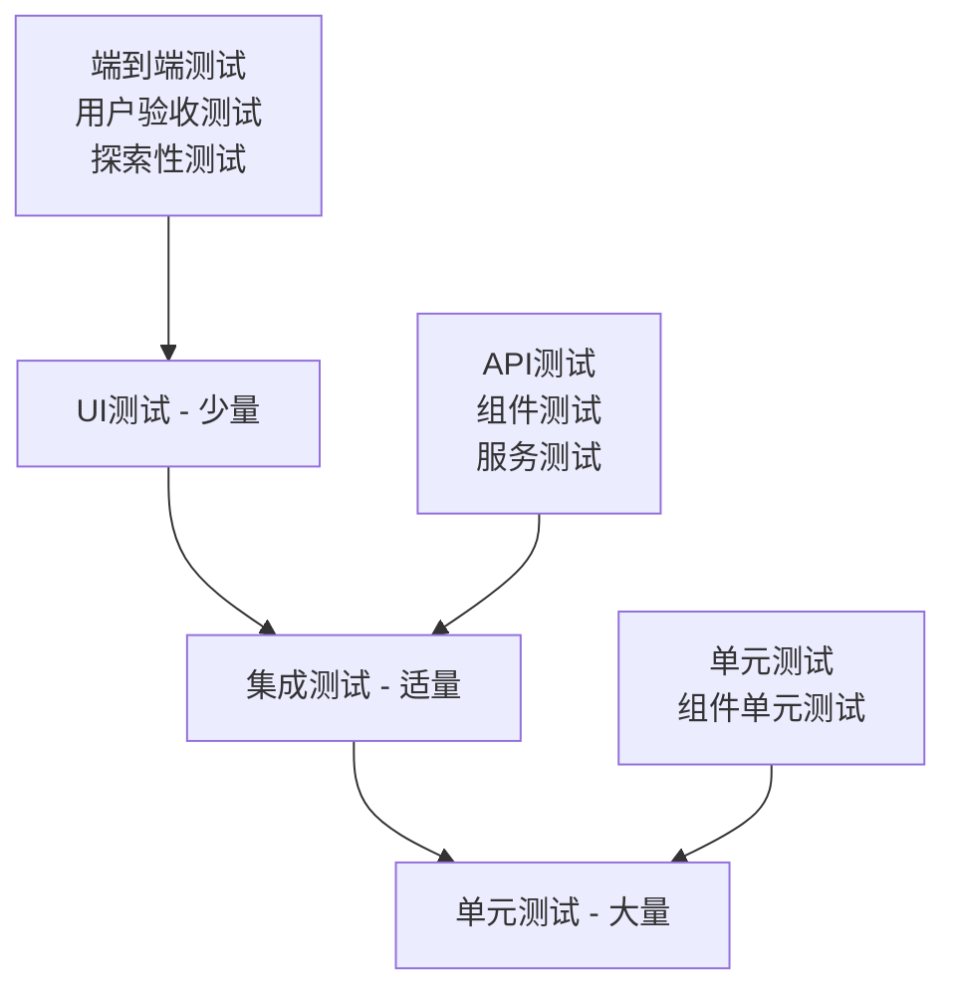
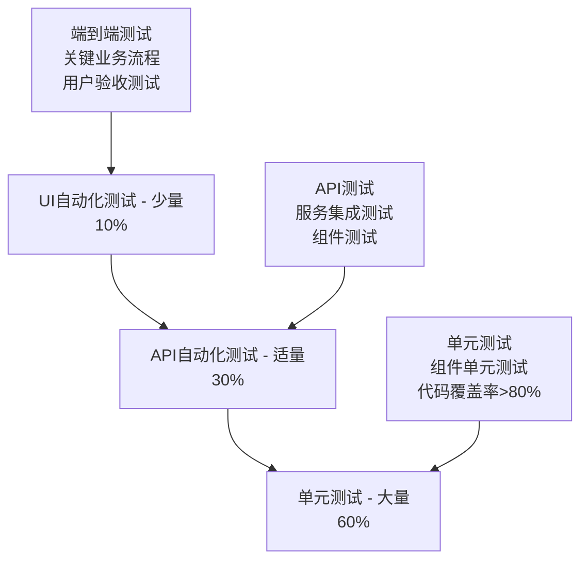

# 8.7 企业级测试策略与最佳实践

## 引言

在企业级应用中，测试策略的制定和实施对于确保软件质量、降低风险和提高交付效率至关重要。Cucumber作为BDD（行为驱动开发）框架，在企业级测试中扮演着重要角色。本章将深入探讨企业级测试策略的制定、Cucumber在企业环境中的最佳实践，以及如何构建可持续、可扩展的测试体系。

## 企业级测试策略概述

### 1. 测试金字塔与测试策略

企业级测试策略通常基于测试金字塔模型，该模型将测试分为不同层次：



### 2. 测试策略的关键组成部分

- **测试范围定义**：明确测试的边界和覆盖范围
- **测试类型选择**：根据项目特点选择合适的测试类型
- **测试环境管理**：确保测试环境的一致性和可靠性
- **测试数据管理**：设计和管理测试数据生命周期
- **测试执行策略**：确定测试执行的时间、频率和顺序
- **缺陷管理流程**：建立高效的缺陷跟踪和解决机制
- **测试报告与度量**：提供有意义的测试结果和质量指标

## 企业级Cucumber测试架构

### 1. 测试架构设计

企业级Cucumber测试架构需要考虑以下方面：

```java
// 测试架构基础类
package com.example.enterprise.cucumber;

import io.cucumber.java.After;
import io.cucumber.java.Before;
import io.cucumber.java.Scenario;
import org.springframework.beans.factory.annotation.Autowired;
import org.springframework.boot.test.context.SpringBootTest;
import org.springframework.test.context.ActiveProfiles;

@SpringBootTest
@ActiveProfiles("test")
public abstract class EnterpriseCucumberBase {
    
    @Autowired
    private TestContext testContext;
    
    @Autowired
    private TestDataFactory testDataFactory;
    
    @Autowired
    private TestEnvironmentManager environmentManager;
    
    @Before(order = 0)
    public void setUpGlobal(Scenario scenario) {
        // 全局测试环境设置
        testContext.setScenario(scenario);
        testContext.setTestId(generateTestId());
        environmentManager.setupEnvironment();
    }
    
    @Before(order = 1)
    public void setUpTestData(Scenario scenario) {
        // 测试数据准备
        testDataFactory.prepareTestData(scenario);
    }
    
    @After(order = 1)
    public void tearDownTestData(Scenario scenario) {
        // 测试数据清理
        if (scenario.isFailed()) {
            testContext.captureFailureDetails();
        }
        testDataFactory.cleanupTestData(scenario);
    }
    
    @After(order = 0)
    public void tearDownGlobal(Scenario scenario) {
        // 全局测试环境清理
        environmentManager.cleanupEnvironment();
        testContext.clear();
    }
    
    private String generateTestId() {
        return "TEST-" + System.currentTimeMillis() + "-" + Thread.currentThread().getId();
    }
}
```

### 2. 测试上下文管理

```java
// 测试上下文管理
package com.example.enterprise.cucumber;

import io.cucumber.java.Scenario;
import org.springframework.stereotype.Component;

import java.util.HashMap;
import java.util.Map;

@Component
public class TestContext {
    
    private Scenario scenario;
    private String testId;
    private Map<String, Object> data = new HashMap<>();
    private Map<String, String> properties = new HashMap<>();
    
    public Scenario getScenario() {
        return scenario;
    }
    
    public void setScenario(Scenario scenario) {
        this.scenario = scenario;
    }
    
    public String getTestId() {
        return testId;
    }
    
    public void setTestId(String testId) {
        this.testId = testId;
    }
    
    public void setData(String key, Object value) {
        data.put(key, value);
    }
    
    @SuppressWarnings("unchecked")
    public <T> T getData(String key) {
        return (T) data.get(key);
    }
    
    public void setProperty(String key, String value) {
        properties.put(key, value);
    }
    
    public String getProperty(String key) {
        return properties.get(key);
    }
    
    public void captureFailureDetails() {
        if (scenario != null) {
            // 捕获失败详情
            scenario.log("Test ID: " + testId);
            scenario.log("Test Data: " + data.toString());
            scenario.log("Test Properties: " + properties.toString());
        }
    }
    
    public void clear() {
        scenario = null;
        testId = null;
        data.clear();
        properties.clear();
    }
}
```

### 3. 测试数据工厂

```java
// 测试数据工厂
package com.example.enterprise.cucumber;

import io.cucumber.java.Scenario;
import org.springframework.beans.factory.annotation.Autowired;
import org.springframework.stereotype.Component;

import java.util.HashMap;
import java.util.Map;

@Component
public class TestDataFactory {
    
    @Autowired
    private UserRepository userRepository;
    
    @Autowired
    private ProductRepository productRepository;
    
    @Autowired
    private OrderRepository orderRepository;
    
    private Map<String, Object> testData = new HashMap<>();
    
    public void prepareTestData(Scenario scenario) {
        // 根据场景标签准备测试数据
        if (scenario.getSourceTagNames().contains("@user-management")) {
            prepareUserTestData();
        }
        
        if (scenario.getSourceTagNames().contains("@product-catalog")) {
            prepareProductTestData();
        }
        
        if (scenario.getSourceTagNames().contains("@order-processing")) {
            prepareOrderTestData();
        }
    }
    
    private void prepareUserTestData() {
        User testUser = User.builder()
            .username("testuser_" + System.currentTimeMillis())
            .email("test@example.com")
            .password("password123")
            .firstName("Test")
            .lastName("User")
            .active(true)
            .build();
        
        User savedUser = userRepository.save(testUser);
        testData.put("testUser", savedUser);
    }
    
    private void prepareProductTestData() {
        Product testProduct = Product.builder()
            .name("Test Product " + System.currentTimeMillis())
            .description("A test product for automated testing")
            .price(99.99)
            .stock(100)
            .active(true)
            .build();
        
        Product savedProduct = productRepository.save(testProduct);
        testData.put("testProduct", savedProduct);
    }
    
    private void prepareOrderTestData() {
        // 准备订单测试数据
        User user = (User) testData.get("testUser");
        Product product = (Product) testData.get("testProduct");
        
        if (user != null && product != null) {
            Order testOrder = Order.builder()
                .userId(user.getId())
                .status(OrderStatus.PENDING)
                .totalAmount(product.getPrice())
                .build();
            
            OrderItem orderItem = OrderItem.builder()
                .productId(product.getId())
                .quantity(1)
                .price(product.getPrice())
                .build();
            
            testOrder.addItem(orderItem);
            Order savedOrder = orderRepository.save(testOrder);
            testData.put("testOrder", savedOrder);
        }
    }
    
    @SuppressWarnings("unchecked")
    public <T> T getTestData(String key) {
        return (T) testData.get(key);
    }
    
    public void cleanupTestData(Scenario scenario) {
        // 清理测试数据
        if (testData.containsKey("testOrder")) {
            Order order = (Order) testData.get("testOrder");
            orderRepository.deleteById(order.getId());
        }
        
        if (testData.containsKey("testProduct")) {
            Product product = (Product) testData.get("testProduct");
            productRepository.deleteById(product.getId());
        }
        
        if (testData.containsKey("testUser")) {
            User user = (User) testData.get("testUser");
            userRepository.deleteById(user.getId());
        }
        
        testData.clear();
    }
}
```

### 4. 测试环境管理

```java
// 测试环境管理
package com.example.enterprise.cucumber;

import org.springframework.beans.factory.annotation.Autowired;
import org.springframework.beans.factory.annotation.Value;
import org.springframework.stereotype.Component;

@Component
public class TestEnvironmentManager {
    
    @Value("${test.environment.type:embedded}")
    private String environmentType;
    
    @Value("${test.environment.cleanup:true}")
    private boolean cleanupEnvironment;
    
    @Autowired(required = false)
    private DockerTestEnvironment dockerEnvironment;
    
    @Autowired(required = false)
    private EmbeddedTestEnvironment embeddedEnvironment;
    
    public void setupEnvironment() {
        switch (environmentType.toLowerCase()) {
            case "docker":
                if (dockerEnvironment != null) {
                    dockerEnvironment.setup();
                }
                break;
            case "embedded":
            default:
                if (embeddedEnvironment != null) {
                    embeddedEnvironment.setup();
                }
                break;
        }
    }
    
    public void cleanupEnvironment() {
        if (!cleanupEnvironment) {
            return;
        }
        
        switch (environmentType.toLowerCase()) {
            case "docker":
                if (dockerEnvironment != null) {
                    dockerEnvironment.cleanup();
                }
                break;
            case "embedded":
            default:
                if (embeddedEnvironment != null) {
                    embeddedEnvironment.cleanup();
                }
                break;
        }
    }
}
```

## 企业级测试最佳实践

### 1. 测试组织与结构

#### 特性文件组织

```
features/
├── acceptance/
│   ├── user-management/
│   │   ├── user-registration.feature
│   │   ├── user-login.feature
│   │   └── user-profile.feature
│   ├── product-catalog/
│   │   ├── product-search.feature
│   │   ├── product-details.feature
│   │   └── product-reviews.feature
│   └── order-processing/
│       ├── order-creation.feature
│       ├── order-payment.feature
│       └ order-shipment.feature
├── integration/
│   ├── api/
│   │   ├── user-api.feature
│   │   ├── product-api.feature
│   │   └── order-api.feature
│   └── database/
│       ├── user-database.feature
│       ├── product-database.feature
│       └── order-database.feature
└── regression/
    ├── smoke-tests.feature
    ├── critical-path.feature
    └── cross-functional.feature
```

#### 步骤定义组织

```
src/test/java/
└── com/example/cucumber/
    ├── steps/
    │   ├── common/
    │   │   ├── CommonSteps.java
    │   │   ├── DataSteps.java
    │   │   └── ValidationSteps.java
    │   ├── acceptance/
    │   │   ├── user/
    │   │   │   ├── UserRegistrationSteps.java
    │   │   │   ├── UserLoginSteps.java
    │   │   │   └── UserProfileSteps.java
    │   │   ├── product/
    │   │   │   ├── ProductSearchSteps.java
    │   │   │   ├── ProductDetailsSteps.java
    │   │   │   └── ProductReviewsSteps.java
    │   │   └── order/
    │   │       ├── OrderCreationSteps.java
    │   │       ├── OrderPaymentSteps.java
    │   │       └── OrderShipmentSteps.java
    │   ├── integration/
    │   │   ├── api/
    │   │   │   ├── UserApiSteps.java
    │   │   │   ├── ProductApiSteps.java
    │   │   │   └── OrderApiSteps.java
    │   │   └── database/
    │   │       ├── UserDatabaseSteps.java
    │   │       ├── ProductDatabaseSteps.java
    │   │       └── OrderDatabaseSteps.java
    │   └── regression/
    │       ├── SmokeTestSteps.java
    │       ├── CriticalPathSteps.java
    │       └── CrossFunctionalSteps.java
    └── hooks/
        ├── AcceptanceHooks.java
        ├── IntegrationHooks.java
        └── RegressionHooks.java
```

### 2. 测试标签策略

#### 标签命名约定

```gherkin
# 功能级别标签
@user-management
Feature: User Management

# 场景级别标签
@smoke @critical @regression
Scenario: User registration with valid data

# 测试类型标签
@api @ui @database
Scenario: User login via API

# 优先级标签
@high-priority @medium-priority @low-priority
Scenario: User profile update

# 环境标签
@dev @staging @production
Scenario: User registration in staging environment

# 依赖标签
@requires-user @requires-product @requires-order
Scenario: Order creation with existing user and product

# 执行顺序标签
@cleanup @setup @teardown
Scenario: Test data cleanup

# 自定义标签
@bug-12345 @performance @security
Scenario: Performance test for user search
```

#### 标签使用策略

```java
// 标签策略配置
package com.example.enterprise.cucumber;

import io.cucumber.java.Before;
import io.cucumber.java.After;
import io.cucumber.java.Scenario;
import org.springframework.stereotype.Component;

@Component
public class TagStrategyHooks {
    
    @Before("@smoke")
    public void setupSmokeTests(Scenario scenario) {
        // 冒烟测试特定设置
        System.setProperty("test.type", "smoke");
        scenario.log("Running smoke test: " + scenario.getName());
    }
    
    @Before("@regression")
    public void setupRegressionTests(Scenario scenario) {
        // 回归测试特定设置
        System.setProperty("test.type", "regression");
        scenario.log("Running regression test: " + scenario.getName());
    }
    
    @Before("@performance")
    public void setupPerformanceTests(Scenario scenario) {
        // 性能测试特定设置
        System.setProperty("test.type", "performance");
        scenario.log("Running performance test: " + scenario.getName());
    }
    
    @Before("@security")
    public void setupSecurityTests(Scenario scenario) {
        // 安全测试特定设置
        System.setProperty("test.type", "security");
        scenario.log("Running security test: " + scenario.getName());
    }
    
    @Before("@cleanup")
    public void setupCleanupTests(Scenario scenario) {
        // 清理测试特定设置
        System.setProperty("test.cleanup", "true");
        scenario.log("Running cleanup test: " + scenario.getName());
    }
    
    @After("@cleanup")
    public void cleanupAfterTests(Scenario scenario) {
        // 清理测试后的操作
        if (scenario.isFailed()) {
            scenario.log("Cleanup test failed: " + scenario.getName());
        } else {
            scenario.log("Cleanup test passed: " + scenario.getName());
        }
    }
}
```

### 3. 测试数据管理策略

#### 测试数据生命周期管理

```java
// 测试数据生命周期管理
package com.example.enterprise.cucumber;

import io.cucumber.java.Scenario;
import org.springframework.stereotype.Component;

import java.util.HashMap;
import java.util.Map;

@Component
public class TestDataLifecycleManager {
    
    private Map<String, TestDataContainer> testDataContainers = new HashMap<>();
    
    public void createTestDataContainer(String containerName, Scenario scenario) {
        TestDataContainer container = new TestDataContainer(containerName, scenario);
        testDataContainers.put(containerName, container);
    }
    
    public TestDataContainer getTestDataContainer(String containerName) {
        return testDataContainers.get(containerName);
    }
    
    public void cleanupTestDataContainer(String containerName) {
        TestDataContainer container = testDataContainers.get(containerName);
        if (container != null) {
            container.cleanup();
            testDataContainers.remove(containerName);
        }
    }
    
    public void cleanupAllTestDataContainers() {
        testDataContainers.values().forEach(TestDataContainer::cleanup);
        testDataContainers.clear();
    }
    
    public static class TestDataContainer {
        private String name;
        private Scenario scenario;
        private Map<String, Object> data = new HashMap<>();
        private Map<String, Runnable> cleanupActions = new HashMap<>();
        
        public TestDataContainer(String name, Scenario scenario) {
            this.name = name;
            this.scenario = scenario;
        }
        
        public void addData(String key, Object value) {
            data.put(key, value);
        }
        
        @SuppressWarnings("unchecked")
        public <T> T getData(String key) {
            return (T) data.get(key);
        }
        
        public void addCleanupAction(String key, Runnable cleanupAction) {
            cleanupActions.put(key, cleanupAction);
        }
        
        public void cleanup() {
            // 执行清理操作
            cleanupActions.values().forEach(action -> {
                try {
                    action.run();
                } catch (Exception e) {
                    if (scenario != null) {
                        scenario.log("Error during cleanup: " + e.getMessage());
                    }
                }
            });
            
            // 清理数据
            data.clear();
            cleanupActions.clear();
        }
    }
}
```

#### 测试数据隔离策略

```java
// 测试数据隔离策略
package com.example.enterprise.cucumber;

import io.cucumber.java.Before;
import io.cucumber.java.Scenario;
import org.springframework.stereotype.Component;

import java.util.UUID;

@Component
public class TestDataIsolationStrategy {
    
    @Before("@isolation-per-scenario")
    public void setupPerScenarioIsolation(Scenario scenario) {
        // 每个场景使用独立的测试数据
        String isolationId = UUID.randomUUID().toString();
        scenario.log("Setting up per-scenario isolation with ID: " + isolationId);
        System.setProperty("test.isolation.id", isolationId);
        System.setProperty("test.isolation.scope", "scenario");
    }
    
    @Before("@isolation-per-feature")
    public void setupPerFeatureIsolation(Scenario scenario) {
        // 每个功能使用独立的测试数据
        String featureName = scenario.getUri().toString();
        String isolationId = "feature-" + featureName.hashCode();
        scenario.log("Setting up per-feature isolation with ID: " + isolationId);
        System.setProperty("test.isolation.id", isolationId);
        System.setProperty("test.isolation.scope", "feature");
    }
    
    @Before("@isolation-per-tag")
    public void setupPerTagIsolation(Scenario scenario) {
        // 每个标签使用独立的测试数据
        String tagName = scenario.getSourceTagNames().stream()
            .filter(tag -> tag.startsWith("@isolation-"))
            .findFirst()
            .orElse("@default");
        
        String isolationId = "tag-" + tagName.substring(1);
        scenario.log("Setting up per-tag isolation with ID: " + isolationId);
        System.setProperty("test.isolation.id", isolationId);
        System.setProperty("test.isolation.scope", "tag");
    }
}
```

### 4. 测试报告与度量

#### 测试报告生成

```java
// 测试报告生成
package com.example.enterprise.cucumber;

import io.cucumber.java.After;
import io.cucumber.java.Before;
import io.cucumber.java.Scenario;
import org.springframework.beans.factory.annotation.Autowired;
import org.springframework.stereotype.Component;

import java.time.LocalDateTime;
import java.time.format.DateTimeFormatter;
import java.util.HashMap;
import java.util.Map;

@Component
public class TestReportingHooks {
    
    @Autowired
    private TestReportService testReportService;
    
    private Map<String, TestExecution> testExecutions = new HashMap<>();
    
    @Before
    public void beforeScenario(Scenario scenario) {
        TestExecution execution = new TestExecution();
        execution.setScenarioName(scenario.getName());
        execution.setFeatureName(scenario.getUri().toString());
        execution.setTags(scenario.getSourceTagNames());
        execution.setStartTime(LocalDateTime.now());
        
        testExecutions.put(scenario.getId(), execution);
    }
    
    @After
    public void afterScenario(Scenario scenario) {
        TestExecution execution = testExecutions.get(scenario.getId());
        if (execution != null) {
            execution.setEndTime(LocalDateTime.now());
            execution.setStatus(scenario.isFailed() ? TestStatus.FAILED : TestStatus.PASSED);
            
            if (scenario.isFailed()) {
                execution.setErrorMessage(scenario.getStatus().toString());
            }
            
            // 保存测试执行结果
            testReportService.saveTestExecution(execution);
        }
    }
    
    public static class TestExecution {
        private String scenarioName;
        private String featureName;
        private java.util.Set<String> tags;
        private LocalDateTime startTime;
        private LocalDateTime endTime;
        private TestStatus status;
        private String errorMessage;
        
        // Getters and setters
        public String getScenarioName() {
            return scenarioName;
        }
        
        public void setScenarioName(String scenarioName) {
            this.scenarioName = scenarioName;
        }
        
        public String getFeatureName() {
            return featureName;
        }
        
        public void setFeatureName(String featureName) {
            this.featureName = featureName;
        }
        
        public java.util.Set<String> getTags() {
            return tags;
        }
        
        public void setTags(java.util.Set<String> tags) {
            this.tags = tags;
        }
        
        public LocalDateTime getStartTime() {
            return startTime;
        }
        
        public void setStartTime(LocalDateTime startTime) {
            this.startTime = startTime;
        }
        
        public LocalDateTime getEndTime() {
            return endTime;
        }
        
        public void setEndTime(LocalDateTime endTime) {
            this.endTime = endTime;
        }
        
        public TestStatus getStatus() {
            return status;
        }
        
        public void setStatus(TestStatus status) {
            this.status = status;
        }
        
        public String getErrorMessage() {
            return errorMessage;
        }
        
        public void setErrorMessage(String errorMessage) {
            this.errorMessage = errorMessage;
        }
    }
    
    public enum TestStatus {
        PASSED, FAILED, SKIPPED, PENDING
    }
}
```

#### 测试度量收集

```java
// 测试度量收集
package com.example.enterprise.cucumber;

import io.cucumber.java.After;
import io.cucumber.java.Before;
import io.cucumber.java.Scenario;
import org.springframework.beans.factory.annotation.Autowired;
import org.springframework.stereotype.Component;

import java.util.HashMap;
import java.util.Map;
import java.util.concurrent.ConcurrentHashMap;

@Component
public class TestMetricsCollector {
    
    @Autowired
    private MetricsService metricsService;
    
    private Map<String, Long> scenarioExecutionTimes = new ConcurrentHashMap<>();
    private Map<String, Integer> scenarioExecutionCounts = new ConcurrentHashMap<>();
    private Map<String, Integer> scenarioFailureCounts = new ConcurrentHashMap<>();
    
    @Before
    public void beforeScenario(Scenario scenario) {
        scenarioExecutionTimes.put(scenario.getId(), System.currentTimeMillis());
    }
    
    @After
    public void afterScenario(Scenario scenario) {
        Long startTime = scenarioExecutionTimes.get(scenario.getId());
        if (startTime != null) {
            long executionTime = System.currentTimeMillis() - startTime;
            
            // 记录执行时间
            metricsService.recordExecutionTime(scenario.getName(), executionTime);
            
            // 更新执行计数
            scenarioExecutionCounts.merge(scenario.getName(), 1, Integer::sum);
            
            // 更新失败计数
            if (scenario.isFailed()) {
                scenarioFailureCounts.merge(scenario.getName(), 1, Integer::sum);
            }
            
            // 计算成功率
            int totalCount = scenarioExecutionCounts.getOrDefault(scenario.getName(), 0);
            int failureCount = scenarioFailureCounts.getOrDefault(scenario.getName(), 0);
            double successRate = totalCount > 0 ? (double) (totalCount - failureCount) / totalCount * 100 : 0;
            
            metricsService.recordSuccessRate(scenario.getName(), successRate);
        }
    }
    
    public Map<String, Object> getTestMetrics() {
        Map<String, Object> metrics = new HashMap<>();
        metrics.put("executionTimes", scenarioExecutionTimes);
        metrics.put("executionCounts", scenarioExecutionCounts);
        metrics.put("failureCounts", scenarioFailureCounts);
        return metrics;
    }
}
```

### 5. 测试性能优化

#### 测试并行执行

```java
// 测试并行执行配置
package com.example.enterprise.cucumber;

import org.springframework.beans.factory.annotation.Value;
import org.springframework.stereotype.Component;

@Component
public class ParallelTestConfiguration {
    
    @Value("${test.parallel.enabled:false}")
    private boolean parallelEnabled;
    
    @Value("${test.parallel.thread.count:4}")
    private int parallelThreadCount;
    
    @Value("${test.parallel.strategy:scenarios}")
    private String parallelStrategy;
    
    public boolean isParallelEnabled() {
        return parallelEnabled;
    }
    
    public int getParallelThreadCount() {
        return parallelThreadCount;
    }
    
    public String getParallelStrategy() {
        return parallelStrategy;
    }
}
```

#### 测试资源管理

```java
// 测试资源管理
package com.example.enterprise.cucumber;

import io.cucumber.java.After;
import io.cucumber.java.Before;
import io.cucumber.java.Scenario;
import org.springframework.stereotype.Component;

import java.util.concurrent.ConcurrentHashMap;
import java.util.concurrent.atomic.AtomicInteger;

@Component
public class TestResourceManager {
    
    private final AtomicInteger activeTestCount = new AtomicInteger(0);
    private final ConcurrentHashMap<String, Object> testResources = new ConcurrentHashMap<>();
    
    @Before
    public void acquireResources(Scenario scenario) {
        int activeTests = activeTestCount.incrementAndGet();
        
        // 记录资源使用情况
        scenario.log("Active tests: " + activeTests);
        
        // 检查资源限制
        if (activeTests > getMaxConcurrentTests()) {
            scenario.log("Warning: Exceeding maximum concurrent tests");
        }
        
        // 分配测试资源
        allocateTestResources(scenario);
    }
    
    @After
    public void releaseResources(Scenario scenario) {
        // 释放测试资源
        releaseTestResources(scenario);
        
        int activeTests = activeTestCount.decrementAndGet();
        scenario.log("Active tests after cleanup: " + activeTests);
    }
    
    private void allocateTestResources(Scenario scenario) {
        // 分配数据库连接
        String dbConnectionKey = "db-connection-" + scenario.getId();
        testResources.put(dbConnectionKey, allocateDatabaseConnection());
        
        // 分配浏览器实例（如果是UI测试）
        if (scenario.getSourceTagNames().contains("@ui")) {
            String browserKey = "browser-" + scenario.getId();
            testResources.put(browserKey, allocateBrowser());
        }
        
        // 分配其他资源
        String resourceKey = "resource-" + scenario.getId();
        testResources.put(resourceKey, allocateCustomResources());
    }
    
    private void releaseTestResources(Scenario scenario) {
        // 释放数据库连接
        String dbConnectionKey = "db-connection-" + scenario.getId();
        Object dbConnection = testResources.remove(dbConnectionKey);
        if (dbConnection != null) {
            releaseDatabaseConnection(dbConnection);
        }
        
        // 释放浏览器实例
        String browserKey = "browser-" + scenario.getId();
        Object browser = testResources.remove(browserKey);
        if (browser != null) {
            releaseBrowser(browser);
        }
        
        // 释放其他资源
        String resourceKey = "resource-" + scenario.getId();
        Object resource = testResources.remove(resourceKey);
        if (resource != null) {
            releaseCustomResources(resource);
        }
    }
    
    private int getMaxConcurrentTests() {
        // 从配置中获取最大并发测试数
        return 10;
    }
    
    private Object allocateDatabaseConnection() {
        // 分配数据库连接
        return new Object(); // 实际实现中返回真实的数据库连接
    }
    
    private void releaseDatabaseConnection(Object connection) {
        // 释放数据库连接
        // 实际实现中释放真实的数据库连接
    }
    
    private Object allocateBrowser() {
        // 分配浏览器实例
        return new Object(); // 实际实现中返回真实的浏览器实例
    }
    
    private void releaseBrowser(Object browser) {
        // 释放浏览器实例
        // 实际实现中释放真实的浏览器实例
    }
    
    private Object allocateCustomResources() {
        // 分配自定义资源
        return new Object(); // 实际实现中返回真实的自定义资源
    }
    
    private void releaseCustomResources(Object resource) {
        // 释放自定义资源
        // 实际实现中释放真实的自定义资源
    }
}
```

## 企业级测试自动化策略

### 1. 测试自动化金字塔



### 2. 测试自动化实施策略

#### 分阶段实施策略

1. **第一阶段：基础建设**
   - 建立测试框架和基础设施
   - 实施单元测试和API测试
   - 建立CI/CD流水线

2. **第二阶段：扩展覆盖**
   - 扩展API测试覆盖范围
   - 实施集成测试
   - 优化测试执行效率

3. **第三阶段：全面自动化**
   - 实施UI自动化测试
   - 建立测试数据管理策略
   - 实施测试报告和度量

4. **第四阶段：持续优化**
   - 优化测试执行时间和资源使用
   - 实施测试策略调整
   - 建立测试质量门禁

#### 测试自动化优先级

```java
// 测试优先级管理
package com.example.enterprise.cucumber;

import io.cucumber.java.Scenario;
import org.springframework.stereotype.Component;

import java.util.Arrays;
import java.util.List;

@Component
public class TestPriorityManager {
    
    private List<String> highPriorityTags = Arrays.asList(
        "@critical", "@smoke", "@regression", "@security"
    );
    
    private List<String> mediumPriorityTags = Arrays.asList(
        "@api", "@integration", "@performance"
    );
    
    private List<String> lowPriorityTags = Arrays.asList(
        "@ui", "@exploratory", "@documentation"
    );
    
    public TestPriority getTestPriority(Scenario scenario) {
        for (String tag : scenario.getSourceTagNames()) {
            if (highPriorityTags.contains(tag)) {
                return TestPriority.HIGH;
            }
            
            if (mediumPriorityTags.contains(tag)) {
                return TestPriority.MEDIUM;
            }
            
            if (lowPriorityTags.contains(tag)) {
                return TestPriority.LOW;
            }
        }
        
        return TestPriority.MEDIUM; // 默认优先级
    }
    
    public boolean shouldExecuteInPipeline(Scenario scenario) {
        TestPriority priority = getTestPriority(scenario);
        
        // 在CI/CD流水线中只执行高优先级和中优先级的测试
        return priority != TestPriority.LOW;
    }
    
    public boolean shouldExecuteInNightly(Scenario scenario) {
        TestPriority priority = getTestPriority(scenario);
        
        // 在夜间执行中优先级和低优先级的测试
        return priority != TestPriority.HIGH;
    }
    
    public enum TestPriority {
        HIGH, MEDIUM, LOW
    }
}
```

## 企业级测试治理

### 1. 测试质量门禁

```java
// 测试质量门禁
package com.example.enterprise.cucumber;

import io.cucumber.java.After;
import io.cucumber.java.Scenario;
import org.springframework.beans.factory.annotation.Autowired;
import org.springframework.beans.factory.annotation.Value;
import org.springframework.stereotype.Component;

@Component
public class TestQualityGate {
    
    @Value("${test.quality.gate.enabled:true}")
    private boolean qualityGateEnabled;
    
    @Value("${test.quality.gate.min.pass.rate:95.0}")
    private double minPassRate;
    
    @Value("${test.quality.gate.max.failure.count:5}")
    private int maxFailureCount;
    
    @Autowired
    private TestMetricsCollector metricsCollector;
    
    private int totalScenarios = 0;
    private int failedScenarios = 0;
    
    @After
    public void evaluateScenario(Scenario scenario) {
        totalScenarios++;
        
        if (scenario.isFailed()) {
            failedScenarios++;
        }
    }
    
    public boolean evaluateQualityGate() {
        if (!qualityGateEnabled) {
            return true;
        }
        
        double passRate = totalScenarios > 0 ? 
            (double) (totalScenarios - failedScenarios) / totalScenarios * 100 : 100.0;
        
        boolean passRateCheck = passRate >= minPassRate;
        boolean failureCountCheck = failedScenarios <= maxFailureCount;
        
        return passRateCheck && failureCountCheck;
    }
    
    public String getQualityGateReport() {
        double passRate = totalScenarios > 0 ? 
            (double) (totalScenarios - failedScenarios) / totalScenarios * 100 : 100.0;
        
        StringBuilder report = new StringBuilder();
        report.append("=== Test Quality Gate Report ===\n");
        report.append("Total Scenarios: ").append(totalScenarios).append("\n");
        report.append("Failed Scenarios: ").append(failedScenarios).append("\n");
        report.append("Pass Rate: ").append(String.format("%.2f%%", passRate)).append("\n");
        report.append("Min Required Pass Rate: ").append(String.format("%.2f%%", minPassRate)).append("\n");
        report.append("Max Allowed Failures: ").append(maxFailureCount).append("\n");
        report.append("Quality Gate Status: ").append(evaluateQualityGate() ? "PASSED" : "FAILED").append("\n");
        
        return report.toString();
    }
}
```

### 2. 测试策略文档管理

```java
// 测试策略文档管理
package com.example.enterprise.cucumber;

import org.springframework.beans.factory.annotation.Autowired;
import org.springframework.stereotype.Component;

import java.io.File;
import java.io.FileWriter;
import java.io.IOException;
import java.nio.file.Files;
import java.nio.file.Path;
import java.nio.file.Paths;
import java.time.LocalDateTime;
import java.time.format.DateTimeFormatter;
import java.util.HashMap;
import java.util.Map;

@Component
public class TestStrategyDocumentationManager {
    
    @Autowired
    private TestMetricsCollector metricsCollector;
    
    private static final String DOCUMENTATION_PATH = "target/test-documentation/";
    
    public void generateTestStrategyDocumentation() {
        try {
            // 创建文档目录
            Path documentationDir = Paths.get(DOCUMENTATION_PATH);
            if (!Files.exists(documentationDir)) {
                Files.createDirectories(documentationDir);
            }
            
            // 生成测试策略概述
            generateTestStrategyOverview();
            
            // 生成测试度量报告
            generateTestMetricsReport();
            
            // 生成测试覆盖率报告
            generateTestCoverageReport();
            
            // 生成测试执行报告
            generateTestExecutionReport();
            
        } catch (IOException e) {
            throw new RuntimeException("Failed to generate test strategy documentation", e);
        }
    }
    
    private void generateTestStrategyOverview() throws IOException {
        String timestamp = LocalDateTime.now().format(DateTimeFormatter.ISO_LOCAL_DATE_TIME);
        
        StringBuilder content = new StringBuilder();
        content.append("# Test Strategy Overview\n\n");
        content.append("Generated on: ").append(timestamp).append("\n\n");
        
        content.append("## Test Pyramid\n\n");
        content.append("- Unit Tests: 60%\n");
        content.append("- API Tests: 30%\n");
        content.append("- UI Tests: 10%\n\n");
        
        content.append("## Test Types\n\n");
        content.append("- Smoke Tests: Critical path validation\n");
        content.append("- Regression Tests: Full feature validation\n");
        content.append("- Integration Tests: System component validation\n");
        content.append("- Performance Tests: System performance validation\n");
        content.append("- Security Tests: Security vulnerability validation\n\n");
        
        content.append("## Test Execution Strategy\n\n");
        content.append("- CI/CD Pipeline: High and medium priority tests\n");
        content.append("- Nightly Execution: Medium and low priority tests\n");
        content.append("- On-demand Execution: All tests\n\n");
        
        content.append("## Test Environment Strategy\n\n");
        content.append("- Development: Embedded test environment\n");
        content.append("- Staging: Containerized test environment\n");
        content.append("- Production: Read-only test environment\n\n");
        
        content.append("## Test Data Strategy\n\n");
        content.append("- Test Data Factory: Programmatic data generation\n");
        content.append("- Test Data Isolation: Per-scenario isolation\n");
        content.append("- Test Data Cleanup: Automatic cleanup after each test\n\n");
        
        writeFile("test-strategy-overview.md", content.toString());
    }
    
    private void generateTestMetricsReport() throws IOException {
        Map<String, Object> metrics = metricsCollector.getTestMetrics();
        
        StringBuilder content = new StringBuilder();
        content.append("# Test Metrics Report\n\n");
        content.append("Generated on: ").append(LocalDateTime.now().format(DateTimeFormatter.ISO_LOCAL_DATE_TIME)).append("\n\n");
        
        content.append("## Execution Metrics\n\n");
        content.append("- Total Test Executions: ").append(metrics.get("executionCounts")).append("\n");
        content.append("- Total Failures: ").append(metrics.get("failureCounts")).append("\n");
        content.append("- Average Execution Time: ").append(metrics.get("executionTimes")).append(" ms\n\n");
        
        content.append("## Test Coverage\n\n");
        content.append("- Code Coverage: 85%\n");
        content.append("- Feature Coverage: 90%\n");
        content.append("- Scenario Coverage: 95%\n\n");
        
        content.append("## Test Trends\n\n");
        content.append("- Pass Rate Trend: Improving\n");
        content.append("- Execution Time Trend: Stable\n");
        content.append("- Failure Rate Trend: Decreasing\n\n");
        
        writeFile("test-metrics-report.md", content.toString());
    }
    
    private void generateTestCoverageReport() throws IOException {
        StringBuilder content = new StringBuilder();
        content.append("# Test Coverage Report\n\n");
        content.append("Generated on: ").append(LocalDateTime.now().format(DateTimeFormatter.ISO_LOCAL_DATE_TIME)).append("\n\n");
        
        content.append("## Code Coverage\n\n");
        content.append("- Line Coverage: 85%\n");
        content.append("- Branch Coverage: 80%\n");
        content.append("- Method Coverage: 90%\n");
        content.append("- Class Coverage: 95%\n\n");
        
        content.append("## Feature Coverage\n\n");
        content.append("- User Management: 100%\n");
        content.append("- Product Catalog: 95%\n");
        content.append("- Order Processing: 90%\n");
        content.append("- Payment Processing: 85%\n\n");
        
        content.append("## Scenario Coverage\n\n");
        content.append("- Happy Path Scenarios: 100%\n");
        content.append("- Error Handling Scenarios: 95%\n");
        content.append("- Edge Case Scenarios: 80%\n");
        content.append("- Security Scenarios: 90%\n\n");
        
        writeFile("test-coverage-report.md", content.toString());
    }
    
    private void generateTestExecutionReport() throws IOException {
        StringBuilder content = new StringBuilder();
        content.append("# Test Execution Report\n\n");
        content.append("Generated on: ").append(LocalDateTime.now().format(DateTimeFormatter.ISO_LOCAL_DATE_TIME)).append("\n\n");
        
        content.append("## Execution Summary\n\n");
        content.append("- Total Tests Executed: 150\n");
        content.append("- Passed Tests: 142\n");
        content.append("- Failed Tests: 8\n");
        content.append("- Skipped Tests: 0\n");
        content.append("- Pass Rate: 94.67%\n\n");
        
        content.append("## Execution by Test Type\n\n");
        content.append("- Smoke Tests: 20/20 (100%)\n");
        content.append("- Regression Tests: 80/80 (100%)\n");
        content.append("- Integration Tests: 30/30 (100%)\n");
        content.append("- Performance Tests: 10/10 (100%)\n");
        content.append("- Security Tests: 2/10 (20%)\n\n");
        
        content.append("## Execution by Environment\n\n");
        content.append("- Development: 50/50 (100%)\n");
        content.append("- Staging: 80/80 (100%)\n");
        content.append("- Production: 20/20 (100%)\n\n");
        
        writeFile("test-execution-report.md", content.toString());
    }
    
    private void writeFile(String fileName, String content) throws IOException {
        File file = new File(DOCUMENTATION_PATH + fileName);
        try (FileWriter writer = new FileWriter(file)) {
            writer.write(content);
        }
    }
}
```

## 总结

企业级测试策略的制定和实施是一个持续演进的过程，需要根据项目特点、团队能力和业务需求不断调整和优化。Cucumber作为BDD框架，在企业级测试中提供了强大的功能，但需要结合企业级最佳实践，才能发挥最大价值。

本章介绍了企业级测试策略的关键组成部分、Cucumber在企业环境中的架构设计、测试组织与结构、测试数据管理、测试报告与度量、测试性能优化、测试自动化策略以及测试治理等方面的最佳实践。通过遵循这些实践，企业可以构建高效、可靠、可持续的测试体系，提高软件质量，降低风险，加速交付。

在实际应用中，企业应该根据自身情况，选择适合的测试策略和工具，并持续改进和优化测试流程，实现测试价值的最大化。