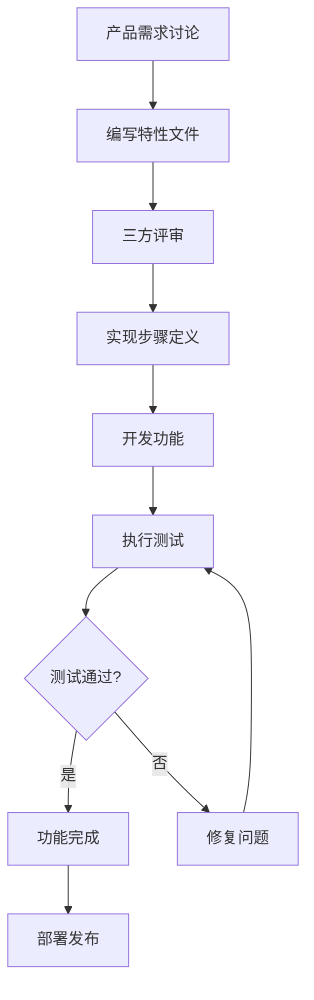

# 9.4 Cucumber团队协作最佳实践

## 引言

BDD（行为驱动开发）不仅仅是技术实践，更是一种团队协作方法。Cucumber作为BDD的实现工具，其成功应用依赖于开发人员、测试人员、产品经理和业务分析师之间的有效协作。本章将介绍如何通过Cucumber促进团队协作，建立高效的沟通机制，以及如何在不同团队规模和项目环境中实施最佳实践。

## 角色与职责

### 1. 三友协作模式

#### 产品负责人/业务分析师

产品负责人或业务分析师在BDD流程中负责：

- **需求定义**：从业务角度定义用户需求和验收标准
- **特性文件编写**：使用业务语言编写特性文件，描述系统行为
- **验收标准明确**：确保每个场景有明确的验收标准
- **需求优先级**：确定特性实现的优先级和顺序
- **业务价值评估**：评估每个特性的业务价值和影响

```gherkin
# 产品负责人编写的特性文件示例
Feature: 用户账户管理

  作为网站用户
  我希望能够管理我的账户信息
  以便保持个人信息最新并确保账户安全

  背景:
    Given 用户已登录系统

  @high-priority
  Scenario: 用户更新个人基本信息
    Given 用户在个人资料页面
    When 用户更新以下信息:
      | 字段       | 值             |
      | 姓名       | 张三           |
      | 电话号码   | 13800138000    |
      | 地址       | 北京市朝阳区    |
    And 用户点击保存按钮
    Then 系统应该显示"个人资料已更新"消息
    And 用户的个人资料应该反映新的信息

  @medium-priority
  Scenario: 用户更改密码
    Given 用户在安全设置页面
    When 用户输入当前密码"CurrentPass123"
    And 用户输入新密码"NewPass456"
    And 用户确认新密码"NewPass456"
    And 用户点击更改密码按钮
    Then 系统应该显示"密码已成功更改"消息
    And 用户应该使用新密码可以登录
```

#### 开发人员

开发人员在BDD流程中负责：

- **步骤定义实现**：实现特性文件中定义的步骤
- **系统功能开发**：开发满足验收标准的系统功能
- **技术实现**：设计合理的技术架构和实现方案
- **代码质量**：确保代码质量和可维护性
- **持续集成**：设置和维护CI/CD流水线

```java
// 开发人员实现的步骤定义
public class UserAccountSteps {
    
    private final UserProfileService userProfileService;
    private final SecurityService securityService;
    private final TestContext testContext;
    
    public UserAccountSteps(UserProfileService userProfileService,
                           SecurityService securityService,
                           TestContext testContext) {
        this.userProfileService = userProfileService;
        this.securityService = securityService;
        this.testContext = testContext;
    }
    
    @Given("用户在个人资料页面")
    public void userOnProfilePage() {
        // 导航到个人资料页面
        profilePage.navigateTo();
        profilePage.waitForPageLoad();
    }
    
    @When("用户更新以下信息:")
    public void userUpdatesInformation(DataTable dataTable) {
        Map<String, String> userInfo = dataTable.asMap(String.class, String.class);
        
        // 更新用户信息
        User user = testContext.getCurrentUser();
        user.setName(userInfo.get("姓名"));
        user.setPhoneNumber(userInfo.get("电话号码"));
        user.setAddress(userInfo.get("地址"));
        
        userProfileService.updateUserProfile(user);
    }
    
    @When("用户点击保存按钮")
    public void userClicksSaveButton() {
        profilePage.clickSaveButton();
    }
    
    @Then("系统应该显示{string}消息")
    public void systemShouldDisplayMessage(String expectedMessage) {
        String actualMessage = profilePage.getSuccessMessage();
        assertEquals(expectedMessage, actualMessage);
    }
    
    @Then("用户的个人资料应该反映新的信息")
    public void userProfileShouldReflectNewInformation() {
        User updatedUser = userProfileService.getUserProfile(testContext.getCurrentUser().getId());
        
        User expectedUser = testContext.getCurrentUser();
        assertEquals(expectedUser.getName(), updatedUser.getName());
        assertEquals(expectedUser.getPhoneNumber(), updatedUser.getPhoneNumber());
        assertEquals(expectedUser.getAddress(), updatedUser.getAddress());
    }
}
```

#### 测试人员

测试人员在BDD流程中负责：

- **测试设计**：设计全面的测试场景和边界条件
- **测试执行**：执行测试并分析结果
- **缺陷报告**：报告和跟踪缺陷
- **测试自动化**：维护和改进测试自动化框架
- **质量保证**：确保产品质量和测试覆盖率

```java
// 测试人员编写的测试辅助类
public class TestDataProvider {
    
    public static Stream<Arguments> provideInvalidPasswordData() {
        return Stream.of(
            Arguments.of("short", "密码长度至少8位"),
            Arguments.of("nodigits", "密码必须包含数字"),
            Arguments.of("NOLOWERCASE", "密码必须包含小写字母"),
            Arguments.of("nouppercase", "密码必须包含大写字母"),
            Arguments.of("NoSpecialChars", "密码必须包含特殊字符")
        );
    }
    
    public static Stream<Arguments> provideValidPhoneNumberData() {
        return Stream.of(
            Arguments.of("13800138000", true, "有效的11位手机号"),
            Arguments.of("18612345678", true, "有效的11位手机号"),
            Arguments.of("12345", false, "无效的短号码"),
            Arguments.of("abcdefghijk", false, "非数字号码"),
            Arguments.of("1380013800", false, "10位号码")
        );
    }
}

// 测试人员编写的参数化测试
@ParameterizedTest
@MethodSource("com.example.TestDataProvider#provideInvalidPasswordData")
public void shouldRejectInvalidPasswords(String password, String expectedError) {
    // 测试逻辑
}
```

### 2. 跨职能团队协作

#### 协作流程

建立清晰的协作流程，确保各角色有效沟通：



#### 协作工具

使用适当的工具支持团队协作：

- **需求管理**：Jira、Azure DevOps、Trello
- **文档协作**：Confluence、Notion、Google Docs
- **代码协作**：Git、GitHub、GitLab、Bitbucket
- **沟通工具**：Slack、Microsoft Teams、Zoom
- **设计协作**：Figma、Sketch、Adobe XD

## 特性工作坊

### 1. 特性工作坊准备

#### 参与人员

特性工作坊应该包括所有关键角色：

- 产品负责人/业务分析师
- 开发人员（至少1名前端，1名后端）
- 测试人员
- UI/UX设计师（可选）
- 运维人员（可选）

#### 准备工作

在举办特性工作坊前，做好以下准备：

1. **明确目标**：确定要讨论的特性范围和目标
2. **准备材料**：收集相关的需求文档、用户故事、原型等
3. **环境设置**：准备会议室、白板、便签等工具
4. **时间安排**：预留足够时间（通常1-2小时）
5. **议程制定**：制定详细的议程和时间分配

```markdown
# 特性工作坊议程示例

## 目标
定义用户登录功能的验收标准

## 时间：2小时
## 参与人员：产品负责人、2名开发人员、1名测试人员、1名UI设计师

### 议程

1. **介绍与目标对齐** (15分钟)
   - 产品负责人介绍用户登录功能的业务价值
   - 讨论功能范围和边界
   - 明确本次工作坊的目标

2. **用户故事讨论** (30分钟)
   - 讨论用户登录的各种场景
   - 识别主要用户角色
   - 确定用户故事优先级

3. **验收标准定义** (45分钟)
   - 使用"Given-When-Then"格式定义场景
   - 讨论异常情况和边界条件
   - 确保场景覆盖所有业务规则

4. **技术可行性讨论** (20分钟)
   - 开发人员评估技术实现难度
   - 讨论可能的技术挑战和解决方案
   - 估算开发工作量

5. **测试策略讨论** (10分钟)
   - 测试人员提出测试考虑
   - 讨论测试数据和环境需求
   - 确定测试优先级

### 输出
- 起草的特性文件
- 行动项和责任人
- 下一步计划
```

### 2. 特性工作坊执行

#### 活动流程

1. **需求介绍**：产品负责人介绍业务需求和用户故事
2. **场景讨论**：团队共同讨论可能的场景和用例
3. **场景编写**：使用"Given-When-Then"格式编写场景
4. **评审与完善**：评审和完善场景，确保清晰和完整
5. **技术讨论**：开发人员评估技术实现可行性
6. **测试考虑**：测试人员提出测试相关的考虑和边界条件

#### 场景编写技巧

在特性工作坊中编写场景时，遵循以下技巧：

- **使用业务语言**：避免技术术语，使用业务人员能理解的语言
- **保持场景独立**：每个场景应该独立，不依赖其他场景
- **关注行为而非实现**：描述系统应该做什么，而不是如何实现
- **使用具体例子**：使用具体的例子和数据，而不是抽象描述
- **考虑边界条件**：包括正常流程和异常情况

```gherkin
# 特性工作坊中编写的场景示例
Feature: 用户登录

  作为网站用户
  我希望能够使用我的凭据登录系统
  以便访问我的个人账户和个性化内容

  背景:
    Given 系统中有以下用户账户:
      | 用户名         | 密码         | 状态   |
      | alice@example.com | Password123! | 活跃   |
      | bob@example.com   | Password456! | 已锁定 |
      | charlie@example.com | Password789! | 未激活 |

  @happy-path
  Scenario: 用户使用有效凭据成功登录
    Given 用户在登录页面
    When 用户输入用户名"alice@example.com"
    And 用户输入密码"Password123!"
    And 用户点击登录按钮
    Then 用户应该被重定向到仪表板
    And 系统应该显示欢迎消息"欢迎，alice@example.com"
    And 用户会话应该被建立

  @error-handling
  Scenario: 用户使用无效密码登录失败
    Given 用户在登录页面
    When 用户输入用户名"alice@example.com"
    And 用户输入密码"WrongPassword"
    And 用户点击登录按钮
    Then 系统应该显示错误消息"用户名或密码不正确"
    And 用户应该保持在登录页面
    And 用户会话不应该被建立

  @error-handling
  Scenario: 已锁定用户尝试登录
    Given 用户在登录页面
    When 用户输入用户名"bob@example.com"
    And 用户输入密码"Password456!"
    And 用户点击登录按钮
    Then 系统应该显示错误消息"账户已被锁定，请联系管理员"
    And 用户应该保持在登录页面
    And 用户会话不应该被建立

  @error-handling
  Scenario: 未激活用户尝试登录
    Given 用户在登录页面
    When 用户输入用户名"charlie@example.com"
    And 用户输入密码"Password789!"
    And 用户点击登录按钮
    Then 系统应该显示错误消息"账户尚未激活，请检查您的电子邮件"
    And 用户应该保持在登录页面
    And 用户会话不应该被建立

  @security
  Scenario: 用户多次登录失败后账户被锁定
    Given 用户在登录页面
    When 用户输入用户名"alice@example.com"
    And 用户输入密码"WrongPassword"
    And 用户点击登录按钮
    And 用户重复上述步骤4次
    Then 系统应该显示错误消息"账户已被锁定，请30分钟后再试"
    And 用户账户应该被标记为已锁定
```

### 3. 特性工作坊后续

#### 行动项跟踪

特性工作坊结束后，跟踪以下行动项：

1. **完善特性文件**：产品负责人根据讨论结果完善特性文件
2. **技术设计**：开发人员进行技术设计和架构规划
3. **测试计划**：测试人员制定详细的测试计划
4. **工作量估算**：团队估算开发工作量
5. **优先级排序**：产品负责人确定实现的优先级

#### 文档管理

确保工作坊的产出得到适当管理：

- **版本控制**：将特性文件纳入版本控制系统
- **文档存储**：将相关文档存储在共享位置
- **访问权限**：确保团队成员有适当的访问权限
- **变更通知**：设置变更通知机制

## 代码审查与知识分享

### 1. 特性文件审查

#### 审查清单

建立特性文件审查清单，确保质量：

```markdown
# 特性文件审查清单

## 内容质量
- [ ] 特性描述清晰，包含角色、目标和价值
- [ ] 场景使用业务语言，避免技术术语
- [ ] 场景独立，不依赖其他场景
- [ ] 场景覆盖正常流程和异常情况
- [ ] 场景包含具体的例子和数据

## 结构质量
- [ ] 使用背景设置共享前置条件
- [ ] 使用场景大纲处理相似场景
- [ ] 使用标签合理分类场景
- [ ] 场景步骤遵循Given-When-Then顺序
- [ ] 数据表格格式正确

## 可维护性
- [ ] 步骤定义可复用，避免重复
- [ ] 场景命名一致且有意义
- [ ] 特性文件组织合理
- [ ] 注释适当且有用
- [ ] 版本信息完整

## 可测试性
- [ ] 场景可自动化
- [ ] 验证点明确
- [ ] 测试数据可控
- [ ] 执行时间合理
- [ ] 并行执行安全
```

#### 审查流程

建立特性文件审查流程：

1. **起草**：产品负责人起草特性文件
2. **自检**：产品负责人使用审查清单自检
3. **同行评审**：开发人员和测试人员评审特性文件
4. **反馈收集**：收集评审反馈和建议
5. **修改完善**：根据反馈修改特性文件
6. **最终确认**：所有参与方确认特性文件
7. **版本控制**：将最终版本纳入版本控制

### 2. 步骤定义审查

#### 审查重点

步骤定义审查应重点关注：

- **实现质量**：代码是否清晰、简洁、可维护
- **错误处理**：是否适当处理异常情况
- **性能考虑**：是否考虑性能和资源使用
- **测试数据**：测试数据是否合理和可控
- **页面对象**：是否正确使用页面对象模式

```java
// 步骤定义审查示例
public class UserLoginSteps {
    
    // 审查点：依赖注入是否合理
    private final LoginPage loginPage;
    private final UserService userService;
    private final TestContext testContext;
    
    public UserLoginSteps(LoginPage loginPage, 
                         UserService userService,
                         TestContext testContext) {
        this.loginPage = loginPage;
        this.userService = userService;
        this.testContext = testContext;
    }
    
    // 审查点：步骤定义是否清晰，参数是否合理
    @Given("用户在登录页面")
    public void userOnLoginPage() {
        // 审查点：页面导航是否正确，等待是否充分
        loginPage.navigateTo();
        loginPage.waitForPageLoad();
    }
    
    // 审查点：步骤定义是否可复用，参数化是否合理
    @When("用户输入用户名{string}和密码{string}")
    public void userEntersCredentials(String username, String password) {
        // 审查点：错误处理是否适当
        try {
            loginPage.enterUsername(username);
            loginPage.enterPassword(password);
        } catch (Exception e) {
            throw new RuntimeException("输入凭据失败: " + e.getMessage(), e);
        }
    }
    
    // 审查点：验证是否充分，断言是否明确
    @Then("用户应该被重定向到{string}页面")
    public void userShouldBeRedirectedToPage(String expectedPage) {
        // 审查点：等待是否充分，验证是否明确
        assertTrue("用户应该被重定向到" + expectedPage + "页面", 
                   loginPage.isRedirectedTo(expectedPage));
    }
    
    // 审查点：测试数据管理是否合理
    @And("系统中有用户{string}，密码为{string}，状态为{string}")
    public void systemHasUserWithPasswordAndStatus(String username, String password, String status) {
        // 审查点：测试数据是否隔离，是否清理
        User user = UserBuilder.aUser()
            .withUsername(username)
            .withPassword(passwordEncoder.encode(password))
            .withStatus(UserStatus.valueOf(status.toUpperCase()))
            .build();
            
        userService.saveUser(user);
        testContext.addCreatedUser(user);
    }
}
```

### 3. 知识分享机制

#### 技术分享会

定期组织技术分享会，促进知识分享：

- **新特性分享**：分享新实现的功能和技术
- **最佳实践**：分享Cucumber使用最佳实践
- **问题解决**：分享遇到的问题和解决方案
- **工具介绍**：介绍新的工具和技术
- **经验总结**：总结项目经验和教训

#### 文档建设

建立完善的文档体系：

- **开发指南**：Cucumber开发规范和指南
- **最佳实践**：Cucumber使用最佳实践
- **常见问题**：常见问题和解决方案
- **API文档**：步骤定义和页面对象API文档
- **架构文档**：测试框架架构和设计文档

```markdown
# Cucumber开发指南示例

## 1. 特性文件编写规范

### 1.1 命名约定
- 特性文件使用kebab-case命名，如user-login.feature
- 场景名称使用"角色 + 操作 + 条件/结果"格式
- 步骤使用业务语言，避免技术术语

### 1.2 结构规范
- 特性文件包含特性描述、背景、场景
- 使用背景设置共享前置条件
- 使用场景大纲处理相似场景
- 使用标签合理分类场景

## 2. 步骤定义编写规范

### 2.1 命名约定
- 步骤定义方法使用camelCase命名
- 方法名应该描述步骤行为
- 参数使用有意义的名称

### 2.2 实现规范
- 使用依赖注入管理依赖
- 使用页面对象模式封装UI交互
- 使用TestContext管理测试状态
- 适当处理异常情况

## 3. 测试数据管理规范

### 3.1 数据创建
- 使用TestDataFactory创建测试数据
- 确保测试数据隔离和唯一性
- 使用Builder模式构建复杂对象

### 3.2 数据清理
- 使用@After钩子清理测试数据
- 确保测试间不相互影响
- 记录创建的测试数据以便清理

## 4. 代码审查规范

### 4.1 审查重点
- 代码质量和可维护性
- 错误处理和边界条件
- 性能和资源使用
- 测试覆盖率和质量

### 4.2 审查流程
- 创建Pull Request
- 指定审查人员
- 解决审查意见
- 合并代码
```

## 持续改进

### 1. 反馈收集

#### 定期回顾

定期组织团队回顾会议，收集反馈：

- **什么做得好**：识别成功的实践和经验
- **什么可以改进**：识别问题和改进机会
- **行动计划**：制定具体的改进措施

```markdown
# 团队回顾会议议程

## 时间：1小时
## 参与人员：全体团队成员

### 议程

1. **回顾目标** (5分钟)
   - 回顾上次会议的改进措施
   - 检查改进措施的实施情况

2. **数据分享** (15分钟)
   - 分享测试执行数据和趋势
   - 分享缺陷统计和分析
   - 分享团队效率指标

3. **成功经验** (15分钟)
   - 每个成员分享过去两周的成功经验
   - 记录和总结成功因素

4. **问题和挑战** (15分钟)
   - 每个成员分享遇到的问题和挑战
   - 分析问题根本原因

5. **改进措施** (10分钟)
   - 讨论和确定改进措施
   - 分配责任人

### 输出
- 改进措施清单
- 责任人分配
- 下次会议时间
```

#### 匿名反馈

使用匿名反馈机制，收集真实意见：

- **在线调查**：使用在线工具收集匿名反馈
- **建议箱**：设置物理或电子建议箱
- **一对一沟通**：定期与团队成员一对一沟通

### 2. 度量与指标

#### 关键指标

跟踪关键指标，评估团队协作效果：

- **测试执行时间**：测试套件执行时间趋势
- **测试通过率**：测试通过率变化
- **缺陷密度**：每千行代码的缺陷数
- **缺陷修复时间**：从发现到修复的平均时间
- **代码审查时间**：代码审查的平均时间
- **特性交付周期**：从需求到交付的时间

#### 仪表板

建立团队仪表板，可视化关键指标：

```java
// 团队指标收集器
@Component
public class TeamMetricsCollector {
    
    private final TestExecutionRepository testExecutionRepository;
    private final DefectRepository defectRepository;
    private final PullRequestRepository pullRequestRepository;
    
    public TeamMetrics collectMetrics(LocalDate startDate, LocalDate endDate) {
        // 测试执行指标
        List<TestExecution> testExecutions = testExecutionRepository.findByExecutionDateBetween(startDate, endDate);
        double averageExecutionTime = calculateAverageExecutionTime(testExecutions);
        double passRate = calculatePassRate(testExecutions);
        
        // 缺陷指标
        List<Defect> defects = defectRepository.findByCreationDateBetween(startDate, endDate);
        double defectDensity = calculateDefectDensity(defects);
        double averageFixTime = calculateAverageFixTime(defects);
        
        // 代码审查指标
        List<PullRequest> pullRequests = pullRequestRepository.findByCreationDateBetween(startDate, endDate);
        double averageReviewTime = calculateAverageReviewTime(pullRequests);
        
        // 特性交付指标
        double averageFeatureCycleTime = calculateAverageFeatureCycleTime(startDate, endDate);
        
        return TeamMetrics.builder()
            .averageExecutionTime(averageExecutionTime)
            .passRate(passRate)
            .defectDensity(defectDensity)
            .averageFixTime(averageFixTime)
            .averageReviewTime(averageReviewTime)
            .averageFeatureCycleTime(averageFeatureCycleTime)
            .build();
    }
    
    private double calculateAverageExecutionTime(List<TestExecution> testExecutions) {
        return testExecutions.stream()
            .mapToLong(TestExecution::getExecutionTime)
            .average()
            .orElse(0.0);
    }
    
    private double calculatePassRate(List<TestExecution> testExecutions) {
        long totalTests = testExecutions.stream()
            .mapToLong(TestExecution::getTotalTests)
            .sum();
            
        long passedTests = testExecutions.stream()
            .mapToLong(TestExecution::getPassedTests)
            .sum();
            
        return totalTests > 0 ? (passedTests * 100.0) / totalTests : 0.0;
    }
    
    // 其他计算方法...
}
```

### 3. 持续学习

#### 技能提升

促进团队成员技能提升：

- **培训计划**：制定个人和团队培训计划
- **技术分享**：定期组织技术分享会
- **外部培训**：参加外部培训和会议
- **在线学习**：利用在线学习资源

#### 实验与创新

鼓励实验和创新：

- **技术实验**：尝试新的工具和技术
- **流程改进**：实验新的工作流程
- **创新时间**：分配时间用于创新项目
- **失败容忍**：容忍实验失败，鼓励学习

## 总结

Cucumber团队协作最佳实践的核心是促进跨职能团队的有效沟通和协作。通过明确角色与职责、组织特性工作坊、建立代码审查机制、促进知识分享和持续改进，团队可以充分发挥BDD的优势，提高开发效率和产品质量。

成功的团队协作需要：

1. **清晰的协作流程**：建立明确的工作流程和沟通机制
2. **有效的沟通工具**：使用适当的工具支持团队协作
3. **定期的知识分享**：促进团队成员之间的知识交流
4. **持续的反馈改进**：建立反馈机制，持续改进协作方式
5. **共同的目标和价值观**：确保团队对目标和价值观有共识

通过实施这些最佳实践，团队可以建立高效的协作文化，充分发挥Cucumber的价值，实现真正的行为驱动开发。